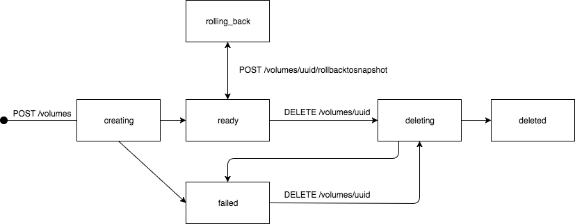

<!-- START doctoc generated TOC please keep comment here to allow auto update -->
<!-- DON'T EDIT THIS SECTION, INSTEAD RE-RUN doctoc TO UPDATE -->
**Table of Contents**

- [RFD 26 Network Shared Storage for Triton](#rfd-26-network-shared-storage-for-triton)
  - [Introduction](#introduction)
  - [Current prototype](#current-prototype)
  - [Use cases](#use-cases)
    - [Storing user generated content for a CMS application](#storing-user-generated-content-for-a-cms-application)
    - [Recording calls for a video conferencing application](#recording-calls-for-a-video-conferencing-application)
  - [General scope](#general-scope)
    - [Requirements](#requirements)
    - [Non-requirements](#non-requirements)
  - [CLI](#cli)
    - [Triton](#triton)
      - [Overview](#overview)
      - [Create](#create)
        - [Options](#options)
      - [List](#list)
      - [Get](#get)
      - [Delete](#delete)
      - [Adding a new `triton report` command](#adding-a-new-triton-report-command)
    - [Docker](#docker)
      - [Overview](#overview-1)
      - [Create](#create-1)
        - [Options](#options-1)
      - [Run](#run)
  - [Shared storage implementation](#shared-storage-implementation)
    - [Non-Requirements](#non-requirements)
    - [Approach](#approach)
    - [Other Considerations](#other-considerations)
      - [Differences between compute containers and shared volumes containers](#differences-between-compute-containers-and-shared-volumes-containers)
      - [Kernel vs user-mode NFS server](#kernel-vs-user-mode-nfs-server)
      - [High availability](#high-availability)
      - [Manta integration](#manta-integration)
      - [Choice of hardware](#choice-of-hardware)
      - [Concurrent access](#concurrent-access)
  - [Allocation (DAPI, packages, etc.)](#allocation-dapi-packages-etc)
    - [Packages for volume containers](#packages-for-volume-containers)
      - [Packages sizes](#packages-sizes)
    - [Placement of volume containers](#placement-of-volume-containers)
      - [Mixing compute containers and volume containers](#mixing-compute-containers-and-volume-containers)
      - [Expressing locality with affinity filters](#expressing-locality-with-affinity-filters)
  - [REST APIs](#rest-apis)
    - [Changes to CloudAPI](#changes-to-cloudapi)
      - [New `/volumes` endpoints](#new-volumes-endpoints)
        - [ListVolumes GET /volumes](#listvolumes-get-volumes)
        - [CreateVolume](#createvolume)
        - [GetVolume GET /volumes/volume-uuid](#getvolume-get-volumesvolume-uuid)
        - [GetVolumeReferences GET /volumes/volume-uuid/references](#getvolumereferences-get-volumesvolume-uuidreferences)
        - [UpdateVolume POST /volumes/volume-uuid](#updatevolume-post-volumesvolume-uuid)
        - [AttachVolumeToNetwork POST /volumes/volume-uuid/attachtonetwork](#attachvolumetonetwork-post-volumesvolume-uuidattachtonetwork)
        - [DetachVolumeFromNetwork POST /volumes/volume-uuid/detachfromnetwork](#detachvolumefromnetwork-post-volumesvolume-uuiddetachfromnetwork)
        - [CreateVolumeSnapshot POST /volumes/volume-uuid/snapshot](#createvolumesnapshot-post-volumesvolume-uuidsnapshot)
        - [GetVolumeSnapshot GET /volumes/volume-uuid/snapshots/snapshot-name](#getvolumesnapshot-get-volumesvolume-uuidsnapshotssnapshot-name)
        - [RollbackToVolumeSnapshot POST /volumes/volume-uuid/rollbacktosnapshot](#rollbacktovolumesnapshot-post-volumesvolume-uuidrollbacktosnapshot)
        - [ListVolumeSnapshots GET /volume/volume-uuid/snapshots](#listvolumesnapshots-get-volumevolume-uuidsnapshots)
        - [DeleteVolumeSnapshot DELETE /volumes/volume-uuid/snapshots/snapshot-name](#deletevolumesnapshot-delete-volumesvolume-uuidsnapshotssnapshot-name)
        - [DeleteVolume DELETE /volumes/volume-uuid](#deletevolume-delete-volumesvolume-uuid)
        - [ListVolumePackages GET /volumepackages](#listvolumepackages-get-volumepackages)
        - [GetVolumePackage GET /volumepackages/volume-package-uuid](#getvolumepackage-get-volumepackagesvolume-package-uuid)
      - [Filtering shared volumes zones from the ListMachines endpoint](#filtering-shared-volumes-zones-from-the-listmachines-endpoint)
      - [Failing for other machine-related endpoints used on shared volumes zones](#failing-for-other-machine-related-endpoints-used-on-shared-volumes-zones)
    - [Changes to VMAPI](#changes-to-vmapi)
      - [Filtering shared volumes zones from list endpoint](#filtering-shared-volumes-zones-from-list-endpoint)
      - [New `internal_role` property on VM objects](#new-internal_role-property-on-vm-objects)
      - [New internal `required_nfs_volumes` property on VM objects](#new-internal-required_nfs_volumes-property-on-vm-objects)
      - [New `mounting_volume` parameter for the `ListVms` endpoint](#new-mounting_volume-parameter-for-the-listvms-endpoint)
        - [Input](#input)
        - [Output](#output)
      - [Naming of shared volumes zones](#naming-of-shared-volumes-zones)
    - [Changes to PAPI](#changes-to-papi)
      - [Introduction of volume packages](#introduction-of-volume-packages)
        - [Storage of volume packages](#storage-of-volume-packages)
        - [Naming conventions](#naming-conventions)
      - [CreateVolumePackage POST /volumepackages](#createvolumepackage-post-volumepackages)
        - [Input](#input-1)
        - [Output](#output-1)
      - [GetVolumePackage](#getvolumepackage)
        - [Output](#output-2)
      - [DeleteVolumePackage](#deletevolumepackage)
    - [New `VOLAPI` service and API](#new-volapi-service-and-api)
      - [ListVolumes GET /volumes](#listvolumes-get-volumes-1)
        - [Input](#input-2)
        - [Output](#output-3)
      - [GetVolume GET /volumes/volume-uuid](#getvolume-get-volumesvolume-uuid-1)
        - [Input](#input-3)
        - [Output](#output-4)
      - [CreateVolume POST /volumes](#createvolume-post-volumes)
        - [Input](#input-4)
        - [Output](#output-5)
      - [DeleteVolume DELETE /volumes/volume-uuid](#deletevolume-delete-volumesvolume-uuid-1)
        - [Input](#input-5)
        - [Output](#output-6)
      - [UpdateVolume POST /volumes/volume-uuid](#updatevolume-post-volumesvolume-uuid-1)
        - [Input](#input-6)
        - [Output](#output-7)
      - [AttachVolumeToNetwork POST /volumes/volume-uuid/attachtonetwork](#attachvolumetonetwork-post-volumesvolume-uuidattachtonetwork-1)
        - [Input](#input-7)
        - [Output](#output-8)
      - [DetachVolumeFromNetwork POST /volumes/volume-uuid/detachfromnetwork](#detachvolumefromnetwork-post-volumesvolume-uuiddetachfromnetwork-1)
        - [Input](#input-8)
        - [Output](#output-9)
      - [Snapshots](#snapshots)
        - [Snapshot objects](#snapshot-objects)
        - [CreateVolumeSnapshot POST /volumes/volume-uuid/snapshot](#createvolumesnapshot-post-volumesvolume-uuidsnapshot-1)
        - [GetVolumeSnapshot GET /volumes/volume-uuid/snapshots/snapshot-name](#getvolumesnapshot-get-volumesvolume-uuidsnapshotssnapshot-name-1)
        - [RollbackToVolumeSnapshot POST /volumes/volume-uuid/rollbacktosnapshot](#rollbacktovolumesnapshot-post-volumesvolume-uuidrollbacktosnapshot-1)
        - [ListVolumeSnapshots GET /volume/volume-uuid/snapshots](#listvolumesnapshots-get-volumevolume-uuidsnapshots-1)
        - [DeleteVolumeSnapshot DELETE /volumes/volume-uuid/snapshots/snapshot-name](#deletevolumesnapshot-delete-volumesvolume-uuidsnapshotssnapshot-name-1)
      - [Volume objects](#volume-objects)
        - [Common layout](#common-layout)
        - [Naming constraints](#naming-constraints)
        - [Type-specific properties](#type-specific-properties)
        - [Deletion and usage semantics](#deletion-and-usage-semantics)
        - [Persistent storage](#persistent-storage)
      - [Volumes state machine](#volumes-state-machine)
      - [Data retention policy](#data-retention-policy)
        - [Reaping failed and deleted volumes](#reaping-failed-and-deleted-volumes)
  - [Snapshots](#snapshots-1)
    - [Use case](#use-case)
    - [Implementation](#implementation)
      - [Limits](#limits)
  - [Support for operating shared volumes](#support-for-operating-shared-volumes)
    - [New sdc-pkgadm command](#new-sdc-pkgadm-command)
      - [Adding new volume packages](#adding-new-volume-packages)
      - [Activating/deactivating a volume package](#activatingdeactivating-a-volume-package)
    - [New `sdc-voladm` command](#new-sdc-voladm-command)
      - [Listing shared volume zones](#listing-shared-volume-zones)
      - [Restarting shared volume zones](#restarting-shared-volume-zones)
      - [Updating shared volume zones](#updating-shared-volume-zones)
      - [Deleting shared volume zones](#deleting-shared-volume-zones)
  - [Open questions](#open-questions)
    - [Resizing volumes](#resizing-volumes)
    - [Ownership of NFS shared volumes' storage VMs](#ownership-of-nfs-shared-volumes-storage-vms)
      - [Potential solutions](#potential-solutions)
        - [Owner is admin, internal metadata for representing actual ownership](#owner-is-admin-internal-metadata-for-representing-actual-ownership)
        - [Adding an additional property on VM objects](#adding-an-additional-property-on-vm-objects)
    - [Interaction with local volumes](#interaction-with-local-volumes)
      - [What happens when mounting of a volume fails?](#what-happens-when-mounting-of-a-volume-fails)
    - [What NFS versions need to be supported?](#what-nfs-versions-need-to-be-supported)
    - [Security](#security)
    - [Can we limit the number of NFS volumes a single container can mount?](#can-we-limit-the-number-of-nfs-volumes-a-single-container-can-mount)
    - [Volume name limitations](#volume-name-limitations)
    - [Granularity of available volume sizes](#granularity-of-available-volume-sizes)
    - [CPU and memory requirements](#cpu-and-memory-requirements)
    - [Monitoring NFS server zones](#monitoring-nfs-server-zones)
    - [Networking](#networking)
      - [Impact of networking changes](#impact-of-networking-changes)

<!-- END doctoc generated TOC please keep comment here to allow auto update -->

# RFD 26 Network Shared Storage for Triton

## Introduction

In general, support for network shared storage is antithetical to the Triton (formerly SmartDataCenter or SDC)
philosophy. However, for some customers and applications it is a requirement.
In particular, network shared storage is needed to support Docker volumes in
configurations where the Triton zones are deployed on different compute nodes.

## Current prototype

A prototype for what this RFD describes is available at
https://github.com/joyent/sdc-volapi. It implements a minimal set of endpoints
for [a new Volumes API service](#new-volapi-service-and-api).

Its [`tools/setup/coal-setup.sh` script](https://github.com/joyent/sdc-volapi/blob/master/tools/setup/coal-setup.sh)
also installs an image of the sdc-docker service that contains changes to
support the `tritonnfs` Docker volume driver to allow Docker users to create and
mount NFS shared volumes.

This prototype is meant to be used on a COAL (Cloud On A Laptop) Triton setup,
and not in a production environment, or any environment where data integrity
matters.

See its [README](https://github.com/joyent/sdc-volapi/blob/master/README.md) for
more details on how to install and use it.

It is used both as a proof of concept and as a foundation upon which to build a
long term solution for the problems that this RFD describes.

## Use cases

The stories in this section have been gathered from Triton users. The UGC
(User Generated Content) story is genericized because it's been described by
many people as something they need. The video conferencing story is more
specific because it’s a one-off so far. The names, of course, are fictional.

### Storing user generated content for a CMS application

Danica runs WordPress, Drupal, Ghost, or some other tool that expects a local
filesystem that stores user generated content (UGC). These are typically
images, but are not limited to it. The size of these filesystems is typically
hundreds of megabytes to hundreds of gigabytes (a 1TB per volume limit would
likely be very acceptable).

When Danica builds a new version of her app, she builds an image (can be
Docker or infrastructure container) with the application code, runtime
environment, and other non-UG content. She tests the image with a sample set
of content, but needs to bring the UGC into the image in some way when
deploying it.

In production, Danica needs to run multiple instances of her app on different
physical compute nodes for availability and performance, and each instance
needs access to a shared filesystem that includes the UGC and persists across
application deploys.

The application supports some manipulation of the UG content (example: an
image editor for cropping), but the most common use for the content is to
serve it out on the internet. The result is that filesystem performance is not
critical to the app or user experience.

Though the UGC is stored on devices that offer RAID protection, Danica further
protects against loss of UG content by making regular backups that she does as
nightly tarballs stored in other infrastructure. She often uses those backups
in her development workflow as a way to get real content and practice the
restore procedures for them.

Danica can’t use an object store for the UGC because there’s no plugin for it
in her app, or no plugin that supports Manta, or she depends on features that
are incompatible with object storage plugins, or she’s running the app on-prem
and can’t send the data to an off-site object store (and she doesn’t have the
interest or budget to run Manta on prem).

Danica does not yet run her application across multiple data centers, but
she’d love to do so as a way to ensure availability of her site in the case of
a data center failure and so to improve performance by directing requests to
the closest DC.

### Recording calls for a video conferencing application

Vinod is building a video conferencing app that allows the optional recording
of conversations. The app component that manages individual conferences is
ephemeral with the exception of the recordings. The recordings are spooled to
disk as the conversation progresses, then the file is closed and enters a task
queue for further processing. Because the recordings can become quite large,
and because the job queue is easier to design if the recordings are on a
shared filesystem, Vinod has chosen to build his application with that
expectation. The recordings don’t stay in the shared filesystem indefinitely,
but workers in the queue compress and move them to an object store
asynchronously to the conversation activity.

Conversation recordings are typically in the low hundreds of gigabytes, and
performance requirements for any single conversation are limited by the bit
rates for internet video. Vinod currently uses a single filesystem, but
expects to add additional filesystems if necessary for performance. By running
the application in multiple data centers, each with its own set of conference
manager instances, shared filesystems, and work queues, Vinod’s app can remain
available despite the loss of individual data centers or shared filesystems,
though users would have to restart any conference calls that were interrupted
by that failure.

Vinod has chosen not to push the recordings into an object store immediately
because doing so would require larger in-instance storage for the video than
is available in all but the most expensive Triton packages, because adding
support for chunked uploads to the app that is managing the conversation is a
big expansion of scope for that component, and because the current process
works and makes sense to him.

## General scope

### Requirements

1. The solution must work for both Triton Cloud and Triton Enterprise users (public cloud and on-prem).

2. A shared volume size must be expandable (i.e. not a fixed quota size at
creation time).

3. Support a maximum shared file system size of 1TB.

4. Although initially targeted toward Docker volume support, the solution should
be applicable to non-Docker containers as well.

### Non-requirements

1. Shared volumes do not need to be available across data centers.

2. High performance is not critical.

3. Dedicated storage server (or servers) hardware is not necessary.

4. Robust concurrent read-write access (e.g. as used by a database) is not
necessary.

## CLI

The `triton` CLI currently doesn't support the concept of (shared) volumes, so
new commands and options will need to be added.

The docker CLI already supports shared volumes, but some conventions will need
to be established to allow Triton users to pass triton-specific input to Triton's
Docker API.

### Triton

#### Overview

```
triton volumes
triton volume create|list|get|delete

triton volume create --opt network=mynetwork --name wp-uploads --size 100g
triton volume create -n wp-uploads -s 100g
triton volume create -n wp-uploads nfs1-100g
```

#### Create

```
triton volume create --opt network=mynetwork --name wp-uploads --size 100g -e affinity:container!=wp-server
```

##### Options

###### Name

The name of the shared volume. If not specified, the command results in an
error.

###### Size

The size of the shared volume. If the size provided is not one of those made
available by `tritonnfs` [volume packages](#volume-packages), the creation fails
and outputs the list of available sizes. The available volume sizes can also be
listed with [CloudAPI's ListVolumePackages endpoint](#listvolumepackages-get-volumepackages).

When specifying a volume size without a suffix, gibibytes are assumed: a size of
`10` means `10 gibibytes`. When using suffixes in the size parameter, binary
units are assumed. That is: `10g` means `10 Gibibtyes`, same for `10G`, `10gb`
and `10GB`.

###### Network

The network to which this shared volume will be attached.

###### Affinity (not necessarily in MVP)

See [Expressing locality with affinity
filters](#expressing-locality-with-affinity-filters) below.

#### List

```
$ triton volume create -n foo ...
$ triton volume list
NAME  SIZE  NETWORK             RESOURCE
foo   100g  My Default Network  nfs://10.0.0.1/foo # nfs://host[:port]/pathname
$
```

#### Get

```
$ triton volume get volume-name
{ id: ... name: ... size: ... network: ... resource: ... compute_node: ... }
```

Including the amount of space used/amount of space available is a nice to
have. It might be possible to use the upcoming container monitoring service to
have quick metrics cache for a VM available and add that to the 'metrics'
field in cloudapi.

#### Delete

```
$ triton volume rm volume-name
```

This command _fails_ if docker containers are using the volume to be deleted,
but not if only non-Docker containers use it. In the latter case, it is the
responsibility the shared volume's owner to determine whenever it is
appropriate to delete it without impacting other compute containers.

#### Adding a new `triton report` command

Creating a shared volume results in creating a VM object and an instance with
`container_type: 'volume'`. As such, a user could list all their "resources"
(including instances _and_ shared volumes) by listing instances.

However, the fact that shared volumes have a 1 to 1 relationship with their
underlying containers is an implementation detail that should not be publicly
exposed.

Shared volumes should instead be considered as a separate resource type and a
new `triton report` command could list all resources of any type for a given
user, including:

* actual compute instances.
* NAT zones.
* shared volumes zones.

### Docker

The Docker CLI [already has support for
volumes](https://docs.docker.com/engine/reference/commandline/volume_create/).
This section describes what commands and command line options will be used by
Triton users to manage their shared volumes on Triton.

#### Overview

```
docker network create mynetwork ...
docker volume create --driver tritonnfs --name wp-uploads \
    --opt size=100g --opt network=mynetwork
docker run -d -v wp-uploads:/var/wp-uploads wp-server
```

The `tritonnfs` driver is the default driver on Triton. If not specified, the
network to which a newly created volume is attached is the default nic. So
more typically, creating a shared volume can be done using the following
shorter command line:

```
docker volume create --name wp-uploads --opt size=100g
```

#### Create

##### Options

###### Name

The name of the shared volume. If not specified, a unique name is automatically
generated.

###### Size

The size of the shared volume. This option is passed using docker's CLI's
`--opt` command line switch:

```
docker volume create --name --opt size=100g
```

If the size provided is not one of those made available by `tritonnfs` [volume
packages](#volume-packages), the creation fails and outputs the list of
available sizes. The available volume sizes can also be listed with [CloudAPI's
ListVolumePackages endpoint](#listvolumepackages-get-volumepackages).

When specifying a volume size without a suffix, gibibytes are assumed: a size of
`10` means `10 gibibytes`. When using suffixes in the size parameter, binary
units are assumed. That is: `10g` means `10 Gibibtyes`, same for `10G`, `10gb`
and `10GB`.

###### Network

The network to which this shared volume will be attached. This option is
passed using docker's CLI's `--opt` command line switch:

```
docker volume create --name --opt network=mynetwork
```

###### Driver

The Triton shared volume driver is named `tritonnfs`. It is the default driver
when creating shared volumes when using Triton's Docker API with the docker
client.

#### Run

Users need to be able to mount shared volumes in read-only mode using the
`:ro` command line suffix for the `-v` option:

```
docker run -d -v wp-uploads:/var/wp-uploads:ro wp-server
```

## Shared storage implementation

For reliability reasons, compute nodes never use network block storage and Triton
zones are rarely configured with any additional devices. Thus, shared block
storage is not an option.

Shared file systems are a natural fit for zones and SmartOS has good support
for network file systems. A network file system also aligns with the semantics
for a Docker volume. Thus, this is the chosen approach. NFS is used as the
underlying protocol. This provides excellent interoperability among various
client and server configurations. Using NFS even provides for the possibility
of sharing volumes between zones and kvm-based services.

### Non-Requirements

1. The NFS server does not need to be HA.
2. Dedicated NFS server (or servers) hardware is not necessary.
3. Robust locking for concurrent read-write access (e.g. as used by a
    database) is not necessary.

### Approach

Because the file system(s) must be served on the customer's VXLAN, it makes
sense to provision an NFS server zone, similar to the NAT zone, which is owned
by the customer and configured on their VXLAN. Container zones can only talk
to NFS server zones that are on the same customer's network.

The current design has a one-to-one mapping between shared volumes and NFS
server zones, but this is an implementation detail: it is not impossible that
in the future more than one volumes be served from one NFS server zone.

Serving NFS from within a zone is not currently supported by SmartOS, although
we have reason to believe that we could fix this in the future. Instead, a
user-mode NFS server will be deployed within the zone. Because the server runs
as a user-level process, it will be subject to all of the normal resource
controls that are applicable to any zone. The user-mode solution can be
deployed without the need for a new platform or a CN reboot.

The NFS server will serve files out of a ZFS delegated dataset, which allow
for the following use cases:

1. Upgrading the NFS server zone (e.g to upgrade the NFS server software) without
needing to throw away users' data.

2. Snapshotting.

3. Using ZFS send to send users' data to a different host.

The user-mode server must be installed in the zone and configured to export
the appropriate file system. The Triton docker tools must support the mapping
of the user's logical volume name to the zone name and share.

When a Docker container uses a shared volume, the NFS file system is mounted
in the container from the shared volume zone automatically at startup.
However, when a non-Docker container uses a shared volume, mounting of the NFS
file system is not automatic: users need to use command line tools to mount it
manually using the appropriate NFS path.

### Other Considerations

#### Differences between compute containers and shared volumes containers

1. Users cannot ssh into shared volume containers.

2. Users cannot list shared volume containers when listing compute instances
(they can list them using CloudAPI's /volumes endpoint).

#### Kernel vs user-mode NFS server

The user-mode NFS server is a solution that provides for quick implementation
but may not offer the best performance. In the future we could do the work
to enable kernel-based NFS servers within zones. Switching over to that
should be transparent to all clients, but would require a new platform on the
server side.

#### High availability

Although HA is not a requirement, an NFS server zone clearly represents a SPOF
for the application. There are various possibilities we could consider to
improve the availability of the NFS service for a specific customer. These
ideas are not discussed here but could be considered as future projects.

#### Manta integration

Integration with Manta is not discussed here. However, we do have our manta-nfs
server and it dovetails neatly with the proposed approach. Integrating
manta access into an NFS server zone could be considered as a future project.

#### Choice of hardware

Hardware configurations that are optimized for use as NFS servers are not
discussed here. It is likely that a parallel effort will be needed to
identify and recommend server hardware that is more appropriate than our
current configurations.

#### Concurrent access

Concurrent access use cases need to be supported, but support for robust high
concurrency ones (such as database storage) is not critical.

## Allocation (DAPI, packages, etc.)

### Packages for volume containers

NFS shared volumes packages are similar to those used by NAT zones. NFS shared
volumes will have separate packages used when provisioning their underlying
storage VMs. These packages will be owned by the administrator, and thus won't
be available to end users when provisioning compute instances.

#### Packages sizes

Each volume would have a minimum size of 10 GiB, and support resizing in units
of 10 GiB and then 100 GiB as the volume size increases:

* 10 GiB
* 20 GiB
* 30 GiB
* 40 GiB
* 50 GiB
* 60 GiB
* 70 GiB
* 80 GiB
* 90 GiB
* 100 GiB
* 200 GiB
* 300 GiB
* 400 GiB
* 500 GiB
* 600 GiB
* 700 GiB
* 800 GiB
* 900 GiB
* 1,000 GiB

### Placement of volume containers

The placement of the NFS server zone during provisioning is a complicated
decision. There is no requirement for dedicated hardware that is optimized as
file servers. The server zones could be interspersed with other zones to soak
up unused storage space on compute nodes. However, care must be taken so that
the server zones have enough free local storage space to expand into.

Provisioning of regular zones should also take into account the presence
storage zones and any future growth they might incur. It is likely we'll have
to experiment with various approaches to provisioning in order to come up with
an acceptable solution. The provisioning design is TBD.

A challenge facing the placement of NFS server zones is whether to place them
greedily (like DAPI currently does), or to spread them out. Greedy placement
fills up servers faster, leaving more servers free for larger allocations; this
improves density in the datacenter. However, greedy placement also directly
conflicts with the ability to resize NFS server zones; resizing a storage volume
up is a relativey common operation, but is a dodgy operation on a server which
has already used up its reserved RAM and disk. Giving NFS server zones a fixed
upper limit (i.e. 1TiB) helps mitigate this problem.

#### Mixing compute containers and volume containers

Mixing compute and volume containers has some advantages: since the server fleet
does not need to be split, there is more potential to spread volumes across the
entire datacenter; the failure of individual servers is less likely to have a
wide-spread effect. There are also disadvantages: dedicated volume servers
likely need platform updates less often, thus having the potential for better
uptime.

The main challenge with mixing compute and volume containers from DAPI's
perspective is that volume containers are disk-heavy, while packages for compute
containers have (and assume) a more balanced mix between memory, disk, and CPU.
E.g. if a package gets 1/4 of a server's RAM, it typically also gets roughly 1/4
of the disk. The disk-heavy volume containers upset this balance, with at least
three (non-exclusive) solutions:

* We accept that mixing compute and volume containers on the same servers will
  leave more memory not reserved to containers. This would leave more for the
  ZFS ARC, but how much is too much?

* We allow the overprovisioning of disk. A lot of disk in typical cloud
  deployments remain unused, thus this would increase utilization, but
  sometimes those promises are all called in on the same server. Programs often
  degrade more poorly under low-disk conditions than low-ram, which can still
  page out.

* We add a tier of packages that are RAM-heavy. These could be more easily
  slotted in on servers which have one or more volumes. It's uncertain how much
  the demand for RAM-heavy packages can compensate for volume containers.

#### Expressing locality with affinity filters

_This functionality is not required for the MVP._

In order to have better control on performance and availability, Triton users
need to be able to express where in the data center their shared volumes are
located in relation with their compute containers.

For instance, a user might need to place a shared volume on a compute node
that is as close as possible than the compute containers that use them.

The same user might need to place another shared volume on a different
computer node than the compute containers that use them to avoid a single
point of failure.

Finally, the same user might need to place several different or identical
shared volumes on different compute nodes to avoid a single point of failure.

These locality constraints are expressed in terms of relative affinity between
shared volumes and compute containers.

Affinity filters are [already supported by the docker
CLI](https://docs.docker.com/swarm/scheduler/filter/#use-an-affinity-filter).
Triton users should be able to express affinity using:

* partial names
* labels

and the following operators:

* `==`:
* `!=`:
* `~=`:

## REST APIs

Several existing APIs are directly involved when manipulating shared volumes:
sdc-docker, VMAPI, CloudAPI, NAPI, etc. . This section presents the changes
that will need to be made to existing APIs as well as new APIs that will need
to be created to support shared volumes and their use cases.

### Changes to CloudAPI

#### New `/volumes` endpoints

Users need to be able to manage their shared volumes from CloudAPI. Most of the
volume related endpoints of CloudAPI will be implemented by forwarding the
initial requests to the Volumes API service and adding the `owner_uuid` input
parameter that corresponds to the user making the request.

##### ListVolumes GET /volumes

###### Input

| Param           | Type         | Description                              |
| --------------- | ------------ | ---------------------------------------- |
| name            | String       | Allows to filter volumes by name. |
| type            | String       | Allows to filter volumes by type, e.g `tritonnfs`. |
| state           | String       | Allows to filter volumes by state, e.g `state=failed`. |
| predicate       | String       | URL encoded JSON string representing a JavaScript object that can be used to build a LDAP filter. This LDAP filter can search for volumes on arbitrary indexed properties. More details below. |
| tag.key         | String       | A string representing the value for the tag with key `key` to match. More details below. |

####### Searching by name

`name` is a pattern where the character `*` has a special meaning of matching
any character any number of time. For instance, `*foo*` will match `foo`,
`foobar`, `barfoo` and `barfoobar`.

####### Searching by predicate

The `predicate` parameter is a JSON string that can be used to build a LDAP
filter to search on the following indexed properties:

* `name`
* `billing_id`
* `type`
* `state`
* `tags`

####### Searching by tags

It is also possible to search for volumes matching one tag by using the `tag`
parameter as following:

``
/volumes?tag.key=value
``

For instance, to search for a volume with the tag `foo` set to `bar`:

``
/volumes?tag.foo=bar
``

This form only allows to specify one tag name/value pair. [The predicate
search](#searching-by-predicate) can be used to perform a search with multiple
tags.

###### Output

A list of volume objects of the following form:

```
[
  {
    "uuid": "e435d72a-2498-8d49-a042-87b222a8b63f",
    "name": "my-volume",
    "owner_uuid": "ae35672a-9498-ed41-b017-82b221a8c63f",
    "type": "tritonnfs",
    "nfs_path": "host:port/path",
    "state": "ready",
    "networks": [
      "1537d72a-949a-2d89-7049-17b2f2a8b634"
    ],
    "snapshots": [
      {
        "name": "my-first-snapshot",
        "create_timestamp": "1562802062480",
        "state": "created"
      },
      {
        "name": "my-second-snapshot",
        "create_timestamp": "1572802062480",
        "state": "created"
      }
    ],
    "tags: {
      "foo": "bar",
      "bar": "baz"
    }
  },
  {
    "uuid": "a495d72a-2498-8d49-a042-87b222a8b63c",
    "name": "my-other-volume",
    "owner_uuid": "d1c673f2-fe9c-4062-bf44-e13959d26407",
    "type": "someothervolumetype",
    "state": "ready",
    "networks": [
      "4537d92a-149c-6d83-104a-97b2f2a8b635"
    ],
    "tags: {
      "foo": "bar",
      "bar": "baz"
    }
  }
  ...
]
```

##### CreateVolume

###### Input

| Param         | Type         | Mandatory | Description                             |
| ------------- | ------------ |-----------|---------------------------------------- |
| name          | String       | Yes       | The desired name for the volume. If missing, a unique name for the current user will be generated |
| size          | String       | No        | The desired minimum storage capacity for that volume. |
| type          | String       | Yes       | The type of volume. Currently only `'tritonnfs'` is supported. |
| networks      | Array        | Yes       | A list of UUIDs representing networks on which the volume is reachable. These networks must be fabric networks owned by the user sending the request. |
| labels        | Object       | No        | An object representing key/value pairs that correspond to label names/values. |

####### Size

The `size` input parameter must match the following regular expression:

```
/(\d+)(g|m|G|M|gb|mb|GB|MB)/
```

All units are in ibibytes (mebibytes and gibibytes). `g`, `G`, `gb` and `GB`
stand for "gibibytes". `m`, `M`, `mb` and `MB` stand for "mebibytes".

###### Output

A [volume object](#volume-objects) representing the volume being created. When
the response is sent, the volume and all its resources are not created and its
state is `creating`. Users need to poll the newly created volume with the
`GetVolume` API to determine when it's ready to use (its state transitions to
`ready`).

If the creation process fails, the volume object has its state set to `failed`
and an `error` property that documents what the cause for the failure was.

##### GetVolume GET /volumes/volume-uuid

GetVolume can be used to get data from an already created volume, or to
determine when a volume being created is ready to be used.

###### Input

| Param           | Type         | Description                     |
| --------------- | ------------ | --------------------------------|
| uuid            | String       | The uuid of the volume object   |

###### Output

A [volume object](#volume-objects) representing the volume with UUID `uuid`.

##### GetVolumeReferences GET /volumes/volume-uuid/references

`GetVolumeReferences` can be used to list resources that are using the volume
with UUID `volume-uuid`.

###### Output

A list of URI pointing to resources (not necessarily VMs) that are using the
volume with UUID `volume-uuid`:

```
[
   "http://api.triton-datacenter.tld/login/machines/some-vm-uuid/",
   "http://api.triton-datacenter.tld/login/machines/some-other-vm-uuid/"
]
```

##### UpdateVolume POST /volumes/volume-uuid

The `UpdateVolume` endpoint can be used to update the following properties of a
shared volume:

* `name`, to rename a volume.
* `tags`, to add/remove tags for a given volume

###### Input

| Param               | Type         | Description                     |
| ------------------- | ------------ | --------------------------------|
| uuid            | String       | The uuid of the volume object       |
| name | String | The new name of the volume with uuid `uuid` |
| tags | Array of string | The new tags for the volume with uuid `uuid` |

Sending any other input parameter will result in an error. Updating other
properties of a volume, such as the networks it's attached to, must be performed
by using other separate endpoints.

###### Output

The response is empty, and the HTTP status code is 204. This allows the
implementation to not have to reload the updated volume, and thus minimizes
latency. If users need to get an updated representation of the volume, they can
send a `GetVolume` request.

##### AttachVolumeToNetwork POST /volumes/volume-uuid/attachtonetwork

`AttachVolumeToNetwork` can be used to make a volume reachable on a given
network.

###### Input

| Param           | Type         | Description                     |
| --------------- | ------------ | --------------------------------|
| uuid            | String       | The uuid of the volume object   |
| network_uuid    | String       | The uuid of the network to which the volume with uuid `uuid` should be attached |

###### Output

A [volume object](#volume-objects) representing the volume with UUID `uuid`.

##### DetachVolumeFromNetwork POST /volumes/volume-uuid/detachfromnetwork

`DetachVolumeFromNetwork` can be used to make a volume that used ot be reachable
on a given network not reachable on that network anymore.

###### Input

| Param           | Type         | Description                     |
| --------------- | ------------ | --------------------------------|
| uuid            | String       | The uuid of the volume object   |
| network_uuid    | String       | The uuid of the network from which the volume with uuid `uuid` should be dettached |

###### Output

A [volume object](#volume-objects) representing the volume with UUID `uuid`.

##### CreateVolumeSnapshot POST /volumes/volume-uuid/snapshot

###### Input

| Param         | Type         | Description                     |
| ------------- | ------------ | --------------------------------|
| name          | String       | The desired name for the snapshot to create. The name must be unique per user. |

###### Output

The volume object representing the volume with UUID `volume-uuid`, with the
newly created snapshot added to its `snapshots` list property. Note that
creating a snapshot can fail as no space might be left in the corresponding zfs
dataset.

##### GetVolumeSnapshot GET /volumes/volume-uuid/snapshots/snapshot-name

###### Output

The [snapshot object](#snapshot-objects) with name `snapshot-name` for the
volume with UUID `volume-uuid`.

##### RollbackToVolumeSnapshot POST /volumes/volume-uuid/rollbacktosnapshot

Note that rolling back a NFS shared volume to a given snapshot requires its
underlying storage VM to be stopped and restarted.

###### Input

| Param         | Type         | Description                              |
| ------------- | ------------ | ---------------------------------------- |
| uuid          | String       | The uuid of the snapshot object that represents the state to which to rollback. |
| name          | String       | The name of the snapshot object that represents the state to which to rollback. |

###### Output

The volume object that represents the volume with UUID `volume-uuid` with its
state property set to `rolling_back`. When the volume has been rolled back to
the snapshot with name `name`, the volume's `state` property is `ready`.

##### ListVolumeSnapshots GET /volume/volume-uuid/snapshots

###### Input

| Param         | Type         | Description                              |
| ------------- | ------------ | ---------------------------------------- |
| name          | String       | The new name of the snapshot object with uuid `snapshot-uuid`. |

###### Output

A list of [snapshot objects](#snapshot-objects) that were created from the
volume with UUID `volume-uuid`.

##### DeleteVolumeSnapshot DELETE /volumes/volume-uuid/snapshots/snapshot-name

###### Output

The [volume object](#volume-objects) that represents the volume with UUID
`volume-uuid`. This volume object can be polled to determine when the snapshot
with name `snapshot-name` is not present in the `snapshots` list anymore, which
means the snapshot was deleted successfully.

##### DeleteVolume DELETE /volumes/volume-uuid

###### Input

| Param           | Type        | Description                     |
| --------------- | ----------- | --------------------------------|
| uuid            | String      | The uuid of the volume object   |
| force           | Boolean     | If true, the volume can be deleted even if there are still non-deleted containers that reference it .   |

If `force` is not specified or `false`, deletion of a shared volume is not
allowed if it has at least one "active user". If `force` is true, the constraint
on users of  doesn't apply.

See the section ["Deletion and usage semantics"](#deletion-and-usage-semantics)
for more information.

###### Output

The output is empty and the status code is 204 if the deletion was scheduled
successfuly.

A volume is always deleted asynchronously. In order to determine when the volume
is actually deleted, users need to poll the volume's `state` property.

If resources are using the volume to be deleted, the request results in an error
and the error contains a list of resources that are using the volume.

##### ListVolumePackages GET /volumepackages

###### Input

| Param           | Type        | Description                             |
| --------------- | ----------- | ----------------------------------------|
| type            | String      | The type of the volume package object, e.g `'tritonnfs'` |

###### Output

An array of objects representing [volume packages](#volume-packages) with the
type set to `type`.

##### GetVolumePackage GET /volumepackages/volume-package-uuid

###### Output

An object representing the [volume package](#volume-packages) with UUID
`volume-package-uuid`.

#### Filtering shared volumes zones from the ListMachines endpoint

Zones acting as shared volumes hosts need to [_not_ be included in
`ListMachines`'s output](#new-internal_role-property-on-vm-objects). CloudAPI's
`ListMachines`' implementation will add a filter to filter out VMs with the
value `tritonnfs_server` for their `internal_role` property.

#### Failing for other machine-related endpoints used on shared volumes zones

All other ["Machines" related CloudAPI
endpoints](https://apidocs.joyent.com/cloudapi/#machines) will need to fail with
an appropriate error message when used on shared volumes zones.

### Changes to VMAPI

#### Filtering shared volumes zones from list endpoint

Zones acting as shared volumes hosts are an implementation detail that should
not be exposed to end users. As such, they need to be filtered out from the
`ListVms` endpoint

#### New `internal_role` property on VM objects

A new `internal_role` property with the value `tritonnfs_volume` will need to be
added on VM objects.

This property overlaps with [the current `smartdc_role` tag used to provision
NFS shared volumes zones](https://github.com/joyent/sdc-volapi
/blob/master/lib/endpoints/volumes.js#L153), but it has the benefit of being
indexable without requiring any change to Moray.

This new `internal_role` property will be empty for any VM object other than
those representing NFS server zones. Changes will be made to CloudAPI's
`ListMachines` endpoint to filter out VMs with a value of `tritonnfs_server`
from its output and to all other machines-related CloudAPI endpoints to fail
with a clear error message for such VMs.

#### New internal `required_nfs_volumes` property on VM objects

A VM object that represents a Docker container mounting a shared volumes will
store a reference to that volume in a new _indexable_ property named
`required_nfs_volumes`.

This will allow VOLAPI to perform an indexed search on VMAPI to determine what
uses a given volume when handling operations that depends on a volume's usage,
e.g a `DeleteVolume` request.

This property is _internal_ and is not exposed to VMAPI and CloudAPI users. It
is used by VMAPI's `ListVms` endpoint to implement support for its new
[`mounting_volume` input
parameter](#new-mounting_volume-parameter-for-the-listvms-endpoint).

#### New `mounting_volume` parameter for the `ListVms` endpoint

While the [`required_nfs_volumes`
property](#new-internal-required_nfs_volumes-property-on-vm-objects) on VM
objects is internal, the `ListVms` API endpoint allows users to list _active_
VMs that mount a given volume.

##### Input

| Param           | Type         | Description                              |
| --------------- | ------------ | ---------------------------------------- |
| mounting_volume | String       | A string representing _one_ volume UUID for wich to list _active_ VMs that reference it. |

##### Output

A list of VMs that represent all active VMs that reference the volume
represented by UUIDs represented by `mounting_volumes`, such as:

```
[
  {
    "uuid": "vm-uuid-1",
    "alias": ...
  },
  {
    "uuid": "vm-uuid-2",
    "alias": ...
  },
]
```

#### Naming of shared volumes zones

Shared volumes names are __unique per account__. Thus, in order to be able to
easily identify and search for shared volume zones without getting conflicts
on VM aliases, shared volume zones' aliases will have the following form:

```
alias='volume-$volumename-$volumeuuid'
```

### Changes to PAPI

#### Introduction of volume packages

Storage volumes sharing the same traits will be grouped into _volume types_. For
instance, NFS shared volumes will have the volume type "tritonnfs". Potential
future "types" of volumes are "tritonebs" for "Triton Elastic Block Storage" or
"tritonefs" for "Triton Elastic File System".

Different settings (volume size, QoS, hardware, etc.) for a given volume type
will be represented as _volume packages_. For instance, a 10 GiB tritonnfs
volume will have its own package, and a different package will be used for a 20
GiB tritonnfs volume.

Each volume package has a UUID and a name, similarly to current packages used to
provision compute instances. In order to avoid confusion, this document uses the
term "compute packages" to explicitly distinguish these packages from volume
packages.

Here's an example of a volume package object represented as a JSON string:

```
{
    "uuid": "df40d4bf-b4f4-4409-84e7-daa04a347c18",
    "name": "nfs4-ssd-10g", // As in 10 GiB
    "size": 10, // In GiB,
    "type": "tritonnfs",
    "created_at": "2016-05-30T17:54:51.511Z",
    "description": "A shared NFS volume providing 10 GiB of storage",
    "active": true
}
```

Common properties of volume packages objects are:

* `uuid`: a unique identifier for a volume package.
* `name`: a unique name that represents a volume package. This name can be used
  in lieu of the UUID to provide an ID that is easier to use and remember.
* `type`: the kind of volume that a package is associated to. Currently, there
  is only one type of volumes that users can create: `'tritonnfs'` volumes.
  However in the future it is likely that other types of volumes will be
  available.
* `created_at`: a timestamp that represents when this volume package was
  created. Note that a volume package cannot be deleted.
* `description`: a string that gives further details to users about the package.
* `owner_uuids`: if present, an array of user UUIDs that represents what users
  can use (list, get and provision volumes with) a package. If empty, the
  package can be used by everyone.
* `active`: a boolean that determines whether a package can be used. Packages
  with `active === false` cannot be used by any user. They can only be managed
  by operators using VOLAPI directly.

Volume packages are polymorphic. Different volume types are associated with
different forms of volume packages. For instance, `'tritonnfs'` volumes are
associated with packages that have a `size` property because these volumes are
not elastic.

Currently, there is just one volume type named `'tritonnfs'`, and its associated
volume packages objects have only one specific property:

* `size`: a Number representing the storage capacity in mebibytes provided by
  volumes created with this package.
* `compute_package_uuid`: the UUID of the compute package to use to provision
  the storage VMs when a new volume using this package is created.

Note that __volume packages are not used by DAPI to provision any VM__. Instead,
when creating a volume requires provisioning a storage VM, a _compute_ package
that matches the volume package used when creating the volume is used.

__However, volume packages' UUIDs are used for billing purposes.__ This means
that in the case of `tritonnfs` volume packages, their corresponding storage VMs
packages are not used for billing.

##### Storage of volume packages

Volume packages data are stored in a separate Moray bucket than the one used to
store compute packages. This has the advantage of not requiring to change and
migrate the existing compute packages data, and overall makes the management of
both compute and volume packages objects in Moray simpler.

It implies some potential limitations, such as making listing all packages
(compute and volume packages) and ordering them by e.g creation time cumbersome
and not perform as well as a single indexed search. However that use case
doesn't seem to be common enought to be a concern.

##### Naming conventions

Volume packages will have the following naming conventions:

```
$type$generation-$property1-$property2-$propertyn
```

where `$type` is a volume type such as `nfs`, $generation is a monotically
increasing integer starting at `1`, and `$propertyX` are values for
differentiating properties of the volume type `$type`, such as the size.

For instance, the proposed names for tritonnfs volume packages are:

* nfs1-10g
* nfs1-20g
* nfs1-30g
* nfs1-40g
* nfs1-50g
* nfs1-60g
* nfs1-70g
* nfs1-80g
* nfs1-90g
* nfs1-100g
* nfs1-200g
* nfs1-300g
* nfs1-400g
* nfs1-500g
* nfs1-600g
* nfs1-700g
* nfs1-800g
* nfs1-900g
* nfs1-1000g

#### CreateVolumePackage POST /volumepackages

##### Input

| Param                | Type             | Description                              |
| -------------------- | ---------------- | ---------------------------------------- |
| type                 | String           | Required. The type of the volume package object, e.g `'tritonnfs'`. |
| size                 | Number           | Required when type is `tritonnfs`, otherwise irrelevant. A number in GiB representing the size volumes created with this package. |
| compute_package_uuid | String           | Required when type is `tritonnfs`, otherwise irrelevant. It represents the UUID of the compute package to use to provision the storage VMs when a new volume using this package is created. |
| description          | String           | Required. A string that gives further details to users about the package. |
| owner_uuids          | Array of strings | Optional. An array of user UUIDs that represents what users can use (list, get and provision volumes with) a package. If empty, the package can be used by everyone. |
| active               | Boolean          | Required. A boolean that determines whether a package can be used. Packages with `active === false` cannot be used by any user. They can only be managed by operators using VOLAPI directly. |

##### Output

An object representing a volume package:

```
{
    "uuid": "df40d4bf-b4f4-4409-84e7-daa04a347c18",
    "name": "nfs4-ssd-10g", // As in 10 GiB
    "size": 10, // In GiB,
    "type": "tritonnfs",
    "created_at": "2016-05-30T17:54:51.511Z",
    "description": "A shared NFS volume providing 10 GiB of storage",
    "active": true,
    "storage_vm_pkg": "ab21792b-6852-4dab-8c78-6ef899172fab"
}
```

#### GetVolumePackage

```
GET /volumepackages/uuid
```

##### Output

```
{
    "uuid": "df40d4bf-b4f4-4409-84e7-daa04a347c18",
    "name": "nfs4-ssd-10g", // As in 10 GiB
    "hardware": "ssd",
    "size": 10, // In GiB,
    "type": "tritonnfs",
    "created_at": "2016-05-30T17:54:51.511Z",
    "description": "A shared NFS volume providing 10 GiB of storage",
    "active": true,
    "storage_vm_pkg": "ab21792b-6852-4dab-8c78-6ef899172fab"
}
```

#### DeleteVolumePackage

As for compute packages, volume packages cannot be destroyed.

### New `VOLAPI` service and API

Even though shared volumes are implemented as actual zones in a way similar to
regular instances, they represent an entirely different concept with different
constraints, requirements and life cycle. As such, they need to be represented
in Triton as different "Volume" objects.

The creation, modification and deletion of these "Volume" objects could
_technically_ be managed by VMAPI, but implementing this API as a separate
service has the advantage of building the foundation for supporting volumes that
are _not_ implemented in terms of Triton VMs, such as volumes backed by storage
appliances or external third party services.

Implementing the Volumes API as a separate service also has some nice side
effects of:

1. not growing the surface area of VMAPI, which is already quite large

2. being able to actually decouple the Volumes API development and deployment
from VMAPI's.

As a result, this section proposes to add a new API/service named "Volume API"
or "VOLAPI".

#### ListVolumes GET /volumes

##### Input

| Param           | Type         | Description                              |
| --------------- | ------------ | ---------------------------------------- |
| name            | String       | Allows to filter volumes by name. |
| owner_uuid      | String       | When not empty, only volume objects with an owner whose UUID is `owner_uuid` will be included in the output |
| billing_id      | String       | When not empty, only volume objects with a billing\_id whose UUID is `billing_id` will be included in the output |
| type            | String       | Allows to filter volumes by type, e.g `type=tritonnfs`. |
| state           | String       | Allows to filter volumes by state, e.g `state=failed`. |
| predicate       | String       | URL encoded JSON string representing a JavaScript object that can be used to build a LDAP filter. This LDAP filter can search for volumes on arbitrary indexed properties. More details below. |
| tag.key         | String       | A string representing the value for the tag with key `key` to match. More details below. |

###### Searching by name

`name` is a pattern where the character `*` has a special meaning of matching
any character any number of time. For instance, `*foo*` will match `foo`,
`foobar`, `barfoo` and `barfoobar`.

###### Searching by predicate

The `predicate` parameter is a JSON string that can be transformed into an LDAP filter to search
on the following indexed properties:

* `name`
* `owner_uuid`
* `billing_id`
* `type`
* `state`
* `tags`

###### Searching by tags

##### Output

A list of volume objects of the following form:

```
[
  {
    "uuid": "e435d72a-2498-8d49-a042-87b222a8b63f",
    "name": "my-volume",
    "owner_uuid": "ae35672a-9498-ed41-b017-82b221a8c63f",
    "type": "tritonnfs",
    "nfs_path": "host:port/path",
    "state": "ready",
    "networks": [
      "1537d72a-949a-2d89-7049-17b2f2a8b634"
    ],
    "snapshots": [
      {
        "name": "my-first-snapshot",
        "create_timestamp": "1562802062480",
        "state": "created"
      },
      {
        "name": "my-second-snapshot",
        "create_timestamp": "1572802062480",
        "state": "created"
      }
    ],
    "tags: {
      "foo": "bar",
      "bar": "baz"
    }
  },
  {
    "uuid": "a495d72a-2498-8d49-a042-87b222a8b63c",
    "name": "my-other-volume",
    "owner_uuid": "d1c673f2-fe9c-4062-bf44-e13959d26407",
    "type": "someothervolumetype",
    "state": "ready",
    "networks": [
      "4537d92a-149c-6d83-104a-97b2f2a8b635"
    ],
    "tags: {
      "foo": "bar",
      "bar": "baz"
    }
  }
  ...
]
```

#### GetVolume GET /volumes/volume-uuid

GetVolume can be used to get data from an already created volume, or to
determine when a volume being created is ready to be used.

##### Input

| Param           | Type         | Description                     |
| --------------- | ------------ | --------------------------------|
| uuid            | String       | The uuid of the volume object   |
| owner_uuid      | String       | The uuid of the volume's owner  |

##### Output

A [volume object](#volume-objects) representing the volume with UUID `uuid`.

#### CreateVolume POST /volumes

##### Input

| Param         | Type         | Description                              |
| ------------- | ------------ | ---------------------------------------- |
| name          | String       | The desired name for the volume. If missing, a unique name for the current user will be generated |
| owner_uuid    | String       | The UUID of the volume's owner. |
| size          | Number       | The desired minimum storage capacity for that volume in mebibytes. |
| type          | String       | The type of volume. Currently only `'tritonnfs'` is supported. |
| networks      | Array        | A list of UUIDs representing networks on which the volume will be reachable. These networks must be owned by the user with UUID `owner_uuid`. |
| server_uuid   | String       | For `tritonnfs` volumes, a compute node (CN) UUID on which to provision the underlying storage VM. Useful for operators when performing `tritonnfs` volumes migrations. |
| ip_address    | String       | For `tritonnfs` volumes, the IP address to set for the VNIC of the underlying storage VM. Useful for operators when performing `tritonnfs` volumes migrations to reuse the IP address of the migrated volume. |
| tags          | Object       | An object representing key/value pairs that correspond to tags names/values. Docker volumes' labels are implemented with tags. |

##### Output

A [volume object](#volume-objects) representing the volume with UUID `uuid`. The
`state` property of the volume object is either `creating` or `failed`.

If the `state` property of the newly created volume is `creating`, sending
`GetVolume` requests periodically can be used to determine when the volume is
either ready to use (`state` === `'ready'`) or when it failed to be created
(`state` === `'failed'`.

#### DeleteVolume DELETE /volumes/volume-uuid

##### Input

| Param           | Type        | Description                     |
| --------------- | ----------- | --------------------------------|
| owner_uuid    | String       | The UUID of the volume's owner. |
| uuid            | String      | The uuid of the volume object   |
| force           | Boolean     | If true, the volume can be deleted even if there are still non-deleted containers that reference it .   |

If `force` is not specified or `false`, deletion of a shared volume is not
allowed if it has at least one "active user". If `force` is true, a shared
volume can be deleted even if it has active users.

See the section ["Deletion and usage semantics"](#deletion-and-usage-semantics)
for more information.

##### Output

The output is empty and the status code is 204 if the deletion was scheduled
successfuly.

A volume is always deleted asynchronously. In order to determine when the volume
is actually deleted, users need to poll the volume's `state` property.

If resources are using the volume to be deleted, the request results in an error
and the error contains a list of resources that are using the volume.

#### UpdateVolume POST /volumes/volume-uuid

The UpdateVolume endpoint can be used to update the following properties of a
shared volume:

* `name`, to rename a volume.
* `tags`, to add/remove tags for a given volume

##### Input

| Param               | Type         | Description                     |
| ------------------- | ------------ | --------------------------------|
| owner_uuid    | String       | The UUID of the volume's owner. |
| uuid            | String       | The uuid of the volume object       |
| name | String | The new name of the volume with uuid `uuid` |
| tags | Array of string | The new tags for the volume with uuid `uuid` |

##### Output

The response is empty, and the HTTP status code is 204. This allows the
implementation to not have to reload the updated volume, and thus minimizes
latency. If users need to get an updated representation of the volume, they can
send a `GetVolume` request.

#### AttachVolumeToNetwork POST /volumes/volume-uuid/attachtonetwork

`AttachVolumeToNetwork` can be used to make a volume reachable on a given
network.

##### Input

| Param           | Type         | Description                     |
| --------------- | ------------ | --------------------------------|
| owner_uuid    | String       | The UUID of the volume's owner. |
| uuid            | String       | The uuid of the volume object   |
| network_uuid    | String       | The uuid of the network to which the volume with uuid `uuid` should be attached |

##### Output

A [volume object](#volume-objects) representing the volume with UUID `uuid`.

#### DetachVolumeFromNetwork POST /volumes/volume-uuid/detachfromnetwork

`DetachVolumeFromNetwork` can be used to make a volume that used ot be reachable
on a given network not reachable on that network anymore.

##### Input

| Param           | Type         | Description                     |
| --------------- | ------------ | --------------------------------|
| owner_uuid    | String       | The UUID of the volume's owner. |
| uuid            | String       | The uuid of the volume object   |
| network_uuid    | String       | The uuid of the network from which the volume with uuid `uuid` should be dettached |

##### Output

A [volume object](#volume-objects) representing the volume with UUID `uuid`.

#### Snapshots

A snapshot represents the state of a volume's storage at a given point in time.
Volume snapshot objects are stored within volume objects because the
relationship between a volume and a snapshot is one of composition. A volume
object is composed, among other things, of zero or more snapshots. When a volume
object is deleted, its associated snapshots are irrelevant and are also deleted.

##### Snapshot objects

A snpashot object has the following properties:

* `name`: a human readable name.
* `create_timestamp`: a number that can be converted to the timestamp at which
  the snapshot was taken.
* `state`: a value of the following set: `creating`, `failed`, `created`.

##### CreateVolumeSnapshot POST /volumes/volume-uuid/snapshot

###### Input

| Param         | Type         | Description                              |
| ------------- | ------------ | ---------------------------------------- |
| name          | String       | The desired name for the snapshot to create. The name must be unique per volume. |

###### Output

An object that allows for polling the state of the snapshot being created:

```
{
  "job_uuid": "job-uuid",
  "volume_uuid": "volume-uuid"
}
```

Note that creating a snapshot can fail as no space might be left in the
corresponding zfs dataset.

##### GetVolumeSnapshot GET /volumes/volume-uuid/snapshots/snapshot-name

###### Input

| Param         | Type         | Description                              |
| ------------- | ------------ | ---------------------------------------- |
| owner_uuid    | String       | If present, the `owner_uuid` passed as a parameter will be checked against the `owner_uuid` of the volume identified by `volume-uuid`. If they don't match, the request will result in an error. |

###### Output

The [snapshot object](#snapshot-objects) with name `snapshot-name` for the
volume with UUID `volume-uuid`.

##### RollbackToVolumeSnapshot POST /volumes/volume-uuid/rollbacktosnapshot

Note that rolling back a NFS shared volume to a given snapshot requires its
underlying storage VM to be stopped and restarted.

###### Input

| Param         | Type         | Description                              |
| ------------- | ------------ | ---------------------------------------- |
| uuid          | String       | The uuid of the snapshot object that represents the state to which to rollback. |
| name          | String       | The name of the snapshot object that represents the state to which to rollback. |
| owner_uuid    | String       | If present, the `owner_uuid` passed as a parameter will be checked against the `owner_uuid` of the volume identified by `volume-uuid`. If they don't match, the request will result in an error. |

###### Output

The volume object that represents the volume with UUID `volume-uuid`, with its
`snapshots` list updated to not list the snapshots that were taken _after_ the
one to which the volume was rolled back.

##### ListVolumeSnapshots GET /volume/volume-uuid/snapshots

###### Input

| Param         | Type         | Description                              |
| ------------- | ------------ | ---------------------------------------- |
| name          | String       | The new name of the snapshot object with uuid `snapshot-uuid`. |
| owner_uuid    | String       | If present, the `owner_uuid` passed as a parameter will be checked against the `owner_uuid` of the volume identified by `volume-uuid`. If they don't match, the request will result in an error. |

###### Output

A list of [snapshot objects](#snapshot-objects) that were created from the
volume with UUID `volume-uuid`.

##### DeleteVolumeSnapshot DELETE /volumes/volume-uuid/snapshots/snapshot-name

###### Input

| Param         | Type         | Description                              |
| ------------- | ------------ | ---------------------------------------- |
| uuid          | String       | The uuid of the snapshot object to delete. |
| owner_uuid    | String       | If present, the `owner_uuid` passed as a parameter will be checked against the `owner_uuid` of the volume identified by `volume-uuid`. If they don't match, the request will result in an error. |

###### Output

An object that allows for polling the state of the snapshot being deleted:

```
{
  "job_uuid": "job-uuid",
  "volume_uuid": "volume-uuid"
}
```

#### Volume objects

##### Common layout

Volumes are be represented as objects that share a common set of properties:

```
{
  "uuid": "some-uuid",
  "owner_uuid": "some-uuid",
  "name": "foo",
  "type": "tritonnfs",
  "create_timestamp": 1462802062480,
  "state": "created",
  "snapshots": [
    {
      "name": "my-first-snapshot",
      "create_timestamp": "1562802062480",
      "state": "created"
    },
    {
      "name": "my-second-snapshot",
      "create_timestamp": "1572802062480",
      "state": "created"
    }
  ],
  tags: {
    "foo": "bar",
    "bar": "baz"
  }
}
```

* `uuid`: the UUID of the volume itself.
* `owner_uuid`: the UUID of the volume's owner. In the example of a NFS shared
  volume, the owner is the user who created the volume using the `docker volume
  create` command.
* `billing_id`: the UUID of the [volume
  package](#introduction-of-volume-packages) used when creating the volume.
* `name`: the volume's name. It must be unique for a given user. This is similar
  to the `alias` property of VMAPI's VM objects.
* `type`: identifies the volume's type. There is currently one possible value
  for this property: `tritonnfs`. Additional types can be added in the future,
  and they can all have different sets of [type specific
  properties](#type-specific-properties).
* `create_timestamp`: a timestamp that indicates the time at which the volume
  was created.
* `state`: `creating`, `ready`, `deleting`, `deleted`, `failed` or
  `rolling_back`. Indicates in which state the volume currently is. `deleted`
  and `failed` volumes are still persisted to Moray for
  troubleshooting/debugging purposes. See the section [Volumes state
  machine](#volumes-state-machine) for a diagram and further details about the
  volumes' state machine.
* `networks`: a list of network UUIDs that represents the networks on which this
  volume can be reached.
* `error`: an optional property present when the `state` property is `failed`.
  It allows users to get further details on why a volume is in the `failed`
  state. Its value is an object with the following properties:
    * `message`: a string that describes the cause for the failure
    * `code`: a string code that identifies classes of errors
* `snapshots`: a list of [snapshot objects](#snapshot-objects).
* `tags`: a map of key/value pairs that represent volume tags. Docker volumes'
  labels are implemented with tags.

##### Naming constraints

Volume names need to be __unique per account__. As indicated in the "Shared
storage implementation" section, several volumes might be on the same zone at
some point.

##### Type-specific properties

Different volume types may need to store different properties in addition to the
properties listed above. For instance, "tritonnfs" volumes have the following
extra properties:

* `nfs_path`: the path that can be used by a NFS client to mount the NFS remote
  filesystem in the host's filesystem.
* `vm_uuid`: the UUID of the Triton VM running the NFS server that exports the
  actual storage provided by this volume.
* `size`: a Number representing the storage size available for this volume, in
  mebibytes.

##### Deletion and usage semantics

A volume is considered to be "in use" if the
[`GetVolumeReferences`](#getvolumereferences-get-volumesvolume-uuidreferences-1)
endpoint doesn't return an empty list of objects UUIDs. When a Docker container
is created, it adds any of its mounted volumes to [an internal
property](#new-internal-required_nfs_volumes-property-on-vm-objects). A
container referencing a shared volume is considered to be using it when it's in
any state except `failed` and `destroyed` -- in other words in any state that
cannot transition to `running`.

For instance, even if a _stopped_ Docker container is the only remaining Docker
container that references a given shared volume, it won't be possible to delete
that volume until that container is _deleted_.

Deleting a shared volume when there's still at least one active Docker container
that references it will result in an error listing active Docker containers
referencing it and a 409 HTTP response. This is in line with [Docker's API's
documentation about deleting volumes](https://docs.docker.com/engine/reference/api/docker_remote_api_v1.23/#remove-a-volume).

However, a shared volume can be deleted if its only users are not mounting it
via the Docker API (e.g by using the `mount` command manually from within a VM),
because currently there doesn't seem to be any way to track that usage cleanly
and efficiently.

##### Persistent storage

Volume objects of any type are stored in the _same_ moray bucket named
`volapi_volumes`. This avoids the need for searches across volume types to be
performed in different tables, then aggregated and sometimes resorted when a
sorted search is requested.

Indexes are setup for the following searchable properties:

* `owner_uuid`
* `name`
* `type`
* `create_timestamp`
* `state`
* `tags`

#### Volumes state machine



#### Data retention policy

##### Reaping failed and deleted volumes

Volumes in state `failed` and `deleted` do not need to be present in persistent
storage forever. Not deleting these entries has an impact on performance. For
instance, searches take longer and responses are larger, which tends to increase
response latency. Maintenance is also impacted. For instance, migrations take
longer as there are more objects to handle.

A separate process running in the VOLAPI service's zone will delete these
entries from persistent storage after some time. This period will need to be
chosen so that staled volume objects are still kept in persistent storage for
long enough and most debugging tasks that require inspecting them can still take
place. For instance, IMGAPI reaps stalled images after a week.

## Snapshots

### Use case

Triton users need to be able to snapshot the content of their shared volumes,
and roll back to any of these snapshots at any time. The typical use case that
needs to be supported is a user who needs to be able to make changes to the
data in a shared volume while being able to roll back to a known snapshot.
Snapshot backups are out of scope.

### Implementation

Shared volumes' user data are stored in a delegated dataset. This gives the
nice property of being able to update the underlying zone's software (such as
the NFS server) without having to recreate the shared volume.

Snapshotting a shared volume involves snapshotting only the delegated dataset
that contains the actual user data, not the whole root filesystem of the
underlying zone.

Snapshotting a shared volume is done by using VOLAPI's [`CreateVolumeSnapshot`
endpoint](#createvolumesnapshot-post-volumesvolume-uuidsnapshot). See the
section about [REST APIs changes](#rest-apis) for more details on APIs that
allow users to manage volume snapshots.

#### Limits

As snapshots consume storage space even if no file is present in the delegated
dataset, limiting the number of snapshots that a user can create may be
needed. This limit could be implemented at various levels:

* In the Shared Volume API (VOLAPI): VOLAPI could maintain a count of how many
snapshots of a given volume exist and a maximum number of snapshots, and send
a request error right away without even reaching the compute node to try and
create a new snapshot.

* At the zfs level: snapshotting operation results would bubble up to VOLAPI,
  which would result in a request error in case of a failure.

## Support for operating shared volumes

Shared volumes are hosted on zones that need to be operated in a way similar
than other user-owned containers. Operators need to be able to migrate, stop,
restart, upgrade them, etc.

### New sdc-pkgadm command

A new sdc-pkgadm command line tool will be added, initially with support for
volume packages only.

#### Adding new volume packages

```
sdc-pkgadm volume add --name $volume-pkg-name -type $volume-type --size $volume-pkg-size [--storage-instance-pkg $storage-vm-pkg-uuid] --description '$description'
```

When creating a `tritonnfs` volume package, a matching compute package must be
provided with the `--storage-instance-pkg` command line option.

#### Activating/deactivating a volume package

```
sdc-pkgadm volume activate|deactivate $volume-pkg-uuid
```

### New `sdc-voladm` command

Triton operators need to be able to perform new operations using a new `sdc-voladm`
command

#### Listing shared volume zones

* Listing all shared volume zones:
```
sdc-voladm list-volume-zones
```

* Listing all shared volume zones for a given user:
```
sdc-voladm list-volume-zones owner-uuid
```

#### Restarting shared volume zones

Shared volumes zones owned by a given user, or with a specific uuid, can be
restarted. Specifying both an owner and a shared volume uuid checks that the
shared volume is actually owned by the owner.

```
sdc-voladm restart-volume-zone [--owner owner-uuid] shared-volume-uuid]
```

If Docker containers use the shared volumes that need to be restarted,
`sdc-voladm` doesn't restart the shared volume zones and instead outputs the
containers' uuids so that the operator knows which containers are still using
them.

#### Updating shared volume zones

Shared volume zones can be updated to the latest version, or any specific
version, for a specific user or for a specific shared volume. Specifying both
an owner and a shared volume uuid checks that the shared volume is actually
owned by the owner.

```
sdc-voladm update-volume-zone [--owner owner-uuid] --image [shared-volumes@uuid] shared-volume-uuid
```

If Docker containers use the shared volumes that need to be updated, `sdcadm`
doesn't update the shared volume zones and instead outputs the containers'
uuids so that the operator knows which containers are still using them.

#### Deleting shared volume zones

Shared volume zones owned by a specific user, or with a specific uuid, can be
deleted by an operator. Specifiying both an owner and a volume uuid checks
that the shared volume is actually owned by the owner:

```
sdc-voladm delete-volume-zone [--owner owner-uuid] shared-volume-uuid
```

If Docker containers use the shared volumes that need to be deleted, `sdcadm`
doesn't delete the shared volume zones and instead outputs the containers'
uuids so that the operator knows which containers are still using them.

## Open questions

### Resizing volumes

VMs _can_ be resized, and thus NFS shared volumes could be resized too, as their
storage is provided by a VM running a NFS server. However, the ability to resize
NFS shared volumes would have an impact on allocation, among other things. I'm
not familiar with the issues of VMs resizing, but I'd imagine they would apply
similarly here.

### Ownership of NFS shared volumes' storage VMs

In general, for any given object in Triton, being the owner of an object
means:

1. being billed for its usage. For instance, VM owners are billed for their CPU
time.

2. being able to perform operations such as listing, getting info, deleting,
updating, etc. on it.

The creation of NFS shared volumes objects implies the creation of an associated
VM object that represents a zone that runs the NFS server and provides the
storage capacity.

Setting ownership of these storage VMs to the same user as the associated
volume's owner would mean end users (as opposed to operators of Triton) would
be billed for their usage, which matches point 1 above, and is the expected
behavior.

However, it would also mean that end users would be able to list and perform any
operation, including destructive ones, on storage VMs. This exposes
implementation details to end users, which is not desirable, at least as the
default behavior.

#### Potential solutions

Provided that the section above accurately represents the requirements for NFS
shared volumes, there are several different potential solutions that solve this
problem, each with their pros and cons.

In the previous sections, this document [recommends the second
solution](#filtering-shared-volumes-zones-from-the-listmachines-endpoint), but
this is not yet set in stone. This section presents all the potential solutions
that have been considered so far, and future discussions may lead to changes in
this document to recommend a different solution.

##### Owner is admin, internal metadata for representing actual ownership

This solution is similar to the one implemented for NAT zones, which are another
form of "internal" VMs. NAT zones are transparently created by Triton when a VM
on a fabric network needs to have access to external networks, in the same way
that storage VMs are transparently created when a NFS shared volume is created.

NAT zones have their owner set to the administrator, but a
`com.joyent:ipnat_owner` property in the VM's `internal_metadata` property
stores the actual owner's UUID.

###### Pros

The main argument for this solution seems to be that it transparently handles
access restriction, without having to write any additional code. Since storage
VMs would be owned by the administrator, the owner of the volume whose creation
triggered the storage VM creation wouldn't be able to perform any operation on
that VM. Back to the NAT zones analogy, the owner of VMs whose creation trigger
NAT zones' creation cannot perform any operation on these NAT zones.

###### Cons

The main disadvantages of this solution seems to be that other components of
Triton are not equipped to deal with it appropriatly.

For instance, billing processes have to special cases NAT zones in order to
properly bill NAT zones' bandwidth usage to the right user. Using the same
solution for NFS shared volumes would add another special case to the billing
process, instead of having it "just work".

Other components of Triton, such as operator tools that gather data about usage per
user, would need to handle this special ownership representation.

##### Adding an additional property on VM objects

Another solution would be to store the "internal" nature of storage VMs in the
VM objects. This could take various forms, such as:

1. An `internal` boolean property. This property would be true for NAT zones and
NFS shared volumes' storage VMs, false for any other VM.

2. An `internal_role` string property representing a set of roles, with only two
possible values for now: `nfs_volume_storage` and `nat`.

###### Pros

The main advantage of such a solution would be that components of Triton relying
on VMs' ownership would work transparently. For instance, billing and operators
tools would not have to be modified to match storage VMs with actual volumes'
owners.

In general, any tool or internal Triton component would be able to rely on an
internal stable interface when dealing with these internal VMs.

###### Cons

The implementation of some core Triton components, such as VMAPI's ListVms endpoint
would need to be modified to filter VMs on the newly added property. The
`vmapi_vms` moray bucket's schema would need to be changed to add an index on
this new property and existing objects would need to be backfilled if NAT zones
were considered as "internal" VMs. In other words, these changes would require
some additional work that could potentially impact almost every Triton component.
Depending on the perspective, this is not a problem, but it certainly is very
much different than the first potential solution mentioned above in that
respect.

### Interaction with local volumes

> Do we support local volumes? If so, is there any chance of conflicts between
local and shared volumes?

#### What happens when mounting of a volume fails?

The current recommendation is to fail the provisioning request with an error
message that is as clear as possible.

### What NFS versions need to be supported?

NFSv3 and NFSv4 are both supported in LX containers, and it may be desirable
to support NFSv3 for mounting shared volumes from the command line in non-
Docker containers.

What are the differences between these two versions?

### Security

What are the NFS security requirements?

At this point sdc-nfs does not support anything other than restricting to a
specfic list of IPs, so we're planning to leave it open to any networks assigned
to the container. Is this a acceptable?

### Can we limit the number of NFS volumes a single container can mount?

If so: how many?

### Volume name limitations

Can we limit to `[a-zA-Z0-9\-\_]`? If not, what characters do we need? How long
should these names be allowed to be?

### Granularity of available volume sizes

Currently, NFS shared volumes packages are available in sizes from 10 GiB to
1000 GiB, with gaps of 10 GiB from 10 to 100 GiB, and then of 100 GiB from 100
to 1000 GiB.

Is the current list of available volume sizes granular enough to cover most use
cases?

### CPU and memory requirements

In order to allow for both optimal utilization of hardware and good performance
for I/O operations on shared volumes, the CPU and memory capacity of NFS server
zones must be chosen carefully.

The current prototype makes NFS server zones have a `cpu_cap` of `100`, and
memory and swap of `256`. Running ad-hoc, manual perfomance tests, CPU
utilization and memory footprint while writing a 4 GiB file from one Docker
container to a shared volume while 9 other containers read the same file did not
go over 40% and 115 MBs respectively.

There is definitely a need for an automated way to run benchmarks that
characterize a much wider variety of workloads to determine optimal capacity
depending on planned usage.

However, it doesn't seem likely that, at least in the short term, we'll be able
to use packages with a smaller memory capacity, since the node process that acts
as the user-mode nfs server uses around 100 MBs of memory even with one NFS
client performing I/O. Thus, the packages setting used by the current prototype
seem to be the minimal settings that still give some room for small unexpected
memory footprint growth without degrading performance too much.

### Monitoring NFS server zones

When NFS server zones or the services they run become severely degraded, usage
of asociated shared volumes is directly impacted. NFS server zones and their
services are considered to be an implementation detail of the infrastructure
that is not exposed to end users. As a result, end users have no way to react to
such problems and can't bring the service to a working state.

Operators, and potentially Triton components, need to be able to react to NFS
server zones' services being in a degraded state. Only monitoring the state of
NFS server zones is not sufficient, as remote filesystems are exported by a
user-level NFS server: a crash of that process, or any problem that makes it
unresponsive to I/O requests would keep the zone running, but would still make
the service unavailable.

Examples of such problems include:

1. High CPU utilization that prevents most requests from being served.
2. Functional bugs in the NFS server that prevents most requests from being
served.
3. Bugs in the NFS server or the zone's software that prevents the service from
being restarted when it crashes.

Thus, it seems that there's a need for a separate monitoring solution that
allows operators and Triton components to be notified when a NFS server zone is
not able to serve I/O requests for their exported NFS file systems.

This monitoring solution could be based on amon or on RFD 27 and needs to allow
operators to receive alerts about NFS shared volumes not working at their
expected level of service.

### Networking

#### Impact of networking changes

Users may want to change the network to which a shared volume is attached for
several reasons:

1. The previous network was too small, or too large, and needs to be recreated
to be made larger or smaller.

2. Containers belonging to several different networks without a route between
them need to access the same shared volume.

In order to achieve this, virtual NICs will need to be added and/or removed to
the NFS shared volume's underlying storage VM. These changes currently require a
zone reboot, and thus will make the shared volume unavailable for some time.

I'm not sure if there's anything we can do to make network changes not impact
shared volumes' availability. If there's nothing we can do, we should probably
communicate it in some way (e.g in the API documentation or by making changes to
the API so that the impact on shared volumes is more obvious).

