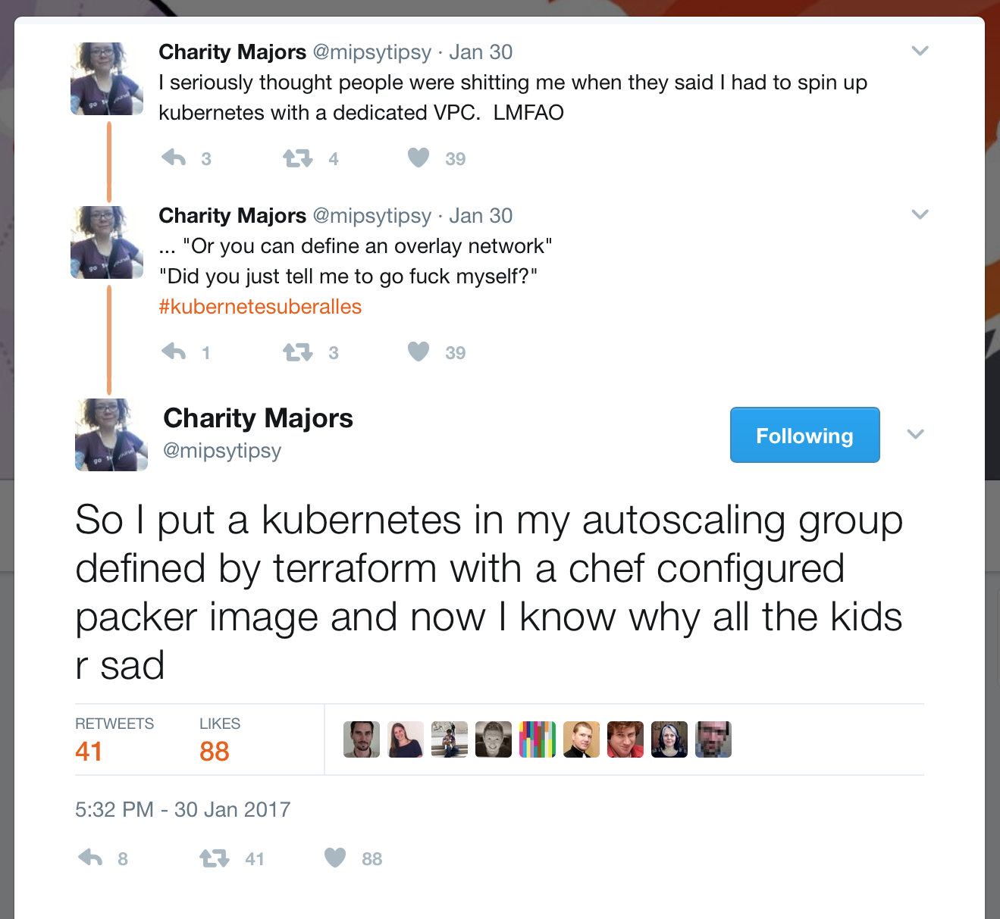
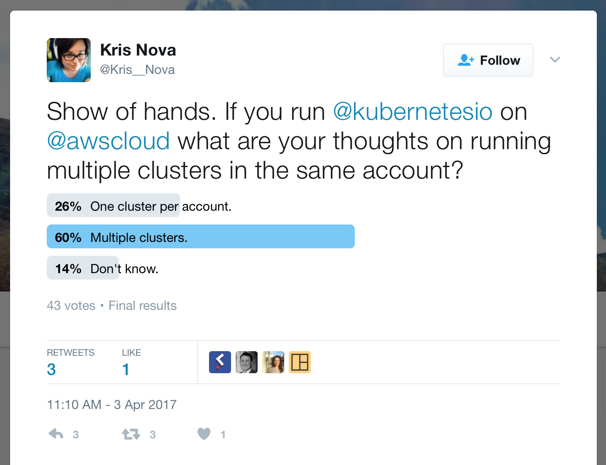
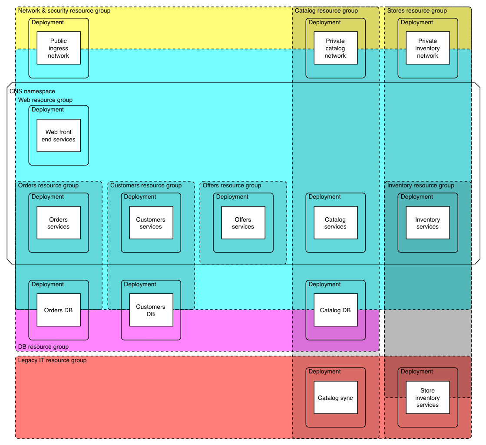

<!--
    This Source Code Form is subject to the terms of the Mozilla Public
    License, v. 2.0. If a copy of the MPL was not distributed with this
    file, You can obtain one at http://mozilla.org/MPL/2.0/.
-->

<!--
    Copyright 2016 Casey Bisson, Joyent
-->

# RFD 36 Triton Service Manager (TSM, code named Mariposa)

Cloud infrastructure (IaaS) providers offer compute, network, and storage resources on which applications can be built and operated. However, those solutions leave it to the customer to assemble those infrastructure components to meet their needs. A given application might require several compute instances for a given component, but the customer is typically responsible for maintaining a mental model of their application, provisioning each instance, and then recognizing the compute instances that support a given software component within a larger list of instances.

Template-driven provisioning tools like Terraform, CloudFormation and many others, along with judicious tagging of instances provide some help to infrastructure customers, but even then there remains a significant gap between raw infrastructure and the applications cloud customers wish to build and run.

The market demonstrates this gap with its investment in Mesos, Kubernetes, and other open source solutions for container scheduling and orchestration. Sadly, those tools have built-in assumptions about running on Linux guests, as well as generally poor support for multi-tenancy and control-plane security that make them unusable in a multi-tenant cloud and require running within VMs on that cloud.

This RFD proposes features that would bring application management tools into our cloud as core features. Roughly speaking, these features include:

- The ability to deploy a set of resources, including compute instances
- The ability to monitor and replace instances representing a logical service if they fail
- The ability to easily scale the number of instances representing a logical service up and down
- The ability to define a logical service, made up of a set of instances that are automatically managed by these features
- The ability to update that logical service definition, and for the management features here to apply those updates by deploying new instances to replace the running instances

That brief list of features is intended as a guide for what this RFD will explore, not as an exhaustive or fully defined list. Additionally, the resource groupings that are described in this RFD may be a target of RBACv2 (described in RFD13 and 48), but they do not replace RBACv2.


## Core principles

- Mariposa offers mechanisms, not policies
- Services must be a first-class object
- Services are made up of instances on Triton
- Users must be able to express their intent about a service, including configuration
- Mariposa must support grouping of services for deployment and management as a set
- Triton (via Mariposa) must take responsibility for converging the infrastructure to the desired state of the service
- Service health is a first class attribute of the service
- Service lifecycle is a first class notion
- Mariposa must support fine-grained placement of resources
- Mariposa must support RBAC access control
- Mariposa must provide a mechanisms for observability, including monitoring, logging, auditing, and debugging


## Prior art

There is no one example of exactly what this RFD proposes, but there are a number of examples in which some portion of the features and principles described here have been implemented.


### CloudFormation, Terraform, and other templated deployment tools

AWS' [CloudFormation](https://aws.amazon.com/cloudformation/) is the first-class solution for deploying or provisioning a set of resources on AWS. CloudFormation templates can specify VPC details, IAM policies, load balancer configuration, Auto Scaling Groups, and many other AWS resources. [CoreOS is just one example](https://coreos.com/kubernetes/docs/latest/kubernetes-on-aws.html) of vendors using CloudFormation to make installation of software on AWS easier. [OpenStack's Heat template features and format](https://wiki.openstack.org/wiki/Heat) are (supposed to be) compatible with CloudFormation templates, and the feature was [the key target of an open source effort to provide compatibility between Open Stack and Triton](https://github.com/icclab/sdc-heat).

CloudFormation can make it easy to provision a set of resources, but it does nothing to improve management after provisioning. The specific implementation is also often criticized, especially by those using other cloud provisioning tools, like [Hashicorp's Terraform](https://www.terraform.io/). Despite these inadequacies, the ease of use cloud users enjoy by being able to paste a deployment template (a manifest, as described elsewhere in this document), click a button, and provision a large set of resources without having to install and configure other software is unmatched by alternatives.


### Auto Scaling Groups

AWS' [Auto Scaling Groups](https://aws.amazon.com/autoscaling/) represent a very basic example of service definition with supervision. Though most people thing of Auto Scaling as a way to respond to performance metrics, the first mode of operation is actually just as a supervisor with health checks:

> Whether you are running one Amazon EC2 instance or thousands, you can use Auto Scaling to detect impaired Amazon EC2 instances and unhealthy applications, and replace the instances without your intervention. This ensures that your application is getting the compute capacity that you expect.

Once an Auto Scaling Group is defined (a service definition, as described elsewhere in this document), AWS customers can easily change the number of running instances of that service. It's [entirely optional to connect performance metrics to it](https://aws.amazon.com/autoscaling/getting-started/) for fully automated scaling.

CloudFormation and Auto Scaling Groups represent some of the most important baseline features proposed for Mariposa, especially the deep integration with the cloud IaaS, but neither of them supports the management features that are also required for users building and running cloud applications today.


### Compose

Most every early Docker user has experienced a moment of great joy when discovering Docker Compose and using it to run a composed set of containers via a single manifest. Sadly, that joy was often later followed by the realization that running Docker Compose in production across multiple VMs required substantially more work, including the use of Docker Swarm (or Swarm Mode on more recent versions of Docker). On Triton, however, because the Docker API is exposed via sdc-docker and users can address an entire data center without needing Docker Swarm or creating any VMs, Docker Compose has proven incredibly powerful.

The critical feature Docker Compose offers over the Docker client itself is the ability to define [one or more services in a manifest, typically named `docker-compose.yaml`](https://docs.docker.com/compose/compose-file/). The [service definition](https://docs.docker.com/compose/compose-file/#compose-file-structure-and-examples) includes features that are common to other examples here, including Kubernetes, Mesos+Marathon, and others. When combined with the [Autopilot Pattern](http://autopilotpattern.io), it is possible to [automate the operations of stateful applications](https://www.joyent.com/blog/persistent-storage-patterns#databases) so that [they operate statelessly from the perspective of the scheduler](https://www.joyent.com/blog/app-centric-micro-orchestration#handling-persistent-data). We've even demonstrated this with [MySQL on Autopilot](https://github.com/autopilotpattern/mysql). For example:

Start a single node of MySQL. This node will become the primary, because no other node is currently running:

```bash
$ docker-compose up -d
Creating tritonmysql_consul_1
Creating tritonmysql_mysql_1
```


Add two read-only MySQL replicas by scaling the number of MySQL instances to three:

```bash
$ docker-compose scale mysql=3
Creating and starting tritonmysql_mysql_2 ... done
Creating and starting tritonmysql_mysql_3 ... done
```

Check the primary to see that the replicas have registered:

```bash
$ docker exec -it tritonmysql_mysql_1 mysql -urepluser -p<password> -e "SHOW SLAVE HOSTS"
+-----------+-----------------+------+-----------+--------------------------------------+
| Server_id | Host            | Port | Master_id | Slave_UUID                           |
+-----------+-----------------+------+-----------+--------------------------------------+
|     38003 | 192.168.130.233 | 3306 |      6431 | 2a5c4dfa-1bc1-11e7-8d2c-90b8d09cb4b6 |
|     30173 | 192.168.131.1   | 3306 |      6431 | 2a806bf6-1bc1-11e7-8d2c-90b8d0cd9a09 |
+-----------+-----------------+------+-----------+--------------------------------------+
```


Insert data on the primary:

```bash
$ docker exec -it tritonmysql_mysql_1 bash -c 'curl -s -o words.sql --fail https://gist.githubusercontent.com/misterbisson/0c8b944a5adfd5db2f47b29a657164b0/raw/37bcc7030a5e63869a1ab45367df9338cb8868dc/words.sql && mysql -udbuser -p<password> demodb < words.sql && rm words.sql'
```

Check that it was replicated to the read-only replicas:

```bash
$ docker exec -it tritonmysql_mysql_2 mysql -udbuser -p<password> demodb -e "SELECT COUNT(1) FROM words"

+----------+
| COUNT(1) |
+----------+
|   471772 |
+----------+
```

Check the status of a replica:

```bash
$ docker exec -it tritonmysql_mysql_2 mysql -urepluser -p<password> -e "SHOW SLAVE STATUS\G"
*************************** 1. row ***************************
               Slave_IO_State: Waiting for master to send event
                  Master_Host: 192.168.130.193
                  Master_User: repluser
                  Master_Port: 3306
                Connect_Retry: 60
              Master_Log_File: mysql-bin.000004
          Read_Master_Log_Pos: 6876776
               Relay_Log_File: mysqld-relay-bin.000002
                Relay_Log_Pos: 6876986
        Relay_Master_Log_File: mysql-bin.000004
             Slave_IO_Running: Yes
            Slave_SQL_Running: Yes
              Replicate_Do_DB:
          Replicate_Ignore_DB:
           Replicate_Do_Table:
       Replicate_Ignore_Table:
      Replicate_Wild_Do_Table:
  Replicate_Wild_Ignore_Table:
                   Last_Errno: 0
                   Last_Error:
                 Skip_Counter: 0
          Exec_Master_Log_Pos: 6876776
              Relay_Log_Space: 6877191
              Until_Condition: None
               Until_Log_File:
                Until_Log_Pos: 0
           Master_SSL_Allowed: No
           Master_SSL_CA_File:
           Master_SSL_CA_Path:
              Master_SSL_Cert:
            Master_SSL_Cipher:
               Master_SSL_Key:
        Seconds_Behind_Master: 0
Master_SSL_Verify_Server_Cert: No
                Last_IO_Errno: 0
                Last_IO_Error:
               Last_SQL_Errno: 0
               Last_SQL_Error:
  Replicate_Ignore_Server_Ids:
             Master_Server_Id: 27178
                  Master_UUID: c5f9870b-1fae-11e7-a6c9-90b8d0b39d83
             Master_Info_File: /var/lib/mysql/master.info
                    SQL_Delay: 0
          SQL_Remaining_Delay: NULL
      Slave_SQL_Running_State: Slave has read all relay log; waiting for the slave I/O thread to update it
           Master_Retry_Count: 86400
                  Master_Bind:
      Last_IO_Error_Timestamp:
     Last_SQL_Error_Timestamp:
               Master_SSL_Crl:
           Master_SSL_Crlpath:
           Retrieved_Gtid_Set: c5f9870b-1fae-11e7-a6c9-90b8d0b39d83:1-12
            Executed_Gtid_Set: c5f9870b-1fae-11e7-a6c9-90b8d0b39d83:1-12
                Auto_Position: 1
```


Remove the MySQL primary, causing a new primary to be elected:

```bash
$ docker rm -f tritonmysql_mysql_1
tritonmysql_mysql_1
```

Check the status of another replica, after the loss of the old primary:

```bash
$ docker exec -it tritonmysql_mysql_3 mysql -urepluser -p<password> -e "SHOW SLAVE STATUS\G"
*************************** 1. row ***************************
               Slave_IO_State: Waiting for master to send event
                  Master_Host: 192.168.130.238
                  Master_User: repluser
                  Master_Port: 3306
                Connect_Retry: 60
              Master_Log_File: mysql-bin.000001
          Read_Master_Log_Pos: 6877002
               Relay_Log_File: mysqld-relay-bin.000002
                Relay_Log_Pos: 634
        Relay_Master_Log_File: mysql-bin.000001
             Slave_IO_Running: Yes
            Slave_SQL_Running: Yes
              Replicate_Do_DB:
          Replicate_Ignore_DB:
           Replicate_Do_Table:
       Replicate_Ignore_Table:
      Replicate_Wild_Do_Table:
  Replicate_Wild_Ignore_Table:
                   Last_Errno: 0
                   Last_Error:
                 Skip_Counter: 0
          Exec_Master_Log_Pos: 6877002
              Relay_Log_Space: 839
              Until_Condition: None
               Until_Log_File:
                Until_Log_Pos: 0
           Master_SSL_Allowed: No
           Master_SSL_CA_File:
           Master_SSL_CA_Path:
              Master_SSL_Cert:
            Master_SSL_Cipher:
               Master_SSL_Key:
        Seconds_Behind_Master: 0
Master_SSL_Verify_Server_Cert: No
                Last_IO_Errno: 0
                Last_IO_Error:
               Last_SQL_Errno: 0
               Last_SQL_Error:
  Replicate_Ignore_Server_Ids:
             Master_Server_Id: 23347
                  Master_UUID: a7accd33-1faf-11e7-a6cf-90b8d080d1c5
             Master_Info_File: /var/lib/mysql/master.info
                    SQL_Delay: 0
          SQL_Remaining_Delay: NULL
      Slave_SQL_Running_State: Slave has read all relay log; waiting for the slave I/O thread to update it
           Master_Retry_Count: 86400
                  Master_Bind:
      Last_IO_Error_Timestamp:
     Last_SQL_Error_Timestamp:
               Master_SSL_Crl:
           Master_SSL_Crlpath:
           Retrieved_Gtid_Set: a7accd33-1faf-11e7-a6cf-90b8d080d1c5:1
            Executed_Gtid_Set: a7accd33-1faf-11e7-a6cf-90b8d080d1c5:1,
c5f9870b-1fae-11e7-a6c9-90b8d0b39d83:1-12
                Auto_Position: 1
```

Check the status of the new primary:

```bash
$ docker exec -it tritonmysql_mysql_2 mysql -urepluser -p<password> -e "SHOW SLAVE HOSTS"
+-----------+---------------+------+-----------+--------------------------------------+
| Server_id | Host          | Port | Master_id | Slave_UUID                           |
+-----------+---------------+------+-----------+--------------------------------------+
|     43951 | 192.168.131.4 | 3306 |     23347 | a749daac-1faf-11e7-a6cf-90b8d0943fd2 |
+-----------+---------------+------+-----------+--------------------------------------+
```

Bring the MySQL composition back up to full strength:

```bash
$ docker-compose scale mysql=3
Creating and starting tritonmysql_mysql_4 ... done
```

Do a rolling update of all three MySQL containers. Typically, this is how you'd deploy an updated image, or configuration changes (for configuration details in the manifest or environment variables). Docker Compose automatically detects those types of changes and will replace containers on `docker-compose up -d`; however, the following example sets the `--force-recreate` flag instead:

```bash
$ docker-compose up -d --force-recreate mysql
Recreating tritonmysql_mysql_3
Recreating tritonmysql_mysql_4
Recreating tritonmysql_mysql_2
```

That example demonstrates Docker Compose's features to turn a a manifest—the `docker-compose.yml` file—into running containers and use it to manage the lifecycle of those containers. The MySQL containers, in turn, demonstrate how even traditionally stateful applications that expect persistent filesystems can be operated in ways that automate their management and make them as easy to operate as stateless applications (see also [stateful, with internal state management
](#stateful-with-internal-state-management), below.


### Mesos+Marathon and Kubernetes

Mesos' history is older than Docker's, but attention on Mesos seemed to grow with the release of [Marathon, a Mesos framework for running Docker containers](https://mesosphere.github.io/marathon/). That combo pioneered cluster management, scheduling, and orchestration of Docker containers, and it was the foundation of many of the earliest Docker in production success stories. Those interested in running Docker containers seem to have mostly moved on to Kubernetes now, but Marathon still deserves mention for one critical reason:

Mesos+Marathon and Docker Compose competed in the marketplace for a time, and the features of the two are worth comparing.

- Both allow you to define applications using manifest files
- Both make it easy to scale and update applications
- Compose runs entirely in the client (in a way, it's like a Docker-specific version of Hashicorp's Terraform), but Mesos+Marathon runs in the cloud with your apps
- Compose can't monitor and re-schedule applications if they fail, but Mesos+Marathon supports that by default

This feature comparison is important because it highlights what most users seem to want for most applications: the ease of use and convenience of Docker Compose with the supervisory features of Marathon, all offered as a service.

However, Kubernetes has since replaced Mesos+Marathon as the default solution in many people's minds for container orchestration. Kubernetes offers many of the same features as Mesos+Marathon:

- Cluster management, scheduling, and orchestration of Docker containers
- Uses manifests to define applications
- Makes it easy to scale and update Dockerized applications
- Runs in the cloud with your apps (often self-hosted/operated)
- Monitors and re-schedules containers if they fail

Additionally, Kubernetes offers features not found natively in Mesos+Marathon, or at least not in earlier versions before Kubernetes took Mesos+Marathon's place:

- [Kube-proxy](https://kubernetes.io/docs/admin/kube-proxy/) load-balancing
- DNS-based discovery (also present in Docker for the past year)

In practice, Kubernetes is also used in conjunction with a variety of additional tools, sometimes commercial, for logging, monitoring, and network virtualization.

If the container is viewed as a type of compute virtualization, then users running Kubernetes (or any other CaaS platform) are effectively duplicating many of the services of a cloud on top of the cloud they run it on. The Linux kernel and its namespaces take the place of a hypervisor and hardware virtual machines. The [Kubernetes controller](https://kubernetes.io/docs/admin/kube-controller-manager/) (one HA set per cluster) and [Kublet](https://kubernetes.io/docs/admin/kubelet/) (on each node) form the control plane and do the work of cluster management. This layering of a cloud creates some complexity, as [highlighted by Charity Majors](https://twitter.com/mipsytipsy/status/826241609972932608) and [Kris Nova](https://twitter.com/Kris__Nova/status/848960871665725443):





A separate question about [whether or not AWS would offer Kubernetes-as-a-service](https://twitter.com/cloud_opinion/status/849426011271954432) unearthed [a pair of interesting GitHub issues](https://twitter.com/catlgrep/status/849429522218967042) for AWS' [ECS scheduler, Blox](https://aws.amazon.com/blogs/aws/blox-new-open-source-scheduler-for-amazon-ec2-container-service/).


## What types of applications is Mariposa intended for?

### Stateless

Stateless applications...12 factor apps...call them what you may, they're easy. They're the hello world for every containers-as-a-service platform. By eliminating the problems with state, the CaaS platform simply has to inject configuration (including secrets. Discovery can be done at the infrastructure layer (CNS on Triton is an example, though buggy DNS clients make that problematic), or it can be done at the application layer (as Consul is used by ContainerPilot).


### Stateful, with internal state management

It is possible to [automate the operations of stateful applications](https://www.joyent.com/blog/persistent-storage-patterns#databases) so that [they operate statelessly from the perspective of the scheduler](https://www.joyent.com/blog/app-centric-micro-orchestration#handling-persistent-data). These solutions may not work for every application or for every CAP guarantee, but they can work for many. Some examples include [Consul on Autopilot](https://github.com/autopilotpattern/consul), [MySQL on Autopilot](https://github.com/autopilotpattern/mysql), and [Mongo on Autopilot](https://github.com/autopilotpattern/mongodb).

As currently implemented (based on the limitations of the tools and infrastructure), this process requires that each node get its state over the network at start time. This can require cloning from an existing node (as in Consul and Mongo), or restoring a filesystem backup and then syncing with the primary (as in MySQL).

A common criticism of that approach is that upgrading an existing instance takes longer than necessary, because the tools and infrastructure provision a new instance with none of the state of the instance it is intended to upgrade/replace. However, this internalization of state or persistence management is especially important at other critical times in an application's lifecycle:

- Scaling up
When scaling an application is scaled up, there can be no presumption that there is an existing filesystem a new instance can use. Instead, the new instances must be bootstrapped by copying/generating their state from elsewhere.
- Recovery from the loss of a node
Recovery in this case is effectively the same as scaling the application up after it was unexpectedly scaled down. Again, the application must be prepared to copy or construct state for a the replacement instance.

See also [the example with MySQL on Autopilot running in Docker Compose](#compose), above.


### Stateful, with external state management

Despite some of the operational advantages to applications that internalize the management of their persistence layer, we must acknowledge that very few applications do so. These applications may have documented approaches for backing up their filesystem state, adding replicas, performing upgrades on top of an existing filesystem, and recovering after filesystem failures. These apps may have varying resiliency to the loss of a filesystem or entire instance(s). This RFD generalizes this problem to a need for persistent filesystems that are defined separately from the compute instances and whose lifecycle is managed separately.

Triton provides limited mechanisms for this now:

- [sdc-docker supports `--volumes-from`](https://apidocs.joyent.com/docker/features/volumes), which allows one container to be used as the storage volume for another
- [RFD26 proposes NFS shared volumes](https://github.com/joyent/rfd/blob/master/rfd/0026/README.md#introduction) which are implemented as zones
- [ZFS datasets can be delegated to an instance](https://docs.joyent.com/private-cloud/instances/delegated-data-sets), though it is [not safe to delegate datasets to untrusted users](https://github.com/joyent/rfd/blob/master/rfd/0044/README.md#safety-considerations)
- [`vmadam`](https://wiki.smartos.org/display/DOC/Using+vmadm+to+manage+virtual+machines#Usingvmadmtomanagevirtualmachines-UpdatingaVM) and the [operator portal](https://docs.joyent.com/private-cloud/instances) support reprovisioning instances, but that feature largely requires a delegated dataset (see above), and is [not exposed publicly via CloudAPI](https://github.com/joyent/node-triton/issues/141)

For the most part, however, instances are provisioned and left running indefinitely while operators update their software using traditional workflows. This RFD will discuss some potential features that may be added to improve support for these applications below.


### Applications presented as services to others

A pattern that can be found in organizations of any size, but is especially common among larger organizations, is for responsibility over different components of an application to be split among multiple teams. A team of DBAs might be responsible for the database(s) while another team is responsible for the application layer. Yet another team might be responsible for all the ecommerce components.

This RFD will discuss the permissions model that might support that only briefly (see RFDs 13 and 48 for more), but will focus on the workflow details and features necessary to support this use.

These applications may fit any of the categories of statefulness described above, with some additional characteristics about how consumers of those applications expect to access them.

Coordination of discovery of the endpoint(s) providing a given service (separate from the discovery of the existence of the service) is often complex. Though a team may choose internally to use [Consul](https://www.consul.io) for discovery between their application components, enforcing that decision on all teams, or even managing Consul services (and permissions) across teams can be a significant challenge.

Often, cross-team discovery expectations and solutions match general expectations of discovery on the internet:

- DNS (though most clients are buggy, and DNS lookups are slow)
- Load-balancers with well-known DNS names (see above) or IPs (see below)
- [Virtual IPs](https://en.wikipedia.org/wiki/Virtual_IP_address) (called [Elastic IPs](http://docs.aws.amazon.com/AWSEC2/latest/UserGuide/elastic-ip-addresses-eip.html) by AWS) that are well-known to the consumers of the services (though moving Elastic IPs can take time, see below)

Triton provides some solutions for this now:

- [Triton CNS](https://www.joyent.com/blog/triton-cns-and-vanity-domains) makes it possible to use well-known DNS names to access any number of instances providing the same service. This works well for web browsers and other consumer applications with well-behaved DNS implementations, but those are exceptional cases and most DNS clients are buggy)
- There are a number of ways to approach [load balancing on Triton](https://www.joyent.com/networking-and-security/load-balancing), but none that are fully as-a-service

This RFD will discuss some potential features that may be added to improve support for these applications below.


## Key objects proposed in this RFD

[Services](#service), [deployment groups](#deployment-group), and [deployment metadata](#deployment-meta-including-secrets) are the key objects or abstractions proposed in this RFD.


### Service

Services are at the core of Mariposa, and they draw their definition from Auto Scaling Groups, Docker Compose, Marathon, and others [discussed above](#prior-art): in practice, services are any number of compute instances running the same software image and configuration; though conceptually services are just a definition of what the user wants. Defining services, rather than manually creating instances, allows users to specify what they want and how many of them while Mariposa does the work of creating and removing instances as needed to conform to the user's desired state.

A service may represent a complete application, if that application runs in a single container, but it's expected that most applications will be comprised of multiple services. The smallest unit of a service is a single Triton instance, just as an Auto Scaling Group can't target anything smaller than a single EC2 instance. This RFD intentionally avoids operating inside an instance, even though that's the operational model for many of the prior art examples. That isn't to say that isn't an interesting problem or that userland schedulers should not be used on Triton, just that it's not Triton's problem to solve. Triton is a solution for orchestrating cloud infrastructure; it is explicitly not a solution for managing what happens inside the compute instances it creates.

Though many of the examples of prior art above focus on Docker containers, this RFD expects that users would want to use all forms of compute available in Triton to run service instances, including:

- Infrastructure containers
- KVM virtual machines
- Docker containers
- Manta jobs

The prior art examples given above focus on services that run continuously, and that is the priority, but nothing in this RFD should be taken to exclude support for services that run on demand or on a schedule defined by the service operator. Fo


### Deployment group

It is expected that most applications are made up of multiple [services](#service). A deployment group defines a set of services and other resources the application operator wishes to work on as a set. It's possible that an entire application run as a single deployment group, but also likely, especially for large applications, that the entire application will be managed in separate deployment groups that share network configuration and publish or consume amongst each other.

The models for deployment groups are [CloudFormation, Terraform](#cloudformation-terraform-and-other-templated-deployment-tools), and [Docker Compose](#compose). Those tools allow users not only to define services (or Auto Scaling Groups on AWS), but also to define other resources, including volumes and networks, needed for a given deployment. Combining these resources that are managed as a group by a single team into a single manifest, even if those resources are shared with other teams or deployments, allows them to be versioned and interacted with as a group, and fits the growing consumer expectations that they should and can manage infrastructure as code.

Interacting with a set of resources as a group can include duplicating the deployment to create a staging environment, or to create a new instance of a single-tenant application that's presented as a service to another customer. Recognizing the user's need to deploy things as a group provides semantic context that makes it easier to support both those workflows.

In addition to [services](#service), other Triton resources that might be included in a deployment group could include [compute instances](https://docs.joyent.com/public-cloud/instances), [network fabrics](https://docs.joyent.com/public-cloud/network/sdn), [firewall rules](https://docs.joyent.com/public-cloud/network/firewall), and [RFD26 volumes](https://github.com/joyent/rfd/tree/master/rfd/0026), as well as other resources we might create in the future.


### Deployment meta (including secrets)

Many applications require configuration values which are undesirable or unsafe to set in the application image or stored in a repo with the service definition. Additionally, these details are often shred among multiple services that are deployed together. These can include license keys, a flag setting whether it's a staging or production environment, usernames and passwords, and other details.

Additionally, there are often details about a deployment that are known at the orchestration level that are useful within applications. An example might include the number of instances the user has defined for a service. That number can then be used by the service to manage its sharding behavior, if so configured.

This document proposes a simple method of storing those details and injecting them into services that offers better security than embedding them in the images or provisioning scripts. It is intended to easily interoperate with existing applications, rather than propose new methods of secret sharing that would require changes in customer applications.


## Significant questions and relationship to other work

The addition of these new abstractions raises some questions that are not yet fully defined in this RFD. Additionally, this RFD proposes things that need to be put in context with other RFDs.


### Task queue

The simple cases of scaling, upgrading, even stopping all the instances of an service can take time...sometimes significant time. While we're already familiar with the time it takes for actions on individual instances to complete, operating on a service that may have hundreds or thousands of instances is expected to take significantly longer and likely require some form of queuing mechanism. We should also be aware that operating at that scale has broader, possibly more disastrous consequences.

In the case that either the user or systems are in error, either in defining the ideal state of the services or in reconciling the actual state with that ideal, users must have a mechanism to stop further changes from being executed by Mariposa. Users must be able to interact with that work queue, perhaps simply to freeze it or to remove tasks from it. And, we need to consider the need to stop the automatic creation of new tasks in the work queue while users may be working to resolve incidents.

The internal service that's responsible for reconciling differences between the user's defined ideal state for services and the actual state of the infrastructure will likely need to manage this queue. However we define that queue, we need to design it in such a way that recognizes the fallibility of users and systems, and gives users an opportunity to stop further changes, and where possible, reverse course.


### Health

A significant aspect of this RFD depends on some notion of the "health" of an instance. Triton has a notion of instance states (TODO: there's an awesome, if only sort-of accurate, diagram showing valid instance state transitions in which shows everything can go to everything; that should be linked here if it can be found), which can include "provisioning" or "running" and similar, but those states don't reflect the health of the application inside the instance.

The failure of PID 1 in a Docker instance will cause the instance transition to the "stopped" state, and may trigger a "restarting," if the instance's restart policy is configured that way (actually, the failure of PID 1 in any instance will trigger this, but it's more common in Docker instances). However, even that behavior cannot be depended on for the needs of most cloud users. Instead, users need to be able to define a test of health, and they expect the scheduler to monitor that health and react to it by scheduling new instances to replace failed instances.


#### What is health?

From an infrastructure level, the best definition of health is that the application operator knows a healthy or unhealthy instance when they see it (apologies to [justice Potter Stewart](https://en.wikipedia.org/wiki/Jacobellis_v._Ohio)), and for that reason this RFD leaves it to the application operator to define the test that determines the health of an instance.

Though health has traditionally been a binary state, [Kubernetes differentiates between an instance's "liveliness" and it's application's "readiness"](https://kubernetes.io/docs/tasks/configure-pod-container/configure-liveness-readiness-probes/) and [Consul allows applications to declare themselves degraded](https://www.consul.io/docs/agent/checks.html) (a "warning" state via an HTTP 429 response). Because this RFD covers both the provisioning of infrastructure—compute instances providing a service—and the health of the service that infrastructure serves, it needs to consider the distinction Kubernetes makes between an instance that has successfully started vs. the health of the application within it. To accommodate that, the strawman config for this RFD proposes that instances be given a window during which that can become healthy after the instance is started.

Though this RFD refuses to attempt a universal definition of "health" for a service, it does attempt to define what should happen if an instance of a service is determined to be unhealthy, within some user configurable space. In broad strokes, unhealthy instances of a service should not be discoverable (with implications for CNS, the only Triton-provided discovery mechanism as this time), and the infrastructure should attempt to schedule replacement instances of that service (rescheduling).


#### Health vs. discovery

Before continuing, we need to acknowledge that the presence of an instance in a discovery service is never a guarantee that it is operating correctly. Modern applications must accept that any given request may fail due to a number of uncontrollable factors. So, discovery is not a guarantee of availability, but it can help limit the number of instances that an application attempts to interact with to those that are _expected_ to be available. This is important to improving performance in any substantially scaled application.

Given these constraints, it is reasonable that services as defined in this RFD and their health definitions interact with [Triton Container Name Service](https://www.joyent.com/blog/tritoncns-and-docker) and that CNS not include instances of a service that have failed their health checks, though the full details and implications this has on [CNS](https://github.com/joyent/rfd/blob/master/rfd/0001/README.md) need further definition.


#### Health vs. rescheduling

Though it may not be appropriate for every application, many cloud customers—including both users of [Autoscaling Groups](#auto-scaling-groups) and [Mesos-like schedulers](#mesos-marathon-and-kubernetes)—have developed expectations and dependencies on the infrastructure's ability to reschedule instances that have failed their health checks. That said, the implications of this seemingly simple proposition are significant. [AWS's infamous 2011 outage](https://aws.amazon.com/message/65648/) was caused by a netsplit that caused a "storm" of activity that overwhelmed the infrastructure.

Clearly, meeting customer expectations regarding rescheduling while also avoiding self-inflicted disaster that may spiral out of control from transient conditions including network interruptions or even a single compute node failure may be challenging. Given the target of 2,000 instances per CN, and assuming every instance on the CN is a managed service, a single CN failure could trigger a substantial amount of rescheduling activity. It's easy to understand how a netsplit that affects even a small portion of a DC could be overwhelming. That challenge, however, demands solutions.

This RFD does not attempt to provide answers to the questions raised by by this challenge, just to acknowledge it. It's possible that the solution may include rate limiting, or other approaches, but that remains an open question to be solved. This RFD also recognizes that rescheduling must not be required for a service, as there are some applications for which it would be harmful. This RFD does not take on those application concerns; instead, it intends to expose a mechanism for application operators to control Triton's behavior to meet their needs.


#### Rescheduling vs. restarting vs. starting vs. garbage collection

[Kubernetes' distinction](https://kubernetes.io/docs/tasks/configure-pod-container/configure-liveness-readiness-probes/#defining-readiness-probes) between "liveliness" (whether or not the container is running) and "readiness" (whether or not the container is healthy and ready to receive requests) is particularly important as the container is starting, as noted in the given example:

> [A]n application might need to load large data or configuration files during startup. In such cases, you don’t want to kill the application, but you don’t want to send it requests either.

That example closely links the questions in this section about rescheduling and discovery, as well as recognizes the difference between the health of an application in an instance vs. the running state of the instance. To accommodate that difference, Kubernetes recognizes an `initialDelaySeconds` in the configuration of health checks, defined as the "number of seconds after the container has started before liveness probes are initiated."

Kubernetes also distinguishes between restarting an instance and rescheduling it. [The `restartPolicy` for a pod](https://kubernetes.io/docs/concepts/workloads/pods/pod-lifecycle/#restart-policy) "only refers to restarts of the containers by the kubelet on the same node." Confusingly, Kubernetes has two different abstractions for rescheduling on containers to different nodes: [ReplicationControllers](https://kubernetes.io/docs/concepts/workloads/controllers/replicationcontroller/#rescheduling) and [ReplicaSets](https://kubernetes.io/docs/concepts/workloads/controllers/replicaset/#when-to-use-a-replicaset), which are managed via [Deployments](https://kubernetes.io/docs/concepts/workloads/controllers/deployment/). Both promise to do much the same thing:

> [W]hether you have 1 pod you want to keep running, or 1000, a ReplicationController will ensure that the specified number of pods exists, even in the event of node failure or pod termination.

In Docker, [rescheduling policies are set in Swarm](https://docs.docker.com/swarm/scheduler/rescheduling/) (though it's not clear how that policy is set in the Docker Engine's new [Swarm Mode](https://docs.docker.com/engine/swarm/)), and [Docker Services](https://docs.docker.com/engine/swarm/services/) are expected to be rescheduled:

> The Docker swarm mode scheduler may reschedule your running service containers at any time if they become unhealthy or unreachable

Like Kubernetes, Docker distinguishes rescheduling from [restart policy](https://docs.docker.com/compose/compose-file/#restartpolicy).

Our own experience with CN reboots does not appear to be reflected in the examples discussed above. In most cases on Triton, if a CN reboots, it will be back online with instances running within 60 seconds. That time period might be faster than makes sense to attempt to reschedule all the instances on it (our goal is to expect 2,000 instances per CN). This is especially important in cases where data is persisted to storage resident in the CN. Though application operators should expect and plan for irrecoverable storage and CN failures, it may be desirable to ride out a temporary loss due to a CN failure and let an application node restart and rejoin its peers.

Given these details, the following restart conditions may be appropriate:

- If the instance is determined to be unhealthy by the health checking mechanism
- If PID1 in the instance fails with a non-zero exit
- If the CN reboots
- Always, regardless of reason, even if PID1 exited zero
- Never

Additionally, the examples given above suggest other some other restart criteria to consider:

- The maximum number of attempts before giving up
- The window after a restart (or a normal start) before which the scheduler will attempt health checks

These configuration options assume and imply that the scheduler will be biased toward restarting instances on the same CN, rather than rescheduling them to other CNs. However, rescheduling becomes more likely as application operators restrict the conditions under which an instance restart on the same CN will be attempted. Example: if the service is set **not** to restart instances on CN reboots, the scheduler is expected to start attempting to reschedule the instance as soon as it detects the CN has failed.

The scheduler may also need configuration options for how it should garbage collect stopped instances. Application operators might wish to preserve instances that rescheduled due to an failure (non-zero exit or failed health checks), but do they want to keep old instances after a CN reboot if they've already been rescheduled elsewhere?


### Relationship between these resources and RBACv2

Though this document does not define any aspect of RBACv2 ([see RFD48 for that](https://github.com/joyent/rfd/blob/master/rfd/0048/README.md)), the abstractions defined here need to be considered in that context. Certainly, users will expect to be able to control permissions on [services](#service), [deployment groups](#deployment-group), and [deployment metadata](#deployment-meta-including-secrets).

Deployment groups are just one of a number of different logical groupings of resources. As with billing groups, a single object, be it a service, network, volume, or any other, may only be a member of a single deployment group. This differs from more general resource groups that may be used for security purposes or to arrange resources in terms that match the org structure.

For some types of groupings, resources can be in exactly one or zero or one group. For other types of groupings, objects may be in any number of groups.

- Billing groups
An object must be in exactly one group
- Deployment groups
An object must be in zero or one deployment groups
- Security management groups or simple organizational groups
An object may be in any number of security groups
- CNS namespaces
This needs definition

The following illustration is offered as an example of this RFD's understanding of how users may implement groupings for an application.




### Placement and affinity

Application operators need some control over placement of their resources for a variety of reasons. The following list is incomplete, but it identifies the key reasons this RFD considers:

- To control fault domains
- To take advantage of performance domains
- To comply with regulatory requirements


#### Fault domains

Fault domains include individual compute nodes (CNs), entire data centers (DCs), and units of various scales in between. Those units in between may include:

- Power
- Network
- Rack

For many users, a "rack" implies power and network domains, but that assumption is not necessarily true in all cases, especially in private cloud installations that may not conform to the same architecture and topology as our public cloud DCs. However, "rack" is also a very convenient term, and its implications are being increasingly codified in Triton ([see RFD43, for example](https://github.com/joyent/rfd/blob/master/rfd/0043/README.md)).


#### Performance domains

While application operators will often be very carful to scale across different fault domains, they may also need want to place components within the same performance domain. In many cases, the domains are the same, just used for different reasons. It's easy to imagine users wishing to scale applications across many racks, but keeping a full set of services for each application within the same rack. Some users may wish to refine their discovery


#### Regulatory domains

Joyent is familiar with regulatory requirements that require single-tenant hardware for certain applications, or that some applications be guaranteed not to operate on the some hardware with others. Here again


#### Domains, criteria, operators

The above discusses the fault, performance, and regulatory domains that operators may wish to consider for placement. Those are in addition other factors Triton uses to manage placement, such as:

- The networks to which an instance may be connected
- The volumes to which an instance may be connected
- Hardware that can host the instance (SSD drives)

Those factors need to be acknowledged, though users interact with them in ways very different from the placement requirements for fault, performance, and regulatory domains discussed here.

Though the reasons a person may choose to target a domain may vary, the names of the domains appear to remain the same:

- Compute node (CN)
- Rack
- Data center (DC)

Within those, users need to be able to specify different criteria so they may place instances of their services as needed. That criteria might include:

- Group name or UUID (groups may be for deployment, resource, billing, etc.)
- Groups with a specified tag
- Service name or UUID
- Services with a specified tag
- Volume name or UUID
- Volumes with a specified tag
- Instance name or UUID
- Instances with a specified tag
- Compute nodes with a specified tag (CN tags are controlled by DC operators, not customers)
- Compute nodes with a minimum platform image

Finally, the comparison operators:

- `==`: The new container must be on the same node as the container(s) identified by `<value>`.
- `!=`: The new container must be on a different node as the container(s) identified by `<value>`.
- `==~`: The new container should be on the same node as the container(s) identified by `<value>`. I.e. this is a best effort or "soft" rule.
- `!=~`: The new container should be on a different node as the container(s) identified by `<value>`. I.e. this is a best effort or "soft" rule.

Strawman examples, formatted in JSON5:

```json5
{
  "placement": {
    "cn|compute_node": [
      # do not place on a compute node with the specified resource group name
      "group:deployment!=<project name>",
      # try to avoid CNs with the specified service (soft rule, must be a service in this deployment group)
      "service!=~<service name>"
    ],
    "rack": [
      # require that the instance be in the same rack as a CN with a specified tag (but not necessarily on that CN)
      "cn:<tag name>==<tag value>"
    ],
    "dc|data_center": [
      # do not provision in a DC that also has a resource group with a given tag (only evals against resource groups in this org)
      "group:resource:<tag name>!==<tag value>"
    ]
  }
}
```

Notes on the strawman:

- `cn|compute_node` is intended to suggest users can use either `cn` or `compute_node`
- This demonstrates colon-separated/joined naming scheme, as in `group:resource:<tag name>`, but `group.resource.<tag name>` makes about equal sense to the author.


### Auditing

Automation without auditability is dangerous. [RFD50](https://github.com/joyent/rfd/blob/master/rfd/0050/README.md) focuses on improving audit logs for individual instances, but we must recognize the need to audit the resources and automation proposed in this RFD. These logs will be critical for both data center operators and end users. Events that must be auditable include create, update, and delete operations on a service, the automatic scheduling and rescheduling of instances, as well as failed health checks and other events.


## Desirable features not addressed in this RFD

This section discusses features that might make it easier to operate [stateful applications that require external state management](#stateful-with-external-state-management), as well as one that would improve the operation of [applications presented as services to others](#applications-presented-as-services-to-others). These features are not being further addressed in this RFD, but this section summarizes them as they relate to this RFD.

Also, because this RFD assumes the ability to define services running Docker images, all without interaction with the Docker API presented by sdc-docker, we should consider CloudAPI features to support Docker API-style interactions with instances, such as some equivalent of `docker exec`.


### Reprovisioning via public APIs

Though [`vmadam`](https://wiki.smartos.org/display/DOC/Using+vmadm+to+manage+virtual+machines#Usingvmadmtomanagevirtualmachines-UpdatingaVM) and the [operator portal](https://docs.joyent.com/private-cloud/instances) support reprovisioning instances, the feature is [not exposed publicly via CloudAPI](https://github.com/joyent/node-triton/issues/141). Triton and Manta upgrades are done via this private reprovisioning feature. The instance's primary volume is over written with a new image while stateful data in the instance is preserved on another volume in the dataset. This process depends on privileged access, either with a delegated dataset in the instance or with privileges in the global zone.

Though many customers would [happily enjoy the benefits of a delegated ZFS dataset](https://github.com/joyent/rfd/blob/master/rfd/0044/README.md), offering support for reprovisioning depends instead on API mechanisms to manage volumes. Users need to be able to specify what volumes to preserve while the others are overwritten with the new image. CloudAPI provides no mechanism to manage volumes in an instance. AWS' API provides only crude support for mapping EBS block devices to instances, but managing the volumes must be done within the instance itself. Interestingly, [Dockerfiles](https://docs.docker.com/engine/reference/builder/#volume) and the [Docker client](https://docs.docker.com/engine/tutorials/dockervolumes/#adding-a-data-volume) provide straightforward means to define and mount volumes in an instance.

This feature would be one solution to separating the lifecycle of an instance's data from the application, as is needed for [stateful applications that require external state management](#stateful-with-external-state-management). This would make it easier to upgrade applications while preserving their filesystem(s), but would offer no protection against the loss of data if the compute node or its storage subsystems fail.


### Public API support for cloning volumes

While support for [reprovisioning via public APIs](#reprovisioning-via-public-apis) would make normal lifecycle management of applications and their data easier, other features are needed to protect against data loss with [stateful applications that require external state management](#stateful-with-external-state-management).

If we assume the addition of volume awareness for instances to CloudAPI for [reprovisioning via public APIs](#reprovisioning-via-public-apis), then it seems fair to also assume features that would support snapshotting those volumes, backing them up to object storage, restoring them, and cloning them to a volume on a different compute node.

More interesting might be to define a mechanism for an instance to be provisioned with one or more designated clones. If combined with health checking mechanisms described elsewhere in this RFD, we might also imagine automated failover as well. Such a mechanism can make only limited guarantees about consistency. Users would need to understand their applications and the appropriateness of such a clone.


### Volume objects (non-NFS)

The section on [reprovisioning via public APIs](#reprovisioning-via-public-apis) offers some help for separating the lifecycle of the application from its data, while [RFD26](https://github.com/joyent/rfd/blob/master/rfd/0026/README.md#introduction), nearing completion at the time of this writing, adds support for NFS-shared volumes.

The volume objects of RFD26 provide a more explicit means of separating those lifecycles, but the implementation makes [intentional trade-offs to support shared network access to those volumes](https://github.com/joyent/rfd/blob/master/rfd/0026/README.md#non-requirements). While RFD26 volumes will be helpful for a number of use cases, they will not be a good choice for the primary storage for high performance applications such as databases.

Given that, we might also consider adding support for non-shared volumes that live on a compute node and which customers can mount to their instances on that compute node. An example of this can be seen when [using `--volumes-from` with Docker](https://docs.docker.com/engine/tutorials/dockervolumes/#creating-and-mounting-a-data-volume-container). In that case, the user first creates a Docker instance, then maps the volume from that container into a new container.

```bash
# First create a container to hold the volume
# I could create a completely empty container,
# but busybox gives me some management tools
$ docker run -d \
	-v /var/lib/postgresql/data \
	--name=my-data \
	busybox sleep 1095d

# Now map that volume into a new container,
# this one running the app you need
$ docker run -d \
	--volumes-from=my-data \
	--name=my-db \
	postgres:9.6-alpine

# Now see the data volume mapped in the DB container
$ docker exec -it my-app df -h
Filesystem                Size      Used Available Use% Mounted on
<snip...>
/dev/sda1                17.9G      2.2G     14.8G  13% /var/lib/postgresql/data
<snip...>
```

Using containers as a wrapper for data volumes and mapping them  into other containers works OK, but it's difficult to manage and it's not supported for infrastructure containers or KVM instances. Docker has since introduced [explicit volume objects](https://docs.docker.com/engine/reference/commandline/volume_create/), but creating multiple volumes, attaching them to multiple containers, and keeping everything matched up correctly still requires additional effort for which Docker's tooling provides little help. In practice, most users simply map volumes from the host filesystem for this use-case, though even that requires additional layers of management for any reasonably complex use-case.

Host volumes aren't supported on Triton because the customer doesn't own the underlying host—the bare metal compute node. That relationship adds more complexity: while it's possible to create a data container as shown above, Triton provides no mechanism to reserve space on that CN for your later use. Without that, customers have no guarantee that space will be available for them to run their applications attached to their data at a later time (the concept of "reservations" has previously been discussed to address this problem, though I can find no written record of it at this time).


### Remote block stores

Though Joyent has deep experience with remote storage and its limitations (see [one](https://www.joyent.com/blog/magical-block-store-when-abstractions-fail-us), [two](https://www.joyent.com/blog/network-storage-in-the-cloud-delicious-but-deadly), [three](https://ops.faithlife.com/?p=6), it's an expected abstraction in clouds. This is different from [RFD26's shared NFS volumes](https://github.com/joyent/rfd/blob/master/rfd/0026/README.md#introduction) in that they're single-tenant (though [Google's offering](https://cloud.google.com/compute/docs/disks/) in [this space](https://cloud.google.com/docs/compare/aws/storage#block_storage) offers [read+write access for a single host and read-only access for many hosts](https://cloud.google.com/compute/docs/disks/add-persistent-disk#use_multi_instances)), demonstrate reasonably high performance, and are tolerable as the backing store for many database applications.

Remote block stores are the most broadly used solution to the critical problem that application operators face of separating the life cycle of compute instances from the data they create and consume in a way that fits the needs of [stateful applications that require external state management](#stateful-with-external-state-management). It should be emphasized that this does not eliminate the risk of data loss due to equipment failures (centralization of data increases that risk in many ways). Joyent has demonstrated alternatives that include [adding internal state management to application images](#stateful-with-internal-state-management). It should be said that state management that goes beyond remote block storage, such as is [demonstrated above](#compose), is absolutely required in any truly resilient and scalable application, but not offering a solution in this space has critical implications to market acceptance.


### Virtual IPs

Virtual IPs are highly desirable for many users, especially those managing [applications being presented as a service to other users](Applications presented as services to others), though exactly how they should work and what application-level availability guarantees they should offer can differ depending on who you ask. For example, [AWS explains migrating Elastic IPs can take time](http://docs.aws.amazon.com/AWSEC2/latest/UserGuide/elastic-ip-addresses-eip.html#using-eip-migration):

> [T]he process of migrating the Elastic IP address can take a few minutes. [...] If the Elastic IP address is in a moving state for longer than 5 minutes, contact [premium support].

As promised there, users should expect requests to a resource fronted by an Elastic IP fronting a host that has failed should fail, and continue to fail while the IP is being migrated over a period of minutes. AWS doesn't offer any automatic health checking mechanisms, so users must also implement their own tools to migrate the IP.

AWS' guarantees fall far short of the hopes of many users, who would prefer automatic, instant failover with no broken or dropped TCP connections.

The distancing of market offerings from customer expectations is further highlighted with RDS, the defining example of an application presented as a service to other cloud users. [AWS explains that users should not depend on persistent IPs for RDS](https://aws.amazon.com/rds/faqs/):

> Please note that, we strongly recommend you use the DNS Name to connect to your DB Instance as the underlying IP address can change (e.g., during a failover).

The lesson there is that RDS users must build their database client applications in a way that tolerates dropped connections, changed IPs, and other failed requests. Looking beyond AWS at other clouds, it does not appear that anybody offers a solution for application independent high-availability with meaningfully better guarantees than Elastic IPs (in this case, "meaningfully" means "instant failover without dropped connections").

This doesn't mean virtual or persistent IPs are not valuable, however. They are highly desirable, especially for internet-facing services and others that perform better with very long DNS TTLs. They are not, however, a miracle solution that eliminates any need for client-side error handling.


### Docker features we should add to CloudAPI and node-triton

Triton implements a Docker API-compatible interface to manage infrastructure in each data center. This Docker API interface (provided by [sdc-docker](https://github.com/joyent/sdc-docker)) operates in parallel to [CloudAPI](https://apidocs.joyent.com/cloudapi/). Users can accomplish some operations using either API, but others are specific to a single API. Consider the following:


The Triton CLI tool (node-triton) allows users convenient CLI control over Triton infrastructure via CloudAPI. It's actually very similar to what Docker users would expect from using the Docker CLI, especially since [Docker restructured the syntax in version 1.13](https://blog.docker.com/2017/01/whats-new-in-docker-1-13/#h.yuluxi90h1om). However, there are a few features that Docker users expect that also would be hugely valuable to implement in CloudAPI and the Triton CLI.

Some common and useful Docker API/CLI operations not supported via CloudAPI and the Triton CLI include:

- [Starting Docker instances](https://docs.docker.com/engine/reference/commandline/run/) via CloudAPI and the Triton CLI; this implies support for [pulling Docker images](https://docs.docker.com/engine/reference/commandline/pull/), including [logging in to private registries](https://docs.docker.com/engine/reference/commandline/login/)
- [`docker exec...`](https://docs.docker.com/engine/reference/commandline/exec/)
- Setting a timeout when stopping an instance via CloudAPI, as in [`docker stop <container name> --time <seconds>`](https://docs.docker.com/engine/reference/commandline/stop/), including an indefinite timeout
- Mapping volumes from another container, as in [`--volumes-from`](https://docs.docker.com/engine/reference/commandline/run/), as well as mapping [RFD26 volumes](https://github.com/joyent/rfd/blob/master/rfd/0026/README.md#introduction) via `-v` or `--volume`


## Priorities and roadmap

The highest priority item in this RFD is the service abstraction (the competitor to AWS' Auto Scaling Groups). Other abstractions and resources proposed here can be delivered independently, at a later date.


## Revision history

- [Current version: rewritten post-meetup](./)
- [27 March, 2017: kick-off content](https://github.com/joyent/rfd/tree/e4a66d6b5754a045502f971deaedef1c8b8be138/rfd/0036)
- [9 March, 2017: reorganized and added implementation straw man](https://github.com/joyent/rfd/tree/e38e0b02776a286db47c9fccea1e90646b5f31ef/rfd/0036)
- [13 December, 2016: added user stories](https://github.com/joyent/rfd/tree/e1b4b05a236e084de065b0765510ec5069210f30/rfd/0036)
- [13 June, 2016: initial draft focusing on end-user experience](https://github.com/joyent/rfd/blob/8529d2d2f6f386d977c66fbf08bab928b3fc91ba/rfd/0036)