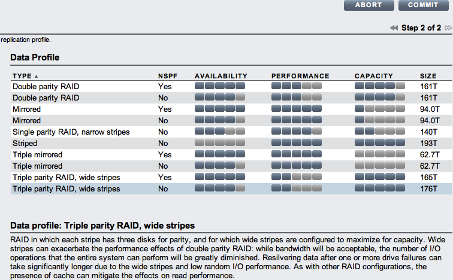

# RFD 53 Improving ZFS Pool Layout Flexibility

Each compute node in Triton is based off of SmartOS. All file system
data is managed by ZFS in a single pool (zpool) of storage. This zpool
is traditionally named `zones`. This zpool is created when the compute
node (or headnode) is first set up.

Today, Triton effectively hard-codes specific zpool layouts. This is
implemented by some of the logic in
[disklayout(1M)](http://smartos.org/man/1m/disklayout). While disklayout
logically allows for a couple of different layouts to be used, Triton
does not allow administrators to specify them. In an ideal, more
appliance centric world, this continues being determined automatically;
however, reality does not allow us to be quite so rigid.  In fact, over
the life time of disklayout.js, there have been many changes to these
hard-code defaults based on sometimes contradictory customer
requirements.

As such, we've reached the point where instead of hard-coding this
information, we should instead choose to expose it. The challenge is to
make this useful to administrators without introducing too much
additional complexity.

## Alternatives for Exposing Options

There are two different ways we could choose to expose control of the
pool topology to the administrator.

### Exposing RAID Stripe Options

The first alternative is to describe pool layouts in a style similar to
`disklayout(1M)`. `disklayout(1M)` has the notion of different layouts,
like `mirror`, that describe how disks are laid out. The supported
profiles today are:

* single - Indicating a single drive should be used for the pool.
* mirror - Indicating drives should be mirrored and then striped.
* raidz1 - Indicating that drives should be put into a RAID-Z1 stripe
* raidz2 - Indicating that drives should be put into RAID-Z2 stripes

Note that this is only intended to allow the operator to have a broad
level of specification. This is not meant to allow or force the operator
to learn about and configure the following which are taken care of
automatically:

1. Stripe Size
2. Assignment of devices as SLOGs and Cache Devices

This is the approach that we have ultimately settled upon.

### Qualitative Descriptions

Another alternative would be to allow for the user to describe
and pick more qualitative options. In this world, the user would have to
basically prioritize the following three axes:

1. Capacity of Storage
2. Performance of Storage
3. Durability of Storage

The challenge with expressing things here is that it makes it harder for
us to set expectations and to really help customers understand what
they'll be ending up with. It also may end up causing us to repeat a
similar class of mistakes and issues that we have with the current
generation of storage layout. Mainly that the ideas of what is best for
performance or capacity may change on a per-customer basis, forcing us
to have conflicting and contradictory desires for what these different
axis represent in terms of actual layouts.

On the other hand, it may also allow us more flexibility and require us
to teach customers less. You don't have to explain how the RAID profiles
work.

It is our belief that while this option is interesting and has
merits (and was in fact the first idea we had), it's not the most
useful solution for this problem.

## Exposing Disk Layout

To enable the configuration flexibility required by this RFD we have chosen
the first alternative; extending and exposing `disklayout(1M)`. The following
enhancements will be made.

* An option will be added to allow the administrator to specify the number
of spares. This will explicitly include the choice of 0 spares.
* An option will be added to allow the administrator to specify that no
cache device should be allocated.
* Support for the `raidz3` layout profile will be added.

## Command Line and Compute Node Setup Changes

This choice should be presented as part of setting up a compute node.
Setting this information should always be considered *optional*. In
other words, existing installations shouldn't have to change anything in
their processes and scripts.

When setting up a compute node via sdc-server, new optional arguments to
control the layout will be provided. If no layout is provided then the
behavior will be unchanged and `disklayout` will be responsible for
selecting the layout using its built-in heuristics.

For `sdc-server` the following new command line options will be added:

* layout
* spares
* cache

When fully specified, the command would look like this:

```
sdc-server setup <uuid> layout=raidz2 spares=0 cache=false [PARAMS]...
```

The way that this information gets passed to the compute node as part of
set up is via CNAPI, which will be enhanced to add the following (optional)
entries into the node.config file:

* layout
* spares
* cache

### Propagating Failure

An important part of extending this interface is to make the error very
clear that when an unsupported layout gets passed through the stack.
Today, many set up failures are hard to diagnose. The work associated
with this rfd should ensure that the following is true:

1. Final validation of the layout is done on the CN during setup
2. When an unknown layout is specified, setup is failed and the fact
that this is the reason set up failed should be obvious.

This likely could be extended to other parts of the CN setup process.

## Future Enhancements

### AdminUI

AdminUI can be enhanced to expose the same new options as sdc-server,

### SAPI Properties

New SAPI properties can be introduced that are used to describe the default
pool layout, number of spares, and cache control. Tools would need to treat
the absence of these properties as equivalent to today's default behavior.

The name of the SAPI properties are beyond the scope of this document;
however, users themselves should never directly interact with SAPI and
instead this should be covered by other means of manipulating the
properties as described below.

To help deal with the software being at different versions, the lack of
the new properties in SAPI should always be treated as no property being set,
which should be equivalent to the default behavior.

#### Managing the Defaults

The new SAPI properties need to be made available to the operator and they
need the ability to inspect and change them, as well as understand their
options. This needs to be represented in both AdminUI and through `sdcadm`.

For sdcadm, I'd suggest that we add a new endpoint to sdcadm for
managing servers explicitly. This is a bit of a straw man and subsumes a
bit of the `sdc-server` tool's use. This could be something like `sdcadm
server`.

Under here in the fullness of time we may want to some of the endpoints
that sdc-server does today. But the main thing to focus on is something
like:

`sdcadm server defaults`

This could be used to get and set the default zpool layout and might be
a good place to allow operators to change things like the default
console.

It may also make sense to have a `sdcadm server setup` which allows for
specifying the hostname, pool layout override, and others. As well as
using that as the vector for the storage pool layout dry run. If we add
the `sdcadm server setup` option, we should make sure that it and the
`sdc-server` code can share implementation where possible and start the
process of deprecating sdc-server in favor of `sdcadm server`.

### Storage Profile Dry Runs

One of the first things that'll come up as soon as we introduce options
is that an operator will ask what do the different pools look like,
what are the trade-offs associated with them, and how much storage is
available is available with a given layout. As part of presenting these,
we should make sure that we take into account the dump and swap space
required, so they get a sense of the fixed costs and their impact.

We'll want to have some kind of ability to perform a storage layout
dry-run. In other words, we should go and run disklayout on the compute
node with the specified profile via ur or some other mechanism and then
report back something for the operator.

In both sdcadm and the browser it may be interesting to put something
together like was done in the fishworks UI. The following image shows an
example of what this looked like:



This is a useful summary and way to view things. While it doesn't make
sense to put this in the CLI server path, making a variant available
there and in the UI is important.

On the CLI this might be a good fit for something under `sdcadm server`,
whether under a setup command or other option.

### Headnode Setup

The last piece of this picture is dealing with headnode setup. We should
put together a new question to prompt what the user wants as the layout
for their headnode and then optionally make this the new default layout
for the DC. It may make sense to logically specify this as two different
questions, but we'll want to be careful about how we do that so as not
to introduce too much additional complexity into the headnode set up
process.

## Upgrading DCs

While a new DC will be able to have the default layout set as part of
its setup, it's worth talking through the flow that we want to use for
updating existing DCs and how that works.

As part of any upgrade, there's no guarantee that the metadata for this
will be added nor should it be required. This is actually the core
tenant: all tools which begin to query this need to treat the absence of
the property as the equivalent of basically saying SDC should decide it.

While diskinfo is part of the platform and thus there may be RAID
profiles that we introduce which disklayout doesn't know about, it
should be possible with the improved CN setup process (which does not
come from the platform) to go through and handle the potential
disconnect and report it in a useful way to the user.

There will be a need for AdminUI, sdcadm, and others to know that some
support for specifying this is available as part of CN setup. As the
implementation is worked through, that will need to be determined.
