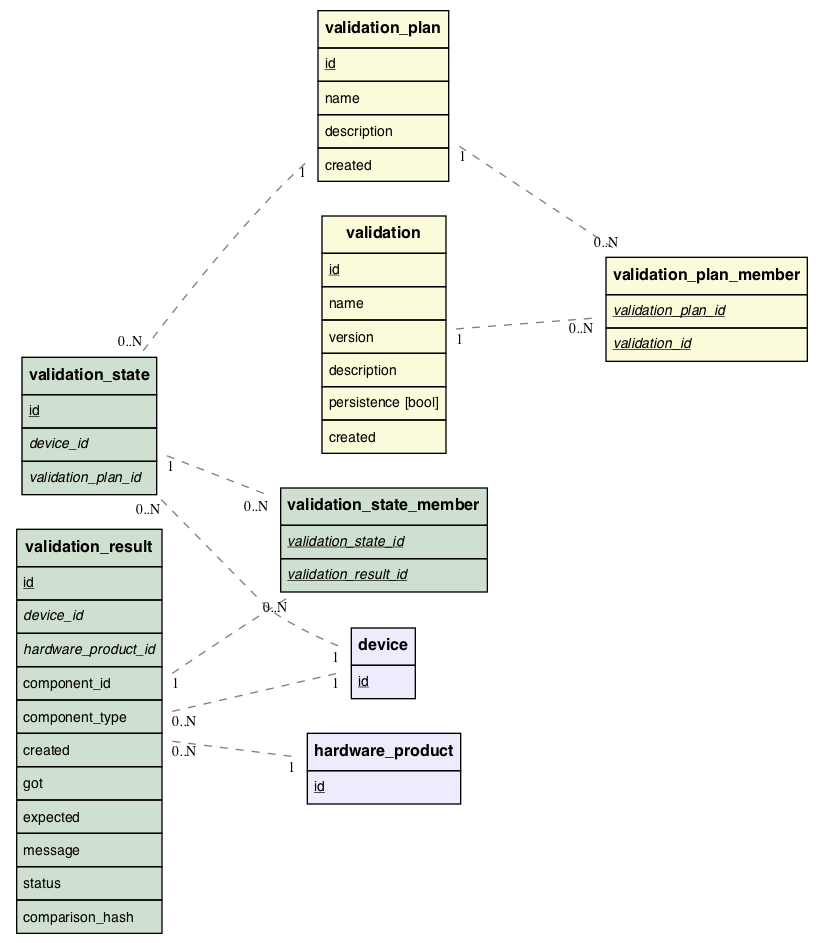

<!--
    This Source Code Form is subject to the terms of the Mozilla Public
    License, v. 2.0. If a copy of the MPL was not distributed with this
    file, You can obtain one at http://mozilla.org/MPL/2.0/.
-->

<!--
    Copyright 2017 <contributor>
-->

# RFD 133 Conch: Improved Device Validation

## Versions

* 2017-10-11 - Initial draft.
* 2017-11-07 - Re-write to describe a 'real-time' validation system and taking
  into account workspaces implemented in [RFD 134](../0134/README.md).
* 2018-02-12 (current) - Significant simplification from previous versions.
  Removal of real-time validation, addition of data storage strategy.

## Introduction

The datacenter preflight validation software, known as Conch, is used to
validate datacenter hardware components and system configuration using a
vendor-agnostic validation process. Device reports, containing information
collected on the device, are sent to Conch and processed. For each device
report received, a series of "validations" are executed using information in the
device report to verify the configuration of the device is correct.

The latest iteration of Conch was developed alongside the Korean datacenter
build in August-September 2017. This project was successful in that it
identified issues with hardware components and system configurations before the
integrator shipped the hardware. However, the implementation was inflexible and
limited. Validation criteria were hard-coded in software and was unable to
respond to unexpected conditions.

For instance: there was a temporary supply shortage of SSDs during the course
of system integration. Conch validated that the correct number of SSDs were
present in each server, and, in this case, Conch gave the integrators warning
messages that were inactionable. To temporarily disable the SSDs validations,
the Conch code had to be manually modified. This modification also disabled
the check for all devices regardless of location. If there were multiple,
concurrent datacenter builds, this would have disabled the validation for
locations where there was no SSD supply issue.

The current set of validations are not tested in any automated way.
Validations should be automatically tested during development to verify
validation logic is correct. During the latest datacenter build, a validation
intended to check the expected switch peer port configuration was incorrect for
a particular rack layout. This caused confusion, and the code had to be
corrected and deployed. Testing will allow us to avoid exposing
false positives and negatives to users.

### Goals

Based on the issues described above, a solution must satisfy the following
requirements:

* The validation process must be parameterized by hardware product
  specifications.
* Validation logic should conform to a consistent, standard interface
* Validation logic must be testable prior to deployment.
* Storage of redundant data from validation results should be minimized.
* The validation system should be decoupled from other processes, such as data
  collection and orchestration.

## Proposed Solution

This section describes in general terms the implementation of the validation
system.

### Glossary

* _Input data_: A hash of data collected by a separate process and provided as
  input to the validation system. The validation system does not manage the
  storage of input data.
* _Validate_: The process of verifying whether a device satisfies a set of
  expectations and conditions.
* _Validation_: The code or process run to verify a device's configuration.
* _Validation result_: The product of executing the validation code. A single
  validation may produce multiple validation results.
* _Validation plan_: A collection of validations run together in a single
  execution.
* _Validation state_: A collection of validation results from an executed
  validation plan for a given device.
* _Persistence validation_: A special case of validation which persists input
  data in the database rather than validating the device.

### System Input

The validation system will require a validation plan ID, a device ID, and a
hash structure of data collected for validation. A device must have a hardware
product associated with it to be validated, and will raise an error if no
hardware product is directly assigned or derivable by the device's assigned
location.

### Validation Code

Each validation will be defined by a unique name and version and will map to an
executable code module stored in the Conch source repository. Validation code
modules will conform to a standard interface. A validation code module will
define four attributes and two functions:

1. a required attribute defining the name of the validation, which must be
   unique among code modules.

2. a required attribute declaring the version of the validation.

3. a required attribute describing the validation.

2. an optional attribute defining the schema for the input data, using the JSON
   schema format.

3. a function to verify the input data is structurally compatible with the
   execution of the validation. If the above schema variable is not defined,
   this function must be defined.

4. a function to execute the validation. This function will be provided the
   input data, a hardware product hash, and a mediator object providing methods
   to access pre-defined database queries and register the validation results.

[A example validation code module written in Perl is provided
here](./ValidationExample.pm). This code is strictly an example for
illustration purposes. The interface and semantics are subject to change during
implementation.

A validation may register many validation results per execution. For example, a
disk validation may register a validation result per disk reported by the
device.

Validations code will be independent from other validations, and validations
may be executed in parallel.

### Persistence Validations

There will be a special case of validation, which have authority to extract and
persist input data into the database. They will be identified by flag in the
validation database table. They will be executed prior to all regular
validations. Instead of a function validating input data and device condition,
persistence validations will define a function to extract data from the input
data hash and write it to the database.  This function will be passed the hash
of input data, the hardware product object, and a data-access object providing
methods to perform pre-defined persistence operations.  Like regular
validations, input data will first be verified with a schema or function to
check the structural integrity of the data. If the input data check fails or an
exception is raised in the persist function, no normal validations will be
executed and the validation system will return a failed validation state.

[A example persistence validation code module written in Perl is provided
here](./PersistenceValidationExample.pm). It is similar to the normal
validation example linked in the section above, but it defines a `persist`
function rather than `validate`.

### Validation State

All validation results from a validation plan execution will be collected into
a validation state object. If this is the first validation state created by a
validation plan for a particular device, the state and all validation results
will be stored. If there was a previous validation state associated with the
device and validation plan, the validation results of the new and most recently
stored validation state will be compared. If all validation results are
equivalent between the two states (equivalence discussed below), the new state
will be dropped and the validation system will return the older validation
state ID. If there are any non-equivalent validation results, the new
validation state and all new validation results will be written to the database
and the system will return the new validation state ID.

Validation state stores references (i.e. foreign-keys) to validation results.
Multiple validation states may reference the same validation results. Unique
validation results will be written when a new validation state is stored.

### Validation Result Comparison

Prior validation systems in Conch stored large numbers of redundant validation
results, wasting disk space and worsening query performance. The number of
stored validation results will be reduced by storing only validation results
changing between executions of validation plans for a given device.

As described above, all validation results will be collected as a validation
state and will be compared to the most recently stored validation state.  The
validations states is to determine whether a validation result has changed from
the previous validation executions. A validation result has changed if it is
not equivalent to the most recently stored validation result. Two validation
result are said to be equivalent if each have the same values for the following
fields:

* device ID
* hardware product ID
* component type
* component ID
* status (pass, failed, error)
* expected value
* received ("got") value

Validation result metadata, such as the created timestamp and the message
field, will be ignored in the comparisons. To assist comparisons between
validation results, a hash value can be calculated from the comparable values
and stored in each row.  When validation states are compared, validation
results can be quickly identified as redundant by the presence of equivalent
hash values.

Values stored in comparable fields should not be volatile data. Rather than
storing individual temperatures values in the 'got' field, for example, the
validation result entry should store whether a temperature satisfies a
threshold.

A validation may fail, pass, and then fail again in the same manner as it did
the first time. In this case, all three validation results will be stored,
because only validation results from the immediately previous validation state
will be compared. This scheme does not eliminate all redundancy, but it will
reduce it for the most common case. This is a more accurate representation of
the history of the validation of a device.

### Output

Each execution of a validation plan will product a validation state ID and a
structure representing the final status of running the validation plan. Given a
set of inputs, a validation plan may pass all validations, fail one or many
validations, or report an unexpected exceptions raised in any of the
validations.  Exceptions will be minimized by validating the inputs sent to the
system, but may still occur due to programming error, resource unavailability,
or other unexpected conditions. Exceptions will be caught, recorded as
validation results, and reported as failures to the executing process.

### Database Schema

The following Entity-Relation diagram describes the database schema underlying
the validation system described above.

Blue entities denote tables that already exist in the system (non-primary key
fields have been elided).  Yellow entities are created prior to the execution
of a validation. Green entities are created for each execution of a validation
plan.

## Code and Related Links

* [Conch Repositority](https://github.com/TritonDataCenter/conch)
* [Issue discussing data reduction](https://github.com/TritonDataCenter/conch/issues/140)
* [JSON Schema](http://json-schema.org)
* [JSON Schema Validation Draft](https://datatracker.ietf.org/doc/draft-wright-json-schema-validation/?include_text=1)
* [JSON::Validator Perl module](https://metacpan.org/pod/JSON::Validator)

## Related Work

* [RFD 132: Conch: Unified Rack Integration Process ](../rfd/0132/README.md)

