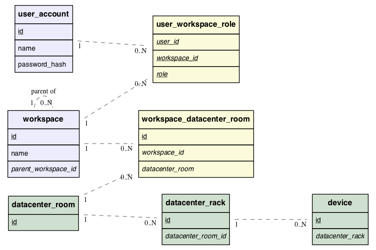

<!--
    This Source Code Form is subject to the terms of the Mozilla Public
    License, v. 2.0. If a copy of the MPL was not distributed with this
    file, You can obtain one at http://mozilla.org/MPL/2.0/.
-->

<!--
    Copyright 2017 <contributor>
-->

# RFD 134 Conch: User Access Control

## Versions

* ? - Initial draft.
* ? - Initial published version.
* 2018-09-19 (current) - Updates to reflect database schema changes, and the
  separation of "system administrator" status from roles held on the "GLOBAL"
  workspace

## Introduction

Conch implemented a simple mandatory access control system in which users were
explicitly assigned access to datacenter rooms.  An authenticated user had read
access to all assigned datacenter rooms, racks contained in those rooms, and
device information for devices assigned to slots in the racks.  Write access
was restricted to assigning device serial numbers to rack slots.  ~~The list of
operations a user may perform is due to increase as new capabilities and types
of users, such as DC operations staff, are added in the near future.~~

The process of creating users and assigning datacenter access was accomplished
calling HTTP APIs using special, hard-coded administrator credentials.  There
was no User Interface for creating or managing users and user access.  Due to
the tedious process of user management, one set of credentials was issued for
the integrator to share among their employees.

Related to user access, a user could use their credentials with a
[Relay device](../0132/README.md#preflight-relay-device)
connected to a top-of-rack switch.  Switches and servers (devices) in the rack
who have booted into the preflight image will begin sending reports to Conch,
using the user's credentials to authenticate the report.  However, this action
had no bearing on the user's access.  The device's reported serial number may
or may not be assigned to a datacenter rack slot.  A user could use their
credentials for devices in a datacenter room for which they don't have access.
This process could result in confusing results where the user could not find
the reporting device in Conch.

Finally, there is little organization in the management of resources.
Datacenter builds are not first-class citizens in our schema.  If an integrator
user were to work on one datacenter build and then a subsequent one using their
same credentials, all resources assigned for the first build would still be
present in the user's view.

## Problems

We need integrators to use their individual user accounts to produce auditable
logs of user actions.

We need to prevent the manipulation of resources that are outside a user's
current working environment.

We should use the principle of least-privilege.  A user who does not need
write access to a datacenter build should not have the ability to make changes.

We should allow users with the proper level of responsibility to create users
and organize resources.

## Proposed Solution

Datacenter resources (datacenter rooms, racks, and devices) will be assigned to a
_workspace_.  A resource may be assigned to more than one workspace.  The
workspaces designates the set of all resources that may be accessed.  A
resource may belong to one or many workspaces.

Each workspace will a set of defined roles, such as administrator, basic user,
and read-only user roles.  A role determines the actions that can be performed
on the resources accessible in the workspace.  The set of roles will be uniform
for all workspaces.

A user maybe be assigned to one role in a workspace.  A user may be assigned a
roles in multiple workspaces, but for each workspace, a user assumes only
one role.  The user may be assigned a different role in each workspace.

Users may be created by a user whose role is permitted to do so.  The created
user assumes the workspace in which the creator performed the action.

Sub-workspaces may be created, which can include a subset of resources
accessible to it.  This may be useful if an integrator sub-contracts part of
the work or wants to limit visibility.

A global workspace will be created by default, which has access to all
resources in the system. Certain operations, such as modifying device role
validation parameters, will be restricted to ~~the global workspace.~~
users with an administrator flag set on their user record, which is treated as
an orthogonal concept to workspace permissions.

Workspace permissions are inherited: if a user holds a certain role on a
workspace, he also has the same role on all child workspaces, grandchildren
and so on.  While it is possible to grant a user a *greater* role on a
descendant workspace, it is not possible to reduce a user's role on a child.
For example: if the user has 'read/write' permission on a workspace, he may
not have just 'read-only' permissions on a child.  This restriction is
enforced by the API, not by the schema.

The Conch User Interface will show only the resources of the currently selected
workspace.  To view resources assigned to a different workspace, a user will
select the workspace in the User Interface and switch their view to the
resources of that workspace.


### Schema



The above Entity-Relation Diagram describes the schema for the proposed
solution.

The most complex part of this otherwise simple schema is the relation
of workspaces to sub-workspaces. Queries involving workspaces and
sub-workspaces will be more complex, but manageable. For example, to list all
sub-workspaces that are descendants from a given workspace, we can use
recursive common-table expressions.

```sql
WITH RECURSIVE subworkspace (id, name, parent_workspace_id) AS (
        SELECT id, name, parent_workspace_id
        FROM workspace w
        WHERE parent_workspace_id = $1
    UNION
        SELECT w.id, w.name, w.parent_workspace_id
        FROM workspace w, subworkspace s
        WHERE w.parent_workspace_id = s.id
)
SELECT * from subworkspace
```

There is a constraint in our model that is not expressed in the schema.
Devices in a sub-workspace must also be available in the parent workspace;
however, this schema does not prevent this condition from being violated.
Alternative schemas were explored to prevent this condition, but they were
found to be more complex than the risk made necessary. This constraint should
be enforced in the Conch API server or using database triggers.


### Example role levels

Here we describe a short list of roles that will be ~~initially~~ implemented.
Additional roles may be added as the scope of Conch changes over time.

* Read-only user (`ro`). User cannot take any action that would persist the result,
  with the exception of sending feedback to the Conch development team.

* ~~Integrator~~ Read-write user (`rw`). User can assign devices to slots and perform tasks
  necessary for normal datacenter integration.

* ~~DC Operations user. User can perform all operations necessary for DC
  operations tasks.~~

* ~~Manager user. User can adjust room and rack-level validation parameters (see
  [RFD 133](../0133/README.md)), invite users to the workspace, modify users'
  roles, and create new sub-workspaces with assigned users.~~

* Administrator user (`admin`). User can perform all actions provided by the API and UI
  in the workspace.

## Discussion

The proposed solution is based on a simplified version of Organization Based
Access Control (OrBAC).  A Workspace is analogous to the term _organization_, a
user is a _subject_, and a resource is an _object_.  In our simplified
approach, _view_ and _context_ are unnecessary and not used.


Device42, a datacenter infrastructure management platform, draws a lot of
parallels to Conch, and a similar method of access control to its method was
considered.  Device42 uses a Role-based Access Control (RBAC) system, in which
roles are created with permissions selected from a defined set, and users are
added to the role.  This provides much finer-grain control than needed for our
us.  Our approach also provides the benefit of organizing resources into
workspaces to reduce the number of resources displayed at a given time.


# References

[Device42 Access Control](https://docs.device42.com/tools/role-based-access-explained/)

[Organization Based Access Control](http://orbac.org/?page_id=21)

A. Abou El Kalam, R. El Baida, P. Balbiani, S. Benferhat, F. Cuppens, Y.
Deswarte, A. Miège, C. Saurel et G. Trouessin.  Organization Based Access
Control. IEEE 4th International Workshop on Policies for Distributed Systems
and Networks (Policy 2003), Lake Come, Italy, June 4-6, 2003.
DOI=http://dx.doi.org/10.1109/POLICY.2003.1206966
