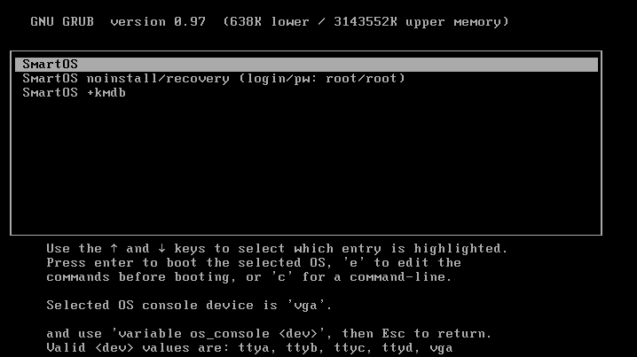
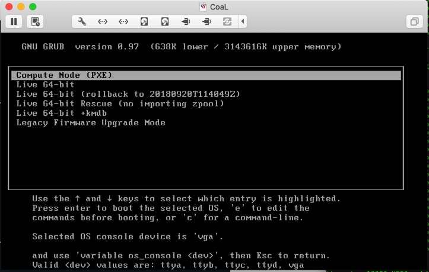
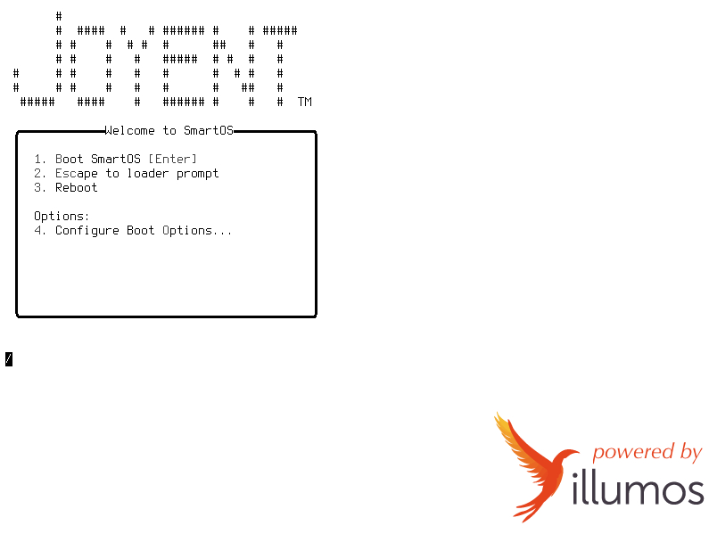
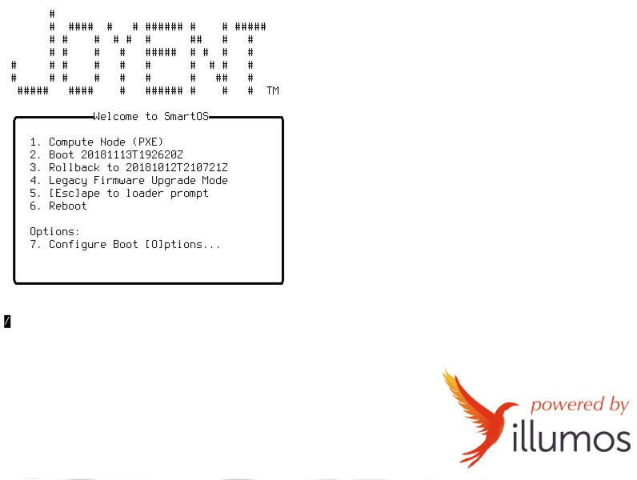
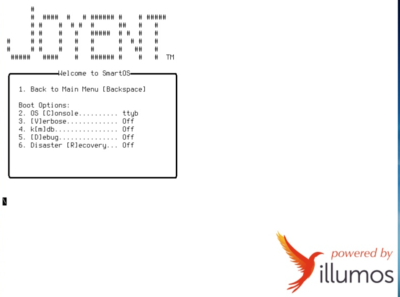

<!--
    This Source Code Form is subject to the terms of the Mozilla Public
    License, v. 2.0. If a copy of the MPL was not distributed with this
    file, You can obtain one at http://mozilla.org/MPL/2.0/.
-->

<!--
    Copyright (c) 2018, Joyent, Inc.
-->

# RFD 156 SmartOS/Triton Boot Modernization

This RFD proposes to rework the boot support mechanisms in SmartOS/Triton in
order to better support both current and future hardware platforms.

## Problem Statement

### Outdated Boot Loader (GRUB)

Currently SmartOS and Triton use GRUB as the boot loader.  GRUB - an acronym
for GRand Unified Bootloader - is an open-source bootloader that was originally
developed in the mid-90s.  For roughly a decade after its introduction, it was
the de facto bootloader for most Linux distributions and was also the
bootloader for OpenSolaris up until Oracle closed the project.

The original GRUB (commonly referred to as Legacy GRUB) ceased development
with version 0.97 in 2005.  This is the version that SmartOS/Triton currently
uses.  Due to its age, legacy GRUB has a number of limitations including:

- it cannot boot on volumes larger than 2TB
- it only supports the X86 architecture
- it does not support UEFI boot mode

Today SmartOS is able to boot on UEFI-capable systems because these systems
support booting in legacy BIOS mode via a compatibility support module (CSM)
that allows UEFI firmware to provide BIOS services.

However, Intel has announced that its reference implementations will no longer
support booting in legacy BIOS mode via CSM starting in 2020[1].  Thus the
inability of SmartOS to boot in UEFI mode has become particularly acute.

Legacy GRUB was succeeded by GRUB2, which was a complete rewrite that added,
among other things, UEFI support.  Most Linux distributions had transitioned to
GRUB2 by 2007.  Oracle Solaris transitioned to GRUB2 in late 2012.

### Outdated PXE Implementation

PXE - an acronym for Preboot eXecution Environment - is an Intel standard
that defines a firmware mechanism for booting a software image over the
network.  Triton compute nodes boot off from the network using an open-source
implementation of the PXE standard called iPXE[2].

In addition to using an outdated boot loader, the version of iPXE used with 
Triton is based on a fork of iPXE that was last synced with upstream in early
2016.  Thus it does not support network booting on some of the newer network
interfaces, including the Intel Fortville nics, which are the standard onboard
interface on most currently shipping enterprise-level system boards.


## Proposed Solution

### New Boot Loader

Loader is the boot loader introduced by the FreeBSD community.  It was ported
to illumos in September 2016[3] and is now the default boot loader for a number
of illumos distributions such as OpenIndiana and OmniOS.

Like GRUB2, Loader supports UEFI boot and has been successfully ported to
a variety of machine architectures that may be interesting to us in the future
(such as ARM).  

This project proposes to change the USB key boot images that are constructed for
SmartOS/Triton and COAL to use the FreeBSD boot loader (referred to herein as
simply "Loader").

The current USB key image uses the Master Boot Record (MBR) paritioning scheme
with a single partition that spans the entire disk. This partition contains
both the boot loader and the platform image.  In legacy BIOS boot mode, BIOS
reads the first sector of the disk and looks for a magic byte sequence
indicating that this sector contains boot code.  If found, BIOS executes this
code.  Because a disk sector is only 512b, it's not enough to hold a complete
boot loader implementation.  So generally, this sector contains what is known
as a first stage loader, which consists simply of the code needed to mount a
partition on the disk and then execute the actual boot loader.

To accomodate booting in UEFI mode, the partitioning scheme used on the USB key
must be changed to the GUID Partitioning Scheme (GPT)[4].  With GPT, each
partition has a UUID, which denotes the type of partition.  UEFI firmware scans
the partition table and looks for a partition with a UUID that corresponds to
the EFI System Partition (ESP).  This partition must be created and formatted
with a FAT filesystem (typically FAT32).  If found, the UEFI firmware will
mount this partition and search for and execute the executable found at a
well-known location defined by the UEFI specification.  The boot loader is
normally placed in this location.

To continue to support legacy BIOS boot mode, a first stage loader will be
installed into the MBR.  This code will mount the root partition and
execute the legacy BIOS version of Loader.

The resulting GPT partitioning layout will look like this:


<pre>
Slice  Type                                                            Size 
0      C12A7328-F81F-11D2-BA4B-00A0C93EC93B (ESP)                     256 MB*
1      6A82CB45-1DD2-11B2-99A6-080020736631 (solaris/illumos boot)      1 MB
2      6A85CF4D-1DD2-11B2-99A6-080020736631 (solaris/illumos root)   rest of disk 
</pre>

* Currently the only file being placed in the ESP is the boot loader executable,
which is under 2MB.  However, future platforms may require software to be placed
into the ESP in order to update the system board firmware.  Additionally there
is a proposal[5] that may place encyption material on the USB key.  So, in
order to leave sufficient headroom for possible future uses of the ESP and to
avoid having to increase the size of the ESP later, we are opting for a much
larger size for the ESP than is currently required.

#### Boot Loader User Interface

Loader offers a richer and more extensible user-interface than Legacy GRUB. 
What follows are a set of before and after screenshots highlighting the key
differences.

Below are a pair of screenshots showing the Legacy GRUB boot loader menu
that is currently displayed when booting standalone SmartOS and Triton,
respectively.  The Legacy GRUB interface is effectively a single-level menu
that can be configured to present of static set of boot target/boot option 
combinations:

If a user wants to apply a boot setting that is not already represented by one
of the static menu entries then the user must enter an edit mode
that allows for manually editting the grub menu configuration.  This is less
than ideal as it requires the user to understand both the format of the Legacy
GRUB configuration parameters and the format of kernel command line.





Below are a pair of screenshots showing the Loader menu that will be
displayed when booting standalone SmartOS and Triton, respectively.  On the
surface, it seems quite similar to Legacy GRUB, in that the menu presents
entries for a similar set of boot targets.





However, Loader also has support for heirarchal menus.  For example, selecting
the "Configure Boot Options" entry on the top-level menu brings the user to the
menu shown in the screenshot below, which allows finer-grained control of the
options passed to the kernel.  The menus are fully customizable, allowing us to
add new menus and expose additional configuration parameters as our operating
system evolves.

Loader also supports bitmapped consoles and ANSI color graphics for text
consoles - allowing for company and/or product-specific logos/branding to be
displayed.



#### Removal of Legacy Firmware Upgrade Mode

The current GRUB-based USB image for Triton includes a boot menu
entry entitled "Legacy Firmware Upgrade Mode".  This entry would boot FreeDOS
and was used to run certain firmware maintenance tools that required a
DOS-like environment.  This was primarily used on older Richmond-A BOMs.

The FreeDOS kernel does not support mounting drives with GPT labels.  Furthermore,
the FreeDOS kernel will not run when the platform is booted in UEFI mode.

Current Joyent BOMs are PXE-booted to Linux to perform firmware maintenance
operations that cannot be done using native tools withing SmartOS.  And future
Joyent BOMs will certainly not be reliant on DOS-based firmare management
tools.

For that reason, the "Legacy Upgrade Firmware Mode" boot option will not be
supported on the new GPT/Loader based USB images and Freedos and memdisk
will be removed from the key contents. The sdcboot repository will be archived,
and iPXE bits directly delivered via `joyent/ipxe`.

#### Build Tool Changes

The joyent/smartos-live repo contains the following two scripts:

tools/build_iso

tools/images/make_image

The first script is used to build SmartOS boot media (either an ISO or a USB
key image).  The second tool creates empty disk images that are used by tools
in the joyent/sdc-headnode repo to construct Triton and COAL boot images.

These two scripts will be replaced by a new tool (tools/build_boot_image) which
will provide the functionality of both of the above tools.  build_boot_image will
create the boot images to use GPT partitioning and will install Loader to
support both legacy BIOS and UEFI boot modes, as described above.

fdisk(1m) does not support creating/modifying GPT labels. Other CLIs that
can work with GPT labels (like zpool) require something that looks like a disk
device path to be passed to it, in order to work.  However, the only practical
way to expose an image file as disk device is to use labelled LOFI devices,
which are not supported in non-global zones.  Therefore, in order to continue
to allow building smartos-live in a zone, without requiring platform changes,
a new build tool, <b>format_image</b>, will be created which will handle
creating the GPT label when constructing USB images.

The joyent/sdc-headnode repo contains the following scripts which are used to
construct Triton and COAL boot images.  These will be modified to handle the
new partitioning layout.

```
bin/build-coal-image
bin/build-tar-image
bin/build-usb-image
```

#### Triton Runtime Changes

Both the smartos-live and sdc-headnode repos contain a number of scripts
and utilities which mount/unmount the USB key and make hardcoded
assumptions about the partitioning layout.  These will be modifed such that
they can handle both the MBR/GRUB based keys and the new GPT/Loader based
keys.

Furthermore, all legacy consumers of `scripts/mount-usb.sh` in `sdc-headnode` will
be converted to instead use `sdc-usbkey`, further reducing code duplication.

The joyent/sdc-headnode repo contains a number of scripts and commands which
directly modify the boot loader configuration for the purposes of configuring
things like the console settings and which platform image to boot.  These tools
will need to be modified such that they can determine which boot loader the
USB key has installed (GRUB or Loader) and then use the appropriate
bootloader-specific logic to inact the desired configuration change.

#### Documentation Changes

The Triton documentation contains a number of sections which include
screenshots of GRUB and/or reference details specific to the GRUB boot loader.
These sections will be modified to include screenshots and documentation
specific to Loader.  At this point, the following docs have been identified as
needing updates:

https://github.com/joyent/triton/blob/master/docs/developer-guide/coal-setup.md

https://docs.joyent.com/private-cloud/install/headnode-installation

https://docs.joyent.com/private-cloud/install/compute-node-setup

### PXE changes

#### Update iPXE

In order to provide support for booting off of more modern network interfaces,
the Joyent fork of ipxe will be resync'd to the tip of the upstream codebase.

At a minimum, the resulting binary will tested on every network interface used
in a Joyent BOM, to ensure regressions are not introduced.

Once that the resync has been tested, the updated ipxe will then be seeded into
the joyent/ipxe, joyent/sdc-booter, and joyent/kvm-cmd repos as needed.

#### EFI PXE boot

FIXME: some notes about booting in EFI not from iPXE (do we still need to support this)

### Conversion Tool for OPS

Replacing the USB key in existing systems can be expensive as often the USB key
is installed in an internal slot on the system board and so replacing it
requires powering the system down and opening the chassis up.  While this
project will not require the conversion of USB keys in existing systems, OPS
may want to convert existing USB keys so as to standardize the boot experience
across a fleet.  Therefore, as part of this project, a tool will be developed
to automate the process of converting a USB key to the new format in situ.

## Versioning of the key and its contents

### Versioning the key format

Introducing the GPT key introduces a second version of the basic layout of the key.
The previous grub-based one, with its root at `p1`, and the new GPT one, with an
ESP partition at `s1`, and the real root at `s2`.

Some basic versioning is introduced to identify these two layouts. `/lib/sdc/usb-key.sh`
and `sdc-usbkey` will both will be modified to figure out the right partition to mount.
The former is used during boot (on SmartOS as well as Triton).

Unfortunately, there is no standardized version location we can use in a disk image.
However, we can formulate our own. We first look in the MBR for its magic value `0xaa55`.
Then, if we see grub's version `3.2` at offset `0x3e`, we have a grub-based key.
Otherwise, if we see `2` at offset `0xfa`, that corresponds to the [version slot placed
inside the loader MBR](https://github.com/joyent/illumos-joyent/blob/master/usr/src/boot/sys/boot/i386/pmbr/pmbr.s#L164).
If we ever need another major revision, we can bump that slot.

### Versioning and updating the key contents

Today, USB keys can be partially updated. `sdc-usbkey update` will copy over the contents
of `/opt/smartdc/share/usbkey` onto the USB key (if we are a CN). This directory comes from
the contents of `cn_tools.tar.gz`, as updated as part of `sdcadm experimental update-gz-tools`.
What this boils down to currently is that a new version of the iPXE binaries can be delivered
and updated on the USB keys.

It would be preferable if we could also update our version of loader, and potentially other
things delivered on the USB keys. We're not interested in the bootstrap images, as they are only
used during commissioning of a system.

Also, it would be nice if we had some reporting on the component versions carried on the USB keys.

To this end, each delivery into the USB key will deliver (for example) `/etc/version/ipxe`, which
is the version the component derived from (today, that would be a PI-style version as defined by
the sdcboot tarball). Each PI also delivers its own `/os/20181203t230136z/platform/etc/version/platform`.
loader itself delivers `/etc/version/boot` as populated by the boot tarball created by the
`smartos-live` build. Thus, we can see at a glance the component versions of what's on each USB key.

We will also re-work the way the contents are updated. Instead of just iPXE binaries, we'll deliver
the whole of the `boot` and `ipxe` tarballs, as well as `sdc-headnode`'s additions into
`/opt/smartdc/share/usbkey/contents`. Instead of `sdc-usbkey update` directly copying files
across, it will instead execute whatever it finds at `/opt/smartdc/share/usbkey/update-usbkey*`
(in glob order). One of these scripts is the same old code that copied files across to the root
of the USB key. Another one will use the loader version file, along with a `cmp` of the
`loader64.efi` file, to update the EFI System Partition with the new loader binary if needed.

As this will execute every script delivered, this should give us some flexibility in the future
if we need to update the key contents in ways other than just copying files. For example,
if we ever need to deliver a newer version of the legacy boot partition (aka a modified
`gptzfsboot`), we can deliver a new script as part of `smartos-live` to correctly do this.

If we ever needed to retire an update script, we could simply replace it with an `exit 0` script.

Currently, `update-gz-tools` doesn't run this update on a headnode; now we are planning to
modify more than just iPXE, it probably should.

## Dependencies

The changes described in the RFD are dependent on various in-flight illumos
changes being worked on by Toomas Soome from the illumos community[6].
Primarily, these changes include:

- Loader fixes related to UEFI boot that have been pulled from upstream
- Kernel changes to provide support for a VGA console during UEFI boot

For the purposes of prototyping the SmartOS and Triton changes described above,
a preliminary set of patches has been pulled from Toomas Soome's loader branch
into a development branch ("uefi") of illumos-joyent.


## Design Constraints

In order to simplify deployment and OPS procedures, the build system should
produce a single USB key image that can support booting in both legacy BIOS and
UEFI modes.

If possible, the build tool changes should not require an updated platform 
image on compute nodes that host build zones.

Triton headnodes must be able to manage a hetergeneous set of compute nodes
where some of them still use MBR/GRUB-based USB keys while others may use the
newer GPT/Loader-based USB keys.

The solution should allow OPS maximum flexibility with respect to determining
when or if to replace/convert the USB key in an existing system to the new
format.


## Planned Testing

Verify ability to create SmartOS ISO images (as non-root)

Verify ability to create SmartOS USB images (as non-root)

Verify SmartOS boots with new USB image in legacy BIOS boot mode

Verify SmartOS boots with new USB image in UEFI boot mode

Verify SmartOS boots with new ISO image in legacy BIOS boot mode in vmware

Verify SmartOS boots with new ISO image in UEFI boot mode in vmware

Verify appearance of Loader over serial line

Verify appearance of Loader over VGA

Verify functionality of Loader menus on SmartOS Image

Verify ability to create proforma disk images

Verify ability to create COAL image under Mac OS X

Verify ability to create COAL image under Linux

Verify ability to create COAL image under SmartOS zone

Verify COAL image boots and initial configuration succeeds

Verify ability to create Triton USB image under Mac OS X

Verify ability to create Triton USB image under Linux

Verify ability to create Triton USB image under SmartOS zone

Verify Triton image boots and initial configuration succeeds

Verify functionality of Loader menus on Triton Image

Verify functionality of sdc-setconsole

Verify functionality of all sdc-usbkey subcommands

Manually verify functionality of all "sdcadm platform" subcommands

Run sdcadm unit tests

Verify Functionality of USB key Conversion tool

Verify no regressions in Triton's ability to manage systems using an
MBR/GRUB-based USB key

Verify ipxe functionality on each network interface used in a Joyent BOM

Verify ability to PXE boot in legacy BIOS boot mode

Verify ability to PXE boot in UEFI boot mode

Verify additional boot modules / DTrace anon tracing

Verify ability to boot a SmartOS KVM via iPXE

Verify ability to boot both a physical node and a KVM instance via iPXE
in a RAN environment

Verify `sdc-usbkey [-v] update [-n]` on legacy/EFI

Verify `sdcadm experimental update-gz-tools`

Verify `sdc-restore`, rest of `tools/bin/` from `sdc-headnode`

Verify `reflash`

Verify MG builds of ipxe repo

Verify sdc-booter undionly chaining (legacy BIOS mode)

Verify `sdc-headnode` `build.spec.local` changes: build-tgz, serial, ipxe

Verify TOOLS-1000 behaviour

Verify RICHMOND-16 systems


## References

[1] http://www.uefi.org/sites/default/files/resources/Brian_Richardson_Intel_Final.pdf

[2] https://ipxe.org

[3] https://www.openindiana.org/2016/09/28/loader-integration/

[4] https://en.wikipedia.org/wiki/GUID_Partition_Table

[5] https://github.com/joyent/rfd/tree/master/rfd/0077

[6] https://github.com/tsoome/illumos-gate/tree/loader
