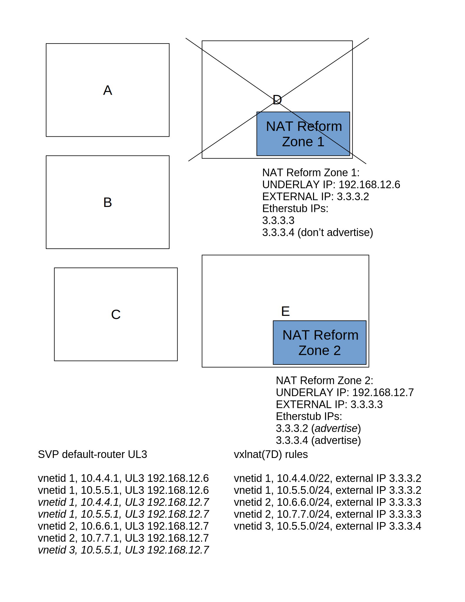
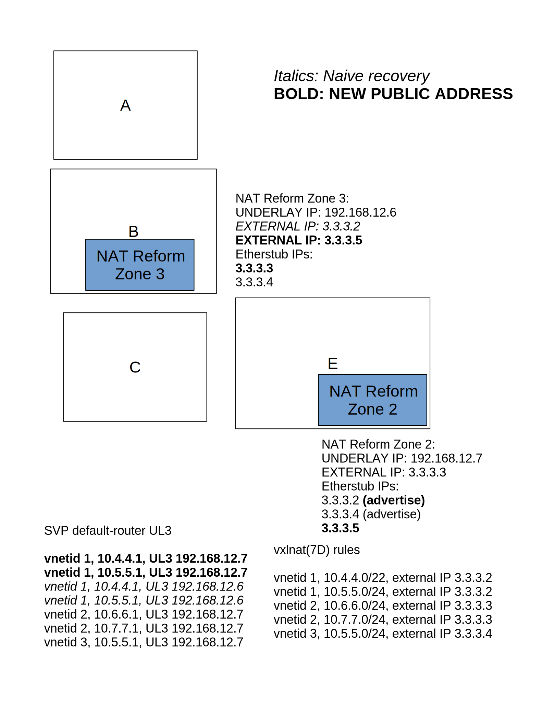

<!--
    This Source Code Form is subject to the terms of the Mozilla Public
    License, v. 2.0. If a copy of the MPL was not distributed with this
    file, You can obtain one at http://mozilla.org/MPL/2.0/.
-->

<!--
    Copyright 2018 Joyent
-->

# RFD 158 NAT Reform, including public IPs for fabric-attached instances.

<!--
TODO:
- MORE -- FILL ME IN!
-->

## Problem Statement

In today's JPC and other Triton deployments, if a Fabric Network is
allowed to reach the Internet it must have its own Network Address
Translation (NAT) zone.  Each NAT zone consumes 128MB of RAM, one unique
public IP, and one `overlay(7D)` NIC.  Furthermore, the NAT zone is only
available on one Compute Node, and is not easily migrated or respun if a CN
fails.  A NAT zone provides Source NAT (SNAT) for egress traffic.

Additionally, many JPC and Triton customers have asked for Destination NAT
(DNAT) to allow a reserved public IP address to have its traffic forwarded to
a private address that may change from time to time. This feature resembles
Amazon's Elastic IP.  This RFD introduces a similar feature, Assignable IP
(AIP), with a narrow definition: a public IP address that can be mapped
one-to-one to exactly one Fabric Network IP (as defined by vnetid + Fabric IP
address), or Fabric-attached instance (as defined by UUID, where the IP is in
the `/vms/`<UUID> entry).

## Proposed Solution

Both of the problems: Many NAT zones and AIPs, can be solved using the same
approach, namely the reimplementation of NAT for Fabric Networks in Triton.
A single entity that could handle the entire Triton's NAT needs, but is also
replicable in any number, should handle NAT-ting for all Fabric Networks.
All instances of this entity should be identically configured with all of the
NAT and AIP rules for the Triton deployment.  The instances differ only in
runtime state, most notably differing (S)NAT flows.  These instances can be
utilized via any number of policies.  Two such policies are equal
load-spreading, where each instance gets some of the load, or hot-standby,
where one or more instances are held in reserve until needed.  On the
interior side, the use of the SmartOS VXLAN Protocol (SVP) to remap the
default router to an appropriate NAT entity can spread interior-to-exterior
traffic across different NAT entities on a per-default-router-IP basis.  On
the exterior side, use of traditional IP routing protocols and, if
appropriate, equal-cost multipathing, will provide similar mappings from the
external arrival side.

On the interior, Fabric Networks will need to know how to reach a NAT entity.
Today NAT Zones consume a Fabric IP address. In the future, each those Fabric
IP addresses will live on the all new NAT entities. Each entity will be able
to service many Fabric IP addresses for many Fabric Networks. SmartOS VXLAN
Protocol (SVP) entries for NAT IPs will point to a smaller set of underlay
IPs (also known as UL3 addresses), depending on policy for spreading out the
NAT load AND on the number of deployed NAT entities.


On the exterior, the routing protocols run for the Internet-connected
networks in the Triton deployment will have to be informed about which public
IPs (both AIPs and public IPs consumed by NAT entities) get routed to which
NAT entities.  The routing information/topology will change as NAT entities
get added or removed (by administrator action OR by failure).  NAT entities
will be ABLE to receive all public IP traffic and send on behalf of all
internal Fabric Networks. Any given one, though, will not have all public IP
traffic routed to it because of external network routing policies, and
because for DNAT flows, DNAT state can exist only in one NAT Reform zone
at a time.


From a cloud administrator's perspective, existing Fabrics stay as they are,
but new fabrics get created on top of NAT Reform zones with a
`nat_reform_public` public IP.  Existing Fabrics with default routes can
convert to NAT Reform by adding a `nat_reform_public` empty-IP UPDATE, and
the submitted job will kill the old NAT zone and rewire its default router to
be on its assigned NAT Reform zone.

Also the cloud administrator can increase/decrease the number of NAT Reform
zones with the ability to assign them to specific CNs, and the request of
shared public IPs or one public IP per customer.  Once configured, Triton
will balance Fabric Assignments as requests come in.

From a cloud customer's POV.  Nothing changes unless they want to be "AIP
ready" which will be a signal for the administrator to convert the customer's
fabrics to NAT Reform.  It may be possible to allow the customer to initiate
a no-going-back upgrade to NAT Reform for their networks.  Also the customer
can request an AIP.  This should only work on an address or instance upgraded
to be NAT Reform ready.

This RFD will cover:

- Technical details of the NAT Device - `vxlnat(7D)`.
- How a zone needs to be configured to be a NAT Reform zone.
- How Assignable IPs (AIPs) will work.
- Changes required for Triton
- Changes required for external network routing for a Triton deployment.

### The `vxlnat(7D)` NAT Device

This project introduces a new pseudo-driver, `vxlnat(7D)`, which implements a
simplified NAT subsystem that can be replicated an arbitrary number of times
on vanilla compute nodes OR on dedicated hardware.  Each instance is
relatively expensive, as each has a full copy of the Triton-wide state for
SNAT mappings and DNAT mappings.

`vxlnat(7D)` implements NAT between multiple VXLAN networks and a set of
public IP addresses.  `vxlnat(7D)` does not implement VXLAN with an
`overlay(7D)` device, instead it listens on the VXLAN UDP port to an
interface that is attached to a VXLAN underlay network. `vxlnat(7D)` uses the
VNET id as an additional field in its NAT rules.  All state in `vxlnat(7D)`
is instantiated and indexed by the 24-bit VXLAN vnet ID.  All VXLAN packets
first find the vnet state, and then proceed.  The per-vnet state contains 1-1
mapping entries, NAT rules for an internal prefix, and NAT flows derived from
the NAT rules.  Each `vxlnat(7D)` instance has its own distinct
underlay-network IP address.


An overview of `vxlnat(7D)` configuration will help better explain the
public-network side of things.  `vxlnat(7D)` is configured in the following
manner:

- A VXLAN address, aka. the underlay network IP.
- 1-1 external-IP to internal-{vnet,IP}
  (NOTE: An external-IP used for 1-1 cannot be use for anything
  else.)
- Traditional NAT rules mapping {vnet,IP-prefix} ==> external-IP.
  (NOTE: external-IPs used here can be reused for other
  {vnet,IP-prefix} mappings. Any mappings sharing an external-IP must
  co-reside on a single NAT Reform zone.)

NOTE: Today Triton does not allow overlapping prefixes in a customer (vnet).
If that changes, the addition of VLAN will be needed in the above mappings,
alongside vnet.

The above configuration is processed by `vxlnatd(1M)`, an SMF-managed service
that opens the `vxlnat(7D)` device, and feeds it that configuration.
`vxlnatd(1M)` will also perform configuration updates, query for
configuration and/or statistics, and query SVP on behalf of 1-1 mappings for
inbound traffic.  The current prototype of `vxlnat(7D)` is such that while it
can be run in a non-global zone, only one `vxlnat(7D)` can run on a machine
at a time.

On the public-network side, `vxlnat(7D)` uses existing TCP/IP stack constructs
to aid in processing NAT flows or rules.  For 1-1 mapped external IPs, the
Internet Route Entry (IRE) for the reserved external IP has its IRE receive
function remapped into a special `vxlnat(7D)` routine that rewrites the
external IP to the internal IP, adjusts checksums, and then VXLAN
encapsulates.  Each NAT flow, as created by outgoing packets, receives a
TCP/IP `conn_t` (corresponding to UDP, TCP, or ICMP sockets).  The existing
TCP/IP code can confirm `conn_t` uniqueness, as well as give each `conn_t`
distinct `squeue` vertical perimeters to allow packet concurrency from
outside-to-inside packet flow.  Each IRE or `conn_t` includes a pointer to
per-vnet state, so additional lookups are not required.

The assumptions of available TCP/IP facilities requires `vxlnat(7D)` get its
own netstack, and that said netstack is properly configured too.

### The NAT Reform Zone.

In illumos, a zone can either have its own TCP/IP netstack, or share it with
the global zone.  `vxlnat(7D)` requires its own netstack, so it cannot be used
in a shared-stack zone. Fortunately, SmartOS disallows shared-stack zones, so
`vxlnat(7D)` can instantiate on any arbitrary zone, even the global zone.

To exploit the existing TCP/IP constructs mentioned in the prior entity, all
external IP addresses must be assigned to the netstack.  If `vxlnat(7D)` is
to be replicable, however, the external IP addresses must not be assigned to
an interface that shares a layer 2 network with other `vxlnat(7D)` instances.

Provisioning and boot-time behavior are discussed in the later Triton
Requirements section, as NAT Reform zones depend on Triton infrastructure
to configure itself.

#### Dedicated etherstub and a single unique external IP.

A NAT Reform zone must get an etherstub assigned exclusively to it, so it can
configure supported external addresses on one or more vnics using that
etherstub.  Since the etherstub has no other zones attached to it, Duplicate
Address Detection will not find any duplicate addresses.

In addition to the set of external IP addresses, the NAT Reform zone must
also have a dedicated external IP so that routing protocols and/or policies
know which actual destination to forward packets for a set of external IP
addresses.  A NAT Reform zone's dedicated IP CAN be on other NAT Reform
zone's etherstub vnics, for easier failover.  The external network diagram
from earlier (see above) illustrates a sample deployment of external IP
addresses.

The etherstub is required because, as of today, there is no way to assign an
address to a NIC without Duplicate Address Detection being invoked.  A
possible future illumos change where an address can be added without
Duplicate Address Detection would obviate the need for an etherstub.

#### Underlay network attachment

As noted in the `vxlnat(7D)` introduction, the zone must be physically
attached to the VXLAN underlay network for internal packet processing.  No
other routes apart from underlay network routes must be on the underlay
interface.  The external interface may have other routes, but those are not
relevant to the underlay network.

Currently this means no routes on the underlay interface, but if Rack-Aware
Networking [RFD 152] comes to the underlay network, routes for other racks
MUST be present, and not collide with any external network IP address space.

#### IP Forwarding

A NAT Reform zone must enable IP forwarding between the external network
NIC and the etherstub vnics.  The NAT Reform zone MUST NOT enable IP
forwarding on the underlay network NIC.  `vxlnat(7D)` itself will perform
VXLAN decapsulation and subsequent IP forwarding, and the disabling of IP
forwarding on the underlay network will reduce the possibility of direct
packet leaks to or from the underlay network.

### Assignable IP Addresses

A NAT Reform deployment enables the concept of an Assignable IP address
(AIP).  An AIP begins with an address from Triton's public IP address space,
which is then assigned to a user.  The user can-and-should be charged for use
of this AIP while they have it.  The user can assign (the 'A' in AIP) it to a
specific fabric-attached instance, as well as modify its assignment with the
expectation of in no-less-than a certain time (e.g. 120 seconds) until the
new instance receives the traffic.  The instance in question should have its
default route point to a same-fabric IP whose underlay address resolves to a
NAT Reform zone.  If `vxlnat(7D)` is functioning as a NAT already for the
fabric network of the instance, this will not require additional update to
the instance or its fabric network.

If a NAT Reform zone fails, merely adjusting the underlay address for VXLAN
traffic will shuffle an AIP to be handled by another one.  For AIPs, this
will result in no TCP connection disruption, as AIP processing is stateless.
(Contrast the state of traditional NAT flows, which will not migrate and
therefore result in TCP connection resets.)  Additionally, the replacement
NAT Reform zone will have to advertise the public AIP for the external
network routing infrastructure.

The creation, modification, and deletion of an AIP mapping will occur in
CloudAPI or NAPI.

### Triton requirements

> QUESTIONS FROM PRIOR VERSIONS ARE NOW OFFLINE, BUT ANSWERED.

Several high-level problems must be solved to deploy `vxlnat(7D)` and NAT
Reform zones as a NAT service for a Triton deployment.

1.) Smooth migration away from Fabric NAT Zones.

2.) Provisioning NAT Reform zones for a Triton deployment (no more than one
    per CN).

3.) Assigning supported public IPs to specific NAT Reform zones.

4.) Assigning public IPs (distributed in #3) to multiple {customer, network,
    default-router} tuples.

5.) Assigning public IPs (distributed in #3) to AIPs.

6.) Tracking the NAT Reform zones for liveness, and reassigning per #3-5.

7.) Increasing/decreasing the number of NAT Reform zones, and reassigning
    per #2-5.

Once NAT Reform arrives in a Triton deployment, Fabric Networks can either
continue to use legacy-per-fabric-NAT-zone, or begin to employ
`vxlnat(7D)`/NAT Reform as their default router.  Modulo public IP
inspections by outside-Triton peers, instances will not be able to tell if
they are legacy-per-fabric or `vxlnat(7D)` NATted.  NAPI (see below) will
have to indicate if a fabric network uses NAT Reform or a traditional NAT
zone, so its changefeed can inform the NAT Reform zones about added or
removed fabric networks.

As stated in the Proposed Solution overview at the beginning, all of the NAT
Reform zones share nearly identical configuration.  What makes the runtime
different on each zone depends internally on how SVP answers to queries about
what the UL3 address is (i.e. which NAT Reform zone's UL3) for a default
router; and externally on how IP routing indicates which `vxlnat(7D)` public
interface to send traffic for a given public IP address.

Fabric Networks already require an `sdcadm post-setup` command to begin.
Either via modifications to the fabrics post-setup, or via a new post-setup,
a number of NAT Reform zones must be spun out on unique compute nodes,
possibly ones dedicated for NAT Reform.  This post-setup will establish:

- Provisioning of NAT Reform zones.  Each one will have an underlay network
  attachment, and a UL3 IP address, an external network attachment with a
  single public IP, and an etherstub to place public IP addresses shared with
  other NAT Reform zones.

- An assignment of `vxlnat(7D)`-serviced fabric networks' default routers to
  various NAT Reform zones, along with appropriate public IP assignment.
  This results in SVP entries for the default routers

- AIP assignments to the NAT Reform zones that match the default-router
  assignment for its inner encapsulating network.  For example, an AIP for an
  instance attached to 10.3.3.0/24 must reside on the same NAT Reform zone as
  the default router for 10.3.3.0/24.  This way, AIP VMs will not need
  a different default router, or worse, SVP trickery depending on if the
  requesting VM is an AIP or not.

Each NAT Reform zone will then boot.  At boot, a zone will query NAPI to
obtain the list of fabric gateways (fabric network entries will now include
the public IP) and the list of AIPs.  NAPI will need changes (documented
below) to support NAT Reform zone configuration After booting, each
NAT Reform zone will subscribe to a NAPI changefeed to detect changes in
the fabric default routers (via changes to a fabric network) or in AIP
assignment (via changes to AIP objects).

During the lifetime of the Triton deployment, fabric networks will be
created or destroyed.  The creation of a fabric network with its NAT being
serviced by NAT Reform will trigger a changefeed event that will cause all
NAT Reform zones to at least add an SNAT rule, and if the public IP is
previously unknown, will cause all of the zones to not only add it to their
etherstub links, but also cause a query to determine which NAT Reform zone
will actually service the public IP (and therefore inject it into
external-network routing).  Fabric network destruction will perform the
inverse, possibly including the removal of an external IP.  AIP creation,
which cannot happen until the inner IP's fabric is crated, and AIP
destruction, which can only happen before the inner IP's fabric can be
destroyed, trigger similar corresponding changefeed events and actions.

#### Example Triton Deployment with NAT Reform

Consider a small Triton deployment that runs NAT Reform.  It has five compute
nodes, four fabric networks, and 13 external IP addresses available to use.

- Compute Nodes A, B, C, D, and E.

- Fabric networks 10.4.4.0/22, 10.5.5.0/24, 10.6.6.0/24, and 10.7.7.0/24
  Each fabric uses .1 as its default router.  The first two belong to vnetid
  1, the second to vnetid 2.

- An underlay network of 192.168.12.0/24, with 192.168.12.1 through
  192.168.12.5 assigned to the CN's overlay(7D) infrastructure.

- External IP addresses 3.3.3.2 through 3.3.3.14.

We will start with two NAT Reform zones on CNs D and E.  While early
discussions with some folks in ops suggest that NAT Reform zones may take up
entire dedicated CNs, for this example, however, we'll make them participate
as zones in the normal fleet of CNs.


As shown above, every fabric network has a default route with a
default-router UL3, an external IP, and an assignment to either NAT Reform
zone 1 or NAT Reform zone 2.  This is the baseline from which to examine
addition/deletion of fabrics, failure handling, scale-up, or scale-down.

##### Adding a Fabric Network

Consider a new user with vnetid 3 who requests 10.5.5.0/22.  Since this is a
new user, they have their own address space.  Under NAT Reform, a new fabric
network needs to pick a vxlnat(1M) instance to handle it.  Also, some
deployment policies may require a new public IP for a new customer.  In the
next figure, all of the changes to make both of these happen are indicated in
*italics*:


Notice how both NAT Reform zones share the same (updated) rules, and since
there's a new public IP not attached to a NAT Reform zone interface, both NAT
Reform zones put the new public IP on their etherstubs.  With NAT Reform zone
2 handling the new fabric, both SVP (internal) and zone 2's routing protocol
configuration (external) need updates as well.


##### Handling a NAT Reform Zone failure or Removing a NAT Reform Zone

If an operator removes NAT Reform zone, or a failure to reach it is detected,
any entries both internal and external must point to alternative available
NAT Reform zones.  NOTE: If the failed NAT Reform zone is the LAST one, no
action is taken.  For this example, let's assume compute node D, and
therefore NAT Reform zone 1, failed.  Removals are ~~striked through~~, and
additions are *italicized*.



With NAT Reform zone 1 gone, zone 2 must assume all of zone 1's duties.  This
means updating the advertisement of any IPs formerly advertised by zone 1,
AND any SVP entries for supported-fabrics' default routers must move from
zone 1 to zone 2. It is important to realize that existing TCP connections or
other network session state will not exist on zone 2, which will cause VMs to
receive TCP RSTs or ICMP HOST_UNREACHABLE messages, depending.

DESIGN NOTE: It is possible to migrate zone 1's UL3 IP over to zone 2, and
that should be considered as an alternate to rewiring UL3 entries for default
routers.  [RFD 32] may be required for UL3 migration, but it might also be
required to support etherstub hosting of public IPs anyway.

##### Handling a NAT Reform Zone recovery or Adding a NAT Reform Zone

Recovery of a previously-down NAT Reform Zone or adding a new NAT Reform Zone
pose the same problem:  What to do with existing NAT flows?

The following illustration shows two approaches.  Entries in *italics* show a
naive recovery approach, which will destroy NAT flows even though there is no
failure.  Entries in **bold** show an approach where the new or recovered NAT
zone gets a new public IP, and is readily available for new fabrics or AIPs.



The two approaches circumscribe a tradeoff.  If adding a new NAT Reform Zone
causes the *italicized* naive recovery approach, while the NAT flows get
destroyed, the load of future flows IMMEDIATELY shifts to the new NAT zone,
while in the **bold** new-public-IP approach, load will not shift at all
until new fabric networks come online.  So the tradeoff is between no
disruption or load rebalancing.

Currently, the `vxlnat(7D)` driver does not indicate to `vxlnatd(1M)` any
additions/deletions of NAT flows.  If it did, the problem of communicating
these changes to other NAT Reform zones remains.  The [Possible
Futures](Possible Futures) section below will discuss this in detail.

##### Assignable IP Addresses (AIPs)

The management of AIPs, 1-1 mappings between public IPs and specific instance
IPs, is relatively simple compared to NAT rules.  With AIPs there is no NAT
state, but there is a requirement that an AIP must co-reside with the NAT
rule handling public IP (so both the AIP and the rest of the VMs can share
the same default router).  The following figure shows two AIPs for two
different prefixes added to the initial example.  The additions for AIPs are
in *italics*.


#### CloudAPI

CloudAPI must enable the management of AIPs.

The following proposed CloudAPI changes deal with AIP management:

##### ListAIPs (GET /:login/aips)

###### Inputs

**Field**    | **Type** | **Description**
------------ | -------- | ---------------
limit        | Number   | Return a max of N AIPs; default is 1000 (which is also the maximum allowable result set size)
marker       | XXX      | Get a `limit` number of AIPs starting at this `marker`

###### Returns

An array of AIP objects.  AIPs are:

**Field**       | **Type**   | **Description**
--------------- | ---------- | ---------------
uuid            | UUID       | UUID of the AIP
ip              | String     | IP Address
private-ip      | String     | Private IP address the AIP is mapped to (Optional)
description     | String     | User defined description (Optional)
tags            | Object     | User defined key:value pairs (Optional) XXX future firewall usage???
belongs_to_uuid | UUID       | UUID of the instance the AIP is assigned to (Optional)
belongs_to_type | String     | Type of triton object the AIP is pointing to e.g. "Instance" (Optional)
owner_uuid      | UUID       | UUID of the owner

##### GetAIP (GET /:login/aips/:id)

###### Inputs

* None

###### Returns

An AIP object:

**Field**       | **Type**   | **Description**
--------------- | ---------- | ---------------
uuid            | UUID       | UUID of the AIP
ip              | String     | IP Address
private-ip      | String     | Private IP address the AIP is mapped to (Optional)
description     | String     | User defined description (Optional)
tags            | Object     | User defined key:value pairs (Optional) XXX future firewall usage???
belongs_to_uuid | UUID       | UUID of the instance the AIP is assigned to (Optional)
belongs_to_type | String     | Type of triton object the AIP is pointing to e.g. "Instance" (Optional)
owner_uuid      | UUID       | UUID of the owner


##### CreateAIP (POST /:login/aips)

Create an AIP that will result in an IP being reserved. You can pass in
optional inputs that allow to assign the AIP during creation.  If no inputs
are passed in you have to use the `UpdateAIP` endpoint to assign the AIP to an
instance of some type.

###### Inputs

**Field**       | **Type**   | **Description**
--------------- | ---------- | ---------------
instance        | UUID       | UUID of the instance you want to assign the AIP to (Optional)  XXX better naming?
private-ip      | String     | Private IP address the AIP is mapped to (Optional)
description     | String     | User defined description (Optional)
tags            | Object     | User defined key:value pairs (Optional) XXX future firewall usage???


###### Returns

An AIP object:

**Field**       | **Type**   | **Description**
--------------- | ---------- | ---------------
uuid            | UUID       | UUID of the AIP
ip              | String     | IP Address
private-ip      | String     | Private IP address the AIP is mapped to (Optional)
description     | String     | User defined description (Optional)
tags            | Object     | User defined key:value pairs (Optional) XXX future firewall usage???
belongs_to_uuid | UUID       | UUID of the instance the AIP is assigned to (Optional)
belongs_to_type | String     | Type of triton object the AIP is pointing to e.g. "Instance" (Optional)
owner_uuid      | UUID       | UUID of the owner

##### DetachAIP (POST /:login/aips/:id?detach=true)

Remove an AIP from active use, but still keep it available for the user
specified in `:login`.  This primitive takes no inputs, and returns nothing.

##### UpdateAIP (PUT /:login/aips/:id)

Assign an AIP to an instance. If you don't pass in the optional private-ip the
API will attempt to determine which private IP address to map to. If the
instance is multihomed on multiple fabric networks it will default to which
ever is the primary IP.  If the primary IP is not a fabric IP the request will
fail.

###### Inputs

An AIP object:

**Field**       | **Type**   | **Description**
--------------- | ---------- | ---------------
instance        | UUID       | UUID of the instance you want to assign the AIP to (Optional)  XXX better naming?
remap           | Boolean    | Set to true to allow an AIP to be remapped if it is already assocaited with an instance
private-ip      | String     | Private IP address the AIP is mapped to (Optional)
description     | String     | User defined description (Optional)
tags            | Object     | User defined key:value pairs (Optional) XXX future firewall usage???

##### DeleteAIP (DELETE /:login/aips/:id)

###### Inputs

**Field**       | **Type**   | **Description**
--------------- | ---------- | ---------------
uuid            | UUID       | UUID of the AIP
really-delete   | Boolean    | True if the AIP should be deleted even if its assigned to an instance XXX do we want a flag like this?

###### Returns

The output is empty and the status code is 204 if the deletion was
succeessful.  If an AIP is in use, the request results in a `AIPInUse` error.


#### NAPI

Fabric Networks that route via NAT Reform zones must have their `networks`
entry updated (as it appears in NAPI's ListFabricNetworks AND in ListNetworks
commands).  Since the `internet_nat` and `gateway_provisioned` variables are
boolean, they alone cannot indicate the tri-state nature (off, NAT Zone, NAT
Reform).  Additionally, NAT Reform Zones need to know the public IP for a
given NAT Reform using Fabric Network.  A new variable: `nat_reform_public`
needs to be attached to Fabric Networks which use NAT Reform zones.  This
variable MUST be set by NAPI to a public IP address, and SHOULD be allowed to
be added (without an address) to an existing fabric networks as we upgrade
them to use NAT Reform zones.  NAT Reform Zones, which subscribe to NAPI
Changefeeds, can create new NAT rules as Fabric Networks transition to use
NAT Reform zones.

At start time, NAT Reform Zones must query NAPI to determine:

- The NAT Reform fabric networks.  `vxlnatd(1M)` NAT rules form from these.

- The AIP lists.  `vxlnatd(1M)` 1-1 rules form from these.

NAT Reform Zones must additionally track via Changefeed `item-published`
publisher events from NAPI to add or remove both NAT rules and 1-1 rules.

##### NAT Reform Zone assignment

When a new, post-NAT-Reform Fabric Network gets created, or when an existing
Fabric Network gets a request for a `nat_reform_public` update.  NAPI will
consult SAPI (see below) to obtain a public IP address for the Fabric
Network, and NAPI will also set the default router UL3 address to the
appropriate NAT Reform Zone.

#### PORTOLAN AND `varpd(1M)`

Portolan implements the server side of SmartDC VXLAN Protocol (SVP), and
`varpd(1M)` implements the client side of SVP.  Portolan is the
source-of-truth about Underlay Network (UL3) addresses, including those for
the default router.  As shown in the examples, UL3 addresses for default
routers change to shuffle outbound packets through different NAT Reform
zones.

Some entity must query for NAT Reform zone liveness. A case can be made for
either Portolan itself or `varpd(1M)` to do so.  Portolan would need to know
which UL3 IP addresses correspond to default routers.  When it answers with
one of those UL3s, Portolan could check NAT Reform zone liveness, and
indicate to NAPI if liveness fails.  Alternatively, `varpd(1M)` has knowledge
if a default-router is being queried (due to the nature of its request), and
as part of the SVP query can confirm/deny NAT Reform zone reachability.

If neither Portolan or `varpd(1M)` is not ultimately responsible for NAT
Reform zone liveness checking, they will need to handle changes for UL3
addresses of default routers.  Once Portolan is updated, it must issue
shootdowns.  The shootdown mechanism between Portolan and `varpd(1M)` is
already in place, so this may not require much, if any, change.

#### SAPI

The actual NAT Reform zones that run `vxlnatd(1M)` to drive `vxlnat(7D)` will
need to be managed by SAPI.  The word `vxlnat` will likely be added to
various parts of the `sdcadm(1)` command, since it describes the VXLAN
NAT-ting that is being managed.  The precedent for Fabric Networks using
`post-setup` may also inform what an administrative interface would look
like.

##### Proposed additions to `sdcadm(1)`

The documentation for `sdcadm(1)` states:

```
Finally, the first instance of some services should not be created using this
tool when there is an alternate choice provided by *post-setup* subcommand.
```

To that end, creating the first set of NAT Reform zones should be done by a
`post-setup` command.

```
sdcadm post-setup vxlnat -s SERVER_UUID1 -s SERVER_UUID2...
```

Subsequent additions of NAT Reform zones can be done using a `create`
command:

```
sdcadm create -s SERVERS vxlnat
```

There is no way currently to remove a NAT Reform zone without using SAPI
directly.

```
sdc-sapi /instances/:uuid -X DELETE
```

#### VMAPI

Today, the VMAPI workflow `fabric-common` contains NAT zone provisioning.
The currently-existing function `provisionNatZone()` creates a new NAT zone.
In a world with NAT Reform, this workflow must first check if a fabric
network is a `vxlnat(7D)`-connected one and if so, allocate a fabric's
next-hop router, and have sdcadm(1M) assign it to the `vxlnat(7D)`
configuration.

A NAT Reform zone under VMAPI itself will look similar to a traditional NAT
zone from the point-of-view.  It will have `customer_metadata` including a
SAPI URL (see above) and a `user-script`.  It may have `internal_metadata`,
possibly including a set of initial configuration. It will have two `nics`:
one attached to the underlay network, and one to the external network.  It
may also have `tags` to further identify it as a NAT Reform zone.

### External network routing requirements

Every NAT Reform zone is capable of receiving traffic on all of the
assigned external addresses for Triton's NAT and AIP purposes. Each one,
however, MUST advertise via a routing protocol ONLY the addresses actively
used by its tables.  This subset of public IPs corresponds to the Fabric
Network default routes it actively services.

The external network to which `vxlnat(7D)` attach must allow NAT Reform
zones to participate in the routing protocol exchanges.  Which routing
protocol is subject to the deployment's policies, and the burden of
interoperability falls on the NAT Reform zone.

### Design Decisions and Tradeoffs

This project will make many design decisions and tradeoffs during its
lifetime.  This section will document them both, and change as implementation
experience informs decisions made pre-implemenatation.

Today, NAT zones consume their own public IP (one per customer, per customer
fabric network).  Moving to a NAT Reform approach should cut back public IP
usage in a Triton cloud.  If a cloud has 100 customers, each with 2 distinct
fabric networks requiring NAT, that consumes 200 public IP addresses (nearly
a /24), as well as 200 `overlay(7D)` instances.  With NAT Reform, the
amount of public IPs for public NATs can decrease, and those extra IPs can be
instead used for AIP.  Some operational concerns about users sharing public
IPs for their prefixes CAN be mitigated by simply assigning one public IP per
customer. NAT Reform does not prevent such a policy implementation.

Because of NAT Reform's approach to the VXLAN side (one all-listening
kernel socket and per-vnet state), using an existing NAT engine (like
ipfilter) would have barriers including per-vnat state.  This leads to
`vxlnat(7D)` needing to implement its own NAT constructs, albeit in a limited
space (only traditional SNAT or 1-1/static).  1-1/static NAT mappings are
straightforward (as long as the VM consuming it has a default route set), and
NAT flows have RFCs and other NAT engines to guide their implementation.

This proposal builds on the assumption that one-or-more NAT Reform instance
will be scattered across a Triton Data Center, each having configuration data
for the entire DC.  In theory a single NAT Reform instance could handle all
of the NAT for all of the fabric networks.  In practice, the idea is that a
combination of NAPI and SVP/Portolan on the interior and routing protocols on
the exterior will roughly balance traffic between the NAT Reform instances so
that individual flows balance across the instances.  If loading the
`vxlnat(7D)` with the entire list of fabrics for the Triton DC is impractical,
this whole approach will have to be revisited.  Unlike OpenFlow (or at least
earlier revisions of OpenFlow), NAT flows do not have to be propagated to all
NAT Reform entities.

> XXX KEBE SAYS MORE TO COME!  This especially includes the enumeration of
> other possible technical solutions.

## Deploying NAT Reform.

The presence of NAT Reform zones can be a transparent event to Triton
instances.  After all, the fabric network experience from an ordinary
instance does not change.  A default router still exists if the fabric can
reach the Internet.  Whether the default router UL3 changes to a NAT Reform
zone or remains with a per-fabric NAT zone matters not to an instance.

The units of concern are the head node and the compute nodes.  A compute node
cannot host a NAT Reform zone until its platform image contains
`vxlnat(7D)` support.  An updated compute node can host both old-fashioned
per-fabric NAT zones AND a NAT Reform zone concurrently, because the
per-fabric NATs use `overlay(7D)`, and the NAT Reform zone uses its own UL3
address on its direct attachment to the underlay network.

The head node's services will need to determine when to start employing
NAT Reform.  That can only happen when the following conditions occur:

* NAPI supports the distinction between old-style NAT Zone Fabric Networks
  and NAT Reform Fabric Networks (and the migration from one to another).

* SAPI supports the control of NAT Reform Zones.

* VMAPI supports fabric network bringup to use NAT Reform Zones.

Once NAT Reform is available, it can be rolled out on a per-Fabric-Network
basis.  Existing Fabric Networks will continue to use dedicated NAT Zones.
New Fabric Networks will get a `nat_reform_public` IP added to their
networks.  Existing Fabric Networks can be converted to use NAT Reform by
adding an empty-address `nat_reform_public` field, which NAPI will in turn
fill in based on SAPI information.

## What Problems This Does Not Solve

This project aims solely to reimplement NAT in Triton such that it can allow
public IPs to be mapped into Fabric Network instances.  There are future
technologies that may be possible after this project completes.

### Possible Futures.

With AIP, this project will enable the mapping of a public IP to an internal
Fabric Network instance.  A future extension of this may be to map a tuple of
{public IP, protocol, port} to a tuple of {Fabric IP, protocol, port},
allowing per-VM port service.

The current plan does not call for NAT flow redundancy.  Other SDN projects,
like Openflow, require the replication of NAT flows across all of their
Openflow router instances.  A possible variant is a partial replication, over
lists of NAT Reform zones for Public IPs and Fabric Network default routers.
Such prioritized lists could also reduce disruption during failures,
scale-down, or scale-up.

[RFD 119] proposed a method of routing between two fabric networks.  The NAT
Reform zone and `vxlnat(7D)` could be used as a basis for an alternate
implementation that removes some responsibility from the VMs or `varpd(1M)`
implementations.  NAT Reform does not disrupt the default-route experience
Triton VMs have, and the policies of joining networks can be enforced in a
NAT Reform Zone.

## References

<!-- Other RFDs -->

* [RFD 32]

[RFD 32]: https://github.com/joyent/rfd/blob/master/rfd/0032/README.md

* [RFD 119]

[RFD 119]: https://github.com/joyent/rfd/blob/master/rfd/0152/README.md

* [RFD 152]

[RFD 152]: https://github.com/joyent/rfd/blob/master/rfd/0152/README.md
