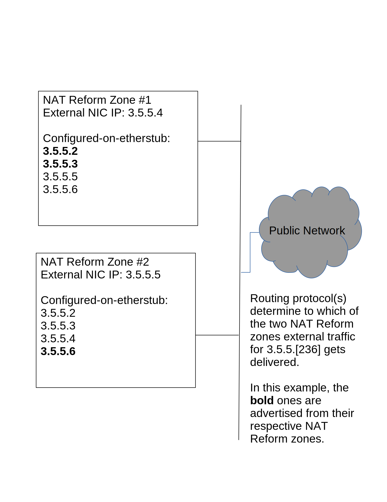

<!--
    This Source Code Form is subject to the terms of the Mozilla Public
    License, v. 2.0. If a copy of the MPL was not distributed with this
    file, You can obtain one at http://mozilla.org/MPL/2.0/.
-->

<!--
    Copyright 2018 Joyent
-->

# RFD 158 NAT Reform, including public IPs for fabric-attached instances.

<!--
TODO:
- MORE -- FILL ME IN!
-->

## Problem Statement

In today's JPC and other Triton deployments, if a Fabric Network is
allowed to reach the Internet it must have its own Network Address
Translation (NAT) zone.  Each NAT zone consumes 128MB of RAM, one unique
public IP, and one `overlay(7D)` NIC.  Furthermore, the NAT zone is only
available on one Compute Node, and is not easily migrated or respun if a CN
fails.  A NAT zone provides Source NAT (SNAT) for egress traffic.

Additionally, many JPC and Triton customers have asked for Destination NAT
(DNAT) to allow a reserved public IP address to have its traffic forwarded to
a private address that may change from time to time. This feature resembles
Amazon's Elastic IP.  This RFD introduces a similar feature, Assignable IP
(AIP), with a narrow definition: a public IP address that can be mapped
one-to-one to exactly one Fabric Network IP (as defined by vnetid + Fabric IP
address).

## Proposed Solution

Both of the problems: Many NAT zones and AIPs, can be solved using the same
approach, namely the reimplementation of NAT for Fabric Networks in Triton.
A single entity that could handle the entire Triton's NAT needs, but is also
replicable in any number, should handle NAT-ting for all Fabric Networks.
All instances of this entity should be identically configured with all of the
NAT and AIP rules for the Triton deployment.  The instances differ only in
runtime state, most notably differing (S)NAT flows.  These instances can be
utilized via any number of policies.  On the interior side, the use of the
SmartOS VXLAN Protocol (SVP) to remap the default router to an appropriate
NAT entity can spread interior-to-exterior traffic across different NAT
entities on a per-default-router-IP basis.  On the exterior side, by use of
traditional IP routing protocols and, where appropriate, equal-cost
multipathing, will provide similar mappings from the external arrival side.

On the interior, Fabric Networks will need to know how to reach a NAT entity.
Today NAT Zones consume a Fabric IP address. In the future, each those Fabric
IP addresses will live on the all new NAT entities. Each entity will be able
to service many Fabric IP addresses for many Fabric Networks. SmartOS VXLAN
Protocol (SVP) entries for NAT IPs will point to a smaller set of underlay
IPs, depending on policy for spreading out the NAT load AND on the number of
deployed NAT entities.

On the exterior, the routing protocols run for the Internet-connected
networks in the Triton deployment will have to be informed about which public
IPs (both AIPs and public IPs consumed by NAT entities) get routed to which
NAT entities.  The routing information/topology will change as NAT entities
get added or removed (by administrator action OR by failure).  NAT entities
will be ABLE to receive all public IP traffic and send on behalf of all
internal Fabric Networks. Any given one, though, will not have all public IP
traffic routed to it because of external network routing policies, and
because for DNAT flows, DNAT state can exist only in one `vxlnat(7D)` zone
at a time.

This RFD will cover:

- Technical details of the NAT Entity - `vxlnat(7D)`.
- How a zone needs to be configured for `vxlnat(7D)`.
- How Assignable IPs (AIPs) will work.
- Changes required for Triton
- Changes required for external network routing for a Triton deployment.

### The `vxlnat(7D)` NAT Entity

This project introduces a new pseudo-driver, `vxlnat(7D)`, which implements a
simplified NAT subsystem that can be replicated an arbitrary number of times
on vanilla compute nodes OR on dedicated hardware.  Each instance is
relatively expensive, as each has a full copy of the Triton-wide state for
SNAT mappings and DNAT mappings.

`vxlnat(7D)` implements NAT between multiple VXLAN networks and a set of
public IP addresses.  `vxlnat(7D)` does not implement VXLAN with an
`overlay(7D)` device, instead it listens on the VXLAN UDP port to an
interface that is attached to a VXLAN underlay network. `vxlnat(7D)` uses the
VNET id as an additional field in its NAT rules.  All state in `vxlnat(7D)`
is instantiated and indexed by the 24-bit VXLAN vnet ID.  All VXLAN packets
first find the vnet state, and then proceed.  The per-vnet state contains 1-1
mapping entries, NAT rules for an internal prefix, and NAT flows derived from
the NAT rules.  Each `vxlnat(7D)` instance has its own distinct
underlay-network IP address.

An overview of `vxlnat(7D)` configuration will help better explain the
public-network side of things.  `vxlnat(7D)` is configured in the following
manner:

- A VXLAN address, aka. the underlay network IP.
- 1-1 external-IP to internal-{vnet,IP}
  (NOTE: An external-IP used for 1-1 cannot be use for anything
  else.)
- Traditional NAT rules mapping {vnet,IP-prefix} ==> external-IP.
  (NOTE: external-IPs used here can be reused for other
  {vnet,IP-prefix} mappings. Any mappings sharing an external-IP must
  co-reside on a single `vxlnat(7D)` zone.)

NOTE: Today Triton does not allow overlapping prefixes in a customer (vnet).
If that changes, the addition of VLAN will be needed in the above mappings,
alongside vnet.

The above configuration is read from a file by `vxlnatd(1M)`, an SMF-managed
service that opens the `vxlnat(7D)` device, and feeds it configuration from a
file.  `vxlnatd(1M)` will also perform configuration updates, query for
configuration and/or statistics, and query SVP on behalf of 1-1 mappings for
inbound traffic.  The current prototype of `vxlnat(7D)` is such that while it
can be run in a non-global zone, only one `vxlnat(7D)` can run on a machine
at a time.

On the public-network side, `vxlnat(7D)` uses existing TCP/IP stack constructs
to aid in processing NAT flows or rules.  For 1-1 mapped external IPs, the
Internet Route Entry (IRE) for the reserved external IP has its IRE receive
function remapped into a special `vxlnat(7D)` routine that rewrites the
external IP to the internal IP, adjusts checksums, and then VXLAN
encapsulates.  Each NAT flow, as created by outgoing packets, receives a
TCP/IP `conn_t` (corresponding to UDP, TCP, or ICMP sockets).  The existing
TCP/IP code can confirm `conn_t` uniqueness, as well as give each `conn_t`
distinct `squeue` vertical perimeters to allow packet concurrency from
outside-to-inside packet flow.  Each IRE or `conn_t` includes a pointer to
per-vnet state, so additional lookups are not required.

The assumptions of available TCP/IP facilities requires `vxlnat(7D)` get its
own netstack, and that said netstack is properly configured too.

### The `vxlnat(7D)` Zone.

In illumos, a zone can either have its own TCP/IP netstack, or share it with
the global zone.  `vxlnat(7D)` requires its own netstack, so it cannot be used
in a shared-stack zone. Fortunately, SmartOS disallows shared-stack zones, so
`vxlnat(7D)` can instantiate on any arbitrary zone, even the global zone.

To exploit the existing TCP/IP constructs mentioned in the prior entity, all
external IP addresses must be assigned to the netstack.  If `vxlnat(7D)` is
to be replicable, however, the external IP addresses must not be assigned to
an interface that shares a layer 2 network with other `vxlnat(7D)` instances.

#### Dedicated etherstub and a single unique external IP.

A `vxlnat(7D)` zone must get an etherstub assigned exclusively to it, so it can
configure supported external addresses on one or more vnics using that
etherstub.  Since the etherstub has no other zones attached to it, Duplicate
Address Detection will not find any duplicate addresses.

In addition to the set of external IP addresses, the `vxlnat(7D)` zone must
also have a dedicated external IP so that routing protocols and/or policies
know which actual destination to forward packets for a set of external IP
addresses.  A `vxlnat(7D)` zone's dedicated IP CAN be on other `vxlnat(7D)`
zone's etherstub vnics, for easier failover.  The external network diagram
from earlier illustrates a sample deployment of external IP addresses.

The etherstub is required because, as of today, there is no way to assign an
address to a NIC without Duplicate Address Detection being invoked.  A
possible future illumos change where an address can be added without
Duplicate Address Detection would obviate the need for an etherstub.

#### Underlay network attachment

As noted in the `vxlnat(7D)` introduction, the zone must be physically
attached to the VXLAN underlay network for internal packet processing.  No
other routes apart from underlay network routes must be on the underlay
interface.  The external interface may have other routes, but those are not
relevant to the underlay network.

Currently this means no routes on the underlay interface, but if Rack-Aware
Networking [RFD 152] comes to the underlay network, routes for other racks
MUST be present, and not collide with any external network IP address space.

#### IP Forwarding

A `vxlnat(7D)` zone must enable IP forwarding between the external network
NIC and the etherstub vnics.  The `vxlnat(7D)` zone MUST NOT enable IP
forwarding on the underlay network NIC.  `vxlnat(7D)` itself will perform
VXLAN decapsulation and subsequent IP forwarding, and the disabling of IP
forwarding on the underlay network will reduce the possibility of direct
packet leaks to or from the underlay network.

### Assignable IP Addresses

A `vxlnat(7D)` deployment enables the concept of an Assignable IP address
(AIP).  An AIP begins with an address from Triton's public IP address space,
which is then assigned to a user.  The user can-and-should be charged for use

> XXX-mg does this mean that the vxlnat zone's IP address will fail over to
> another zone in the event that the first goes offline (planned or unplanned)?

> XXX KEBE SAYS ALL vxlnat zones have ALL of the public IP addresses.  Most
> on the etherstub, ONE on the actual external NIC.

> XXX KEBE ALSO SAYS the picture in "Dedicated etherstub" may help a lot in
> answering this.

of this AIP while they have it.  The user can assign (the 'A' in AIP) it to a
specific fabric-attached instance, as well as modify its assignment with the
expectation of in no-less-than a certain time (e.g. 120 seconds) until the
new instance receives the traffic.  The instance in question should have its
default route point to a same-fabric IP whose underlay address resolves to a
`vxlnat(7D)` zone.  If `vxlnat(7D)` is functioning as a NAT already for the
fabric network of the instance, this will not require additional update to
the instance or its fabric network.

If a `vxlnat(7D)` zone fails, merely adjusting the underlay address for VXLAN
traffic will shuffle an AIP to be handled by another one.  For AIPs, this
will result in no TCP connection disruption, as AIP processing is stateless.
(For traditional NAT flows, it will result in TCP connection resets.)

The creation, modification, and deletion of an AIP mapping will occur in
NAPI(?).

### Triton requirements

> QUESTIONS FROM PRIOR VERSIONS ARE NOW OFFLINE, BUT ANSWERED.

Once NAT Reform arrives in a Triton deployment, Fabric Networks can either
continue to use legacy-per-fabric-NAT-zone, or begin to employ `vxlnat(7D)`
as their default router.  Modulo public IP inspections by outside-Triton
peers, instances will not be able to tell if they are legacy-per-fabric or
`vxlnat(7D)` NATted.

> XXX DOCUMENT IN GREAT DETAIL the `vxlnat(7D)` pool, a reminder from above
> about how all zones get the same configuration, and most importantly
> document (for now, this will change) how a new default router selects a
> servicing vxlnat(7D) zone.

> XXX DOCUMENT IN GREAT DETAIL THE FAILURE MODES.  ALSO THINK OF WAYS TO
> RECOVER FROM FAILURE:  E.g. single + hot-standbys, or Using Portolan to
> rewire interior connectivity, or Using NAPI WITH RFD 32 to reassign DOWN
> UL3 IPs to still-running `vxlnat(7D)` instances.

#### PORTOLAN

> Portolan is the source-of-truth about UL3 addresses, including those for
> the default router.  Starting with NAT Reform, it will also have to be the
> monitoring checker for `vxlnat(7D)` zones, unless another suitable entity
> exists. We need to fill in what all Portolan needs to do in a NAT Reform
> world.  Initially I didn't think much, but the recent VPC+Triton call
> suggests SOMETHING has to check `vxlnat(7D)` zone health.

#### NAPI

> We need to store SOMEWHERE (either /fabrics/:user/vlans/:vlan or /networks)
> if a fabric network is vxlnat(7D)-consuming OR not, the latter meaning
> traditional NAT.  Not sure if we need a new field, or if we overload the
> old field.

> Update docs too, e.g. https://docs.joyent.com/public-cloud/network/sdn

##### CHANGEFEED

> XXX KEBE ASKS IS THIS HOW WE PUSH OUT `vxlnat(7D)` ZONE RULE UPDATES?

#### SAPI

> Fill in text about the `vxlnat(7D)` service.  Mention how sdcadm(1M) will
> need to configure it.  Use electric-moray from Manta as an example (since
> it too is replicable same-configuration zones).

#### VMAPI

Today, the VMAPI workflow `fabric-common` contains NAT zone provisioning.
The currently-existing function `provisionNatZone()` creates a new NAT zone.
In a world with `vxlnat(7D)`, this workflow must first check if a fabric
network is a `vxlnat(7D)`-connected one and if so, allocate a fabric's
next-hop router, and have sdcadm(1M) assign it to the `vxlnat(7D)`
configuration.

### External network routing requirements

> XXX KEBE SAYS TALK TO NETOPS ABOUT THIS.  HOW DO PUBLIC-IP PREFIXES GET
> HANDLED TODAY?  YOU HAVE SOME OLD DRAWINGS, SEE IF THEY CHANGED. DO WE NEED
> `vxlnat(7D)` RUNNING ROUTING PROTOCOLS?  WE JUST MIGHT!

> IT IS POSSIBLE THAT TRITON ITSELF WILL LIKELY KNOW A LOT MORE ABOUT
> `vxlnat(7D)` INSTANCES THAN THE EXTERNAL NETWORK VIA ROUTING PROTOCOLS.  IS
> THERE A GOOD WAY TO SHARE THAT KNOWLEDGE WITH THE EXTERNAL NETWORK CONTROL
> PLANE?

> THE FUNDAMENTAL PROBLEM TO BE SOLVED IS SIMPLE TO STATE: WHEN AN INSTANCE
> GOES DOWN, THE EXTERNAL IP ADDRESSES IT SERVICES (BOTH AIPS AND SNAT PUBLIC
> IPS) SERVICED BY THE INSTANCE MUST BE TRANSFERRED TO OTHER RUNNING
> INSTANCES, WITH ROUTING UPDATED APPROPRIATELY.

> ONCE THIS TRANSFER IS COMPLETE, THE AIP ADDRESSES SHOULD CONTINUE TO MOVE
> BITS  ANY LOSS BEYOND THE TIME THE AIP COULD NOT REACH A WORKING
> INSTANCE.  FOR SNAT/MAPPINGS, THE EXISTING STATE IS GONE, AND INTERIOR
> NAT-USING FABRIC INSTANCES WILL HAVE TO RESTART THEIR TCP/UDP SESSIONS.
> BECAUSE `vxlnat(7D)` CONFIGURATION IS REPLICATED IDENTICALLY ACROSS ALL
> INSTANCES, ONLY REACHABILITY STATE NEEDS TO UPDATE.

### Design Decisions and Tradeoffs

> XXX KEBE SAYS THIS IS WHERE "Why didn't you X?" QUESTIONS AND ANSWERS GO.

Today, NAT zones consume their own public IP (one per customer, per customer
fabric network).  Moving to a `vxlnat(7D)` approach should cut back public IP
usage in a Triton cloud.  If a cloud has 100 customers, each with 2 distinct
fabric networks requiring NAT, that consumes 200 public IP addresses (nearly
a /24), as well as 200 `overlay(7D)` instances.  With `vxlnat(7D)`, the
amount of public IPs for public NATs can decrease, and those extra IPs can be
instead used for AIP.

Because of `vxlnat(7D)`'s approach to the VXLAN side (one all-listening
kernel socket and per-vnet state), using an existing NAT engine (like
ipfilter) would have barriers including per-vnat state.  This lead to
`vxlnat(7D)` needing to implement its own NAT constructs, albeit in a limited
space (only traditional SNAT or 1-1/static).  1-1/static NAT mappings are
straightforward (as long as the VM consuming it has a default route set), and
NAT flows have RFCs and other NAT engines to guide their implementation.

This proposal builds on the assumption that one-or-more `vxlnat(7D)` instance
will be scattered across a Triton Data Center, each having configuration data
for the entire DC.  In theory a single `vxlnat(7D)` instance could handle all
of the NAT for all of the fabric networks.  In practice, the idea is that a
combination of NAPI and SVP/Portolan on the interior and routing protocols on
the exterior will roughly balance traffic between the `vxlnat(7D)` instances so
that individual flows balance across the instances.  If loading the
`vxlnat(7D)` with the entire list of fabrics for the Triton DC is impractical,
this whole approach will have to be revisited.  Unlike OpenFlow (or at least
earlier revisions of OpenFlow), NAT flows do not have to be propagated to all
`vxlnat(7D)` entities.

> XXX KEBE SAYS MORE TO COME!  This especially includes the enumeration of
> other possible technical solutions.

## Deploying `vxlnat(7D)`.

The presence of `vxlnat(7D)` zones can be a transparent event to Triton
instances.  After all, the fabric network experience from an ordinary
instance does not change.  A default router still exists if the fabric can
reach the Internet.  Whether the default router UL3 changes to a `vxlnat(7D)`
zone or remains with a per-fabric NAT zone matters not to an instance.

The units of concern are the head node and the compute nodes.  A compute node
cannot host a `vxlnat(7D)` zone until its platform image contains
`vxlnat(7D)` support.  An updated compute node can host both old-fashioned
per-fabric NAT zones AND a `vxlnat(7D)` zone concurrently, because the
per-fabric NATs use `overlay(7D)`, and the `vxlnat(7D)` zone uses its own UL3
address on its direct attachment to the underlay network.

The head node's services will need to determine when to start employing
`vxlnat(7D)`.  That can only happen when the following conditions occur:

* NAPI supports <TBD>

* Portolan support <TBD>

* SAPI supports <TBD>

* VMAPI supports fabric network bringup by modifying the `vxlnat(7D)` rules.

> XXX KEBE SAYS HOW DO WE DEPLOY `vxlnat(7D)` IN A WORLD OF FABRIC NETS WITH
> NAT ZONES?!  GOOD QUESTION.  WE MIGHT BE ABLE TO DO IT INCREMENTALLY IF WE
> CAN PUSH THE PORTOLAN UPDATES OUT (and the NAPI ones, and the....)

## References

<!-- Other RFDs -->

* [RFD 152]

[RFD 152]: https://github.com/joyent/rfd/blob/master/rfd/0152/README.md
