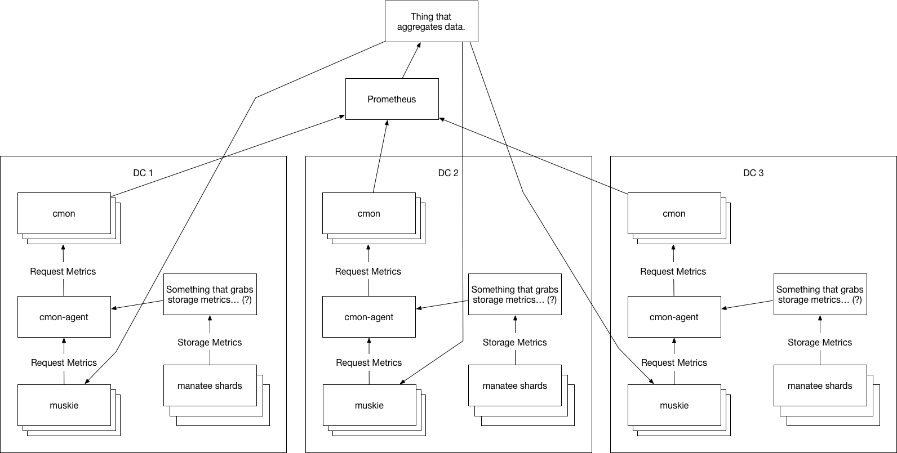

<!--
    This Source Code Form is subject to the terms of the Mozilla Public
    License, v. 2.0. If a copy of the MPL was not distributed with this
    file, You can obtain one at http://mozilla.org/MPL/2.0/.
-->

<!--
    Copyright 2019 Joyent
-->

<!-- this is here because rfdlint is silly
# RFD 160 CloudWatch-like Metrics for Manta
-->

# 1. CloudWatch-like Metrics for Manta

The goal of this project is to implement CloudWatch-like metrics for Manta
storage that's similar to [what AWS has for S3](https://docs.aws.amazon.com/AmazonS3/latest/dev/cloudwatch-monitoring.html).

## Open Questions

I'm putting this here for now so you can keep these in mind while reading
through this. If you know the answers to these, please let me know.

 * How compatible do we need to be with CloudWatch?
     * Should our metrics line up on the minute like theirs?
     * Do we want all of the metrics they have that are possible, or are there
       some we don't want to expose?
     * Do we need to support all the same "statistics" on each of the metrics?
       E.g. Do we need min/max on 4xxErrors?
     * Do we want to require people create a "metric configuration" before they
       can get request metrics? If so: are we going to limit to 1000 per bucket?
       Or some other value? If not: are we going to monitor *every*
       prefix/subdirectory?
     * Are we going to support filtering metrics based on
       prefixes/subdirectories at all?
     * Are we going to need to "extend" this feature with some additional filter
       options to make up for things we don't have (some ideas are listed
       below), or are these out of scope for mvp?
     * Are we going to add some metrics that make more sense in Manta, like:
       ListDirectoryRequests, PutSnapLinkRequests, anything about jobs, anything
       else?
     * In the existing muskie metrics, we have requests with `method="LIST"`. Do
       we need to add a metric that includes those?
 * How should we handle non-buckets Manta?
     * Should we make special "buckets" that represent the top-level manta
       directories: stor, public, jobs, uploads, reports, etc.?
 * How much data should we expect?
     * What is the average rate of requests at a muskie? What is the maximum
       rate before which we add more?
     * How many customers do we expect to use these metrics?
     * How many metrics configurations should we design for?
 * Is it possible for CMON to handle this data?
     * If not: can changes be made that makes it possible?
 * For storage metrics, are we going to be able to get the data we need from
   PostgreSQL?
     * Can we dump the data from async?
     * How long will it take to get the data from each async?
     * How do we find the list of all shards we need to grab data from?
 * Can Prometheus be involved?
     * The way prometheus handles data, it might be hard to have strict 1-minute
       samples.
 * How far back should data be available?
     * CloudWatch stores data going back 15 months. Including for deleted
       buckets.
 * How durable does this data need to be?
     * If we lost all existing metric data at some point (breaking whatever
       retention policy we had), how bad would that be?
 * How should we handle shards being down or other things in the metric
   collection path for a subset of the data, at the time we're collecting
   metrics?
     * If we're collating the data every minute for requests, what happens when
       data is unavailable for one muskie? What if that data shows up later? Is
       it ok if I query the data for a time period twice and get different
       results (because more data showed up)?
 * Is it ok to add this feature as a set of new endpoints to Muskie?
     * That is the API that's used to perform these actions, so it seems to me
       like the logical place to query for these metrics.
     * Wherever we put this data, it seems like it needs to be available for the
       region rather than just DC. Since customers use `us-east.manta.*` rather
       than `us-east-1.manta.*`
 * How will we determine how much additional load this puts on the system?
     * Do we need to design things such that the collection of metrics backs-off
       somehow before it impacts overall service? How should it tell? How can it
       tell when it is ok to start dropping data?
     * What is acceptable for additional CPU/disk/memory usage in muskie for
       both collection and serving data?

# 2. CloudWatch

## Overview

This will be a very brief and incomplete overview of CloudWatch + S3 just to
give relevant understanding of how one uses CloudWatch to get metrics about
one's S3 buckets.

## Request Metrics

All of the [metrics exposed for S3 by
CloudWatch](https://docs.aws.amazon.com/AmazonS3/latest/dev/cloudwatch-monitoring.html#s3-cloudwatch-metrics)
are scoped to buckets. When you want to be able to use anything other than the
storage metrics for a bucket (which are always available), you must first create
a "metric configuration" for that bucket. You can create up to 1000 of these
configurations per bucket and must give each one an Id. If you create a
configuration like:

```
aws s3api put-bucket-metrics-configuration \
    --endpoint http://s3-us-west-2.amazonaws.com \
    --bucket mahBukkit \
    --id EntireBucket \
    --metrics-configuration '{"Id": "EntireBucket"}'
```

The configuration will apply to the entire bucket. The "id" here doesn't have to
be "EntireBucket" it could be whatever you'd like to call it. You could also
instead create a configuration like:

```
aws s3api put-bucket-metrics-configuration \
    --endpoint http://s3-us-west-2.amazonaws.com \
    --bucket mahBukkit \
    --id BlueObjects \
    --metrics-configuration '{"Id": "BlueObjects", "Filter": {"Prefix": "blue"}}'
```

which creates a filter "BlueObjects" that only applies to operations on files
with the prefix "blue". If we add both of these configurations (leaving us
998/1000 for this bucket), and we PUT and GET an object `blue/object.txt` a few
times to this bucket, we should see the results show up for both the
"EntireBucket" filter and the "BlueObjects" filter. However, if we put an object
`object.txt` to this bucket, we should only see those requests reflected in the
"EntireBucket" filter, and not the "BlueObjects" filter. It is also possible to
define a filter that applies only to object with specific
[S3 Tags](https://docs.aws.amazon.com/AmazonS3/latest/dev/object-tagging.html)
by including `"Tag": "<tag name>"` in your filter when creating the metric
configuration.

Whenever you want to lookup metric data, you must specify both the bucket name
and the filter name. It's possible also to specify a "StorageType" to limit your
results to just operations on objects of a specific type. Metrics do not seem to
be collected until you've created a filter, so I'm guessing that the creation of
the "metric configuration"/filter is what causes something on the backend to
start actually gathering this data.  The exception to this is the two "Storage
Metrics" which the documentation says are collected daily for every bucket even
without a metric configuration.

With at least one "metric configuration" in place for your bucket, request
metrics will start being collected with a 1-minute granularity. Note that on AWS
completeness and timeliness of these metrics are not guaranteed, and they point
out that billing might show more requests than the metrics. Importantly, these
"metric configurations" do matter for storage metrics. Storage metrics apply
only to whole buckets (example is shown below).

To actually do a query on this data, as mentioned above, you must specify at
least a bucket and a filter. You must also specify which statistic to gather.
Some metrics support more than one statistic, others just support one. An
example request would look like:

```
aws cloudwatch get-metric-statistics \
    --namespace AWS/S3 \
    --metric-name 4xxErrors \
    --start-time 2019-01-28T20:00:00Z \
    --end-time 2019-01-28T23:59:00Z \
    --statistics Average \
    --period 60 \
    --dimensions Name=FilterId,Value=EntireBucket Name=BucketName,Value=mahBukkit
```

in my test case this results in output like:

```
{
    "Label": "4xxErrors",
    "Datapoints": [
        {
            "Timestamp": "2019-01-28T23:55:00Z",
            "Average": 0.0,
            "Unit": "Count"
        },
        {
            "Timestamp": "2019-01-28T22:35:00Z",
            "Average": 0.0,
            "Unit": "Count"
        },
        {
            "Timestamp": "2019-01-28T22:48:00Z",
            "Average": 0.3333333333333333,
            "Unit": "Count"
        },
        {
            "Timestamp": "2019-01-28T23:54:00Z",
            "Average": 0.0,
            "Unit": "Count"
        },
        {
            "Timestamp": "2019-01-28T22:34:00Z",
            "Average": 0.0,
            "Unit": "Count"
        },
        {
            "Timestamp": "2019-01-28T23:58:00Z",
            "Average": 0.0,
            "Unit": "Count"
        },
        {
            "Timestamp": "2019-01-28T22:38:00Z",
            "Average": 0.8333333333333334,
            "Unit": "Count"
        },
        {
            "Timestamp": "2019-01-28T22:47:00Z",
            "Average": 0.0,
            "Unit": "Count"
        },
        {
            "Timestamp": "2019-01-28T22:37:00Z",
            "Average": 1.0,
            "Unit": "Count"
        }
    ]
}
```

Because we're using the 4xxErrors metric here, we could have used any of
Minimum, Maximum, SampleCount or Sum instead of "Average".

You can also run:

```
aws cloudwatch list-metrics --namespace "AWS/S3"
```

to list all of your metrics which will look something like:

```
{
    "Metrics": [
        {
            "Namespace": "AWS/S3",
            "MetricName": "BytesUploaded",
            "Dimensions": [
                {
                    "Name": "BucketName",
                    "Value": "mahBukkit"
                },
                {
                    "Name": "FilterId",
                    "Value": "EntireBucket"
                }
            ]
        },
        ...
        {
            "Namespace": "AWS/S3",
            "MetricName": "GetRequests",
            "Dimensions": [
                {
                    "Name": "BucketName",
                    "Value": "mahBukkit"
                },
                {
                    "Name": "FilterId",
                    "Value": "BlueObjects"
                }
            ]
        },
        ...
```

for each of the combinations of filter and bucket you've created "metric
configurations" for, and each metric available.

If I do a bunch of curl requests to `<bucket>/object.txt` and a smaller number to `<bucket>/blue/object.txt` then run:

```
aws cloudwatch get-metric-statistics \
    --namespace AWS/S3 \
    --metric-name AllRequests \
    --start-time 2019-01-29T00:00:00Z \
    --end-time 2019-01-29T01:00:00Z \
    --statistics Sum \
    --period 60 \
    --dimensions Name=FilterId,Value=BlueObjects Name=BucketName,Value=mahBukkit
```

I see:

```
{
    "Label": "AllRequests",
    "Datapoints": [
        {
            "Timestamp": "2019-01-29T00:16:00Z",
            "Sum": 3.0,
            "Unit": "Count"
        },
        {
            "Timestamp": "2019-01-29T00:15:00Z",
            "Sum": 3.0,
            "Unit": "Count"
        }
    ]
}
```

but if I look at the EntireBucket filter using:

```
aws cloudwatch get-metric-statistics \
    --namespace AWS/S3 \
    --metric-name AllRequests \
    --start-time 2019-01-29T00:00:00Z \
    --end-time 2019-01-29T01:00:00Z \
    --statistics Sum \
    --period 60 \
    --dimensions Name=FilterId,Value=EntireBucket Name=BucketName,Value=mahBukkit
```

I get:

```
{
    "Label": "AllRequests",
    "Datapoints": [
        {
            "Timestamp": "2019-01-29T00:16:00Z",
            "Sum": 21.0,
            "Unit": "Count"
        },
        {
            "Timestamp": "2019-01-29T00:15:00Z",
            "Sum": 5.0,
            "Unit": "Count"
        }
    ]
}
```

since that includes all the requests.

## Storage Metrics

As mentioned earlier, for the 2 "storage metrics" things work differently from
the request metrics. Specifically you:

 * cannot use filters (metrics are only available on the whole bucket)
 * must specify a storage type [See Appendix 1 for list for S3]()

So to get the BucketSizeBytes you'd run:

```
aws cloudwatch get-metric-statistics \
    --namespace AWS/S3 \
    --metric-name BucketSizeBytes \
    --start-time 2019-01-01T00:00:00Z \
    --end-time 2019-01-31T00:00:00Z \
    --statistics Average \
    --period 86400 \
    --dimensions Name=BucketName,Value=mahBukkit Name=StorageType,Value=StandardStorage
```

which might have results that look like:

```
{
    "Label": "BucketSizeBytes",
    "Datapoints": [
        {
            "Timestamp": "2019-01-30T00:00:00Z",
            "Average": 238.0,
            "Unit": "Bytes"
        },
        {
            "Timestamp": "2019-01-29T00:00:00Z",
            "Average": 238.0,
            "Unit": "Bytes"
        }
    ]
}
```

note that if you *don't* specify a StorageType (can use Value=AllStorageTypes),
or if you *do* specify a filter, even one that's valid for request metrics, you
will get no results. The granularity of these metrics is daily, so even if you
specify a period smaller than 86400, you'll only get one datapoint per day
between `start-time` and `end-time`.

For sake of completeness, to get the count for a bucket you can run:

```
aws cloudwatch get-metric-statistics \
    --namespace AWS/S3 \
    --metric-name NumberOfObjects \
    --start-time 2019-01-01T00:00:00Z \
    --end-time 2019-01-31T00:00:00Z \
    --statistics Average \
    --period 86400 \
    --dimensions Name=BucketName,Value=mahBukkit Name=StorageType,Value=AllStorageTypes
```

which will output something like:

```
{
    "Label": "NumberOfObjects",
    "Datapoints": [
        {
            "Timestamp": "2019-01-30T00:00:00Z",
            "Average": 5.0,
            "Unit": "Count"
        },
        {
            "Timestamp": "2019-01-29T00:00:00Z",
            "Average": 5.0,
            "Unit": "Count"
        }
    ]
}
```

## Table of Metrics

### Storage Metrics

| AWS Metric | Statistics | Decription |
| ---------- | ---------- | ---------- |
| BucketSizeBytes | Average | bytes of data stored in a bucket |
| NumberOfObjects | Average | number of objects in a bucket |

### Request Metrics

| AWS Metric | Statistics | Decription |
| ---------- | ---------- | ---------- |
| AllRequests | Sum | total number of HTTP (all methods) requests |
| GetRequests | Sum | number of HTTP GET requests |
| PutRequests | Sum | number of HTTP PUT requests |
| DeleteRequests | Sum | number of HTTP DELETE requests |
| HeadRequests | Sum | number of HTTP HEAD requests |
| PostRequests | Sum | number of HTTP POST requests |
| SelectRequests | Sum | number of [SELECT Object Content](https://docs.aws.amazon.com/AmazonS3/latest/API/RESTObjectSELECTContent.html) requests |
| SelectScannedBytes | Average, Sum, SampleCount, Minimum, Maximum | number bytes scanned by [SELECT Object Content](https://docs.aws.amazon.com/AmazonS3/latest/API/RESTObjectSELECTContent.html) requests |
| SelectReturnedBytes | Average, Sum, SampleCount, Minimum, Maximum | number bytes returned by [SELECT Object Content](https://docs.aws.amazon.com/AmazonS3/latest/API/RESTObjectSELECTContent.html) requests |
| ListRequests | Sum | number requests to list the contents of a bucket |
| BytesDownloaded | Average, Sum, SampleCount, Minimum, Maximum | number bytes downloaded from S3 from all responses with bodies |
| BytesUploaded | Average, Sum, SampleCount, Minimum, Maximum | number bytes uploaded to S3 from all requests with bodies |
| 4xxErrors | Average, Sum, SampleCount, Minimum, Maximum | number of 4xx errors: avg shows rate, sum shows count per error type |
| 5xxErrors | Average, Sum, SampleCount, Minimum, Maximum | number of 5xx errors |
| FirstByteLatency | Average, Sum, SampleCount, Minimum, Maximum | per-request time from request received until first byte of response returned (ms) |
| TotalRequestLatency | Average, Sum, SampleCount, Minimum, Maximum | per-request time from request received until last byte of response returned (ms) |

## Features

The key features that seem to make the CloudWatch metrics especially useful
include:

 * the ability to create filters on object name prefixes
    * if I have a `website` bucket, I could put different assets with different
      prefixes such as `blog/`, `contact/`, `products/` and create a "metric
      configuration" for each of these and one with an empty filter on the
      bucket itself. Then I could create a graph which allows me to track such
      things as: What percent of my requests are for the `products/`?
 * the ability to create filters on object tags
    * if I wanted, I could tag specific objects by type. In the previous
      example, maybe I want to tag things as images, javascript and content. I
      could have separate metrics for each of these within a bucket and graph
      them independently for comparison.

With the combination of these two filter types it's possible to track your
requests in arbitrary ways that meet your business requirements/goals.

## Other Service Notes

 * CloudWatch stores [all metrics for 15 months](https://aws.amazon.com/blogs/aws/amazon-cloudwatch-update-extended-metrics-retention-user-interface-update/).
     * One minute data points are available for 15 days.
     * Five minute data points are available for 63 days.
     * One hour data points are available for 455 days (15 months).
     * These retention periods also apply to deleted buckets

# 3. What should our solution look like?

## Overview

This is my current straw-man and subject to change entirely.

 * Add /:account/metrics endpoints to muskie (See below for parameters)
 * Collect all the request data for registered customers/buckets/paths from all
   the muskies in a DC and aggregate these every minute for the DC
 * Collect the aggregated request data for all DCs in a region every minute and
   make this available for muskies to query (to serve /:account/metrics requests)
 * Gather sizes and counts for all registered customers/buckets/paths from the
   metadata tier's data from all shards. Ideally every hour or so, but at least
   a couple times a day.
 * Collect the aggregated storage data for each bucket/top-level directory for
   all DCs in a region at least daily and make this available for muskies to
   query (for /:account/metrics).

## /:account/metrics endpoints

### GET /:account/metrics

| Parameter | Value |
| --------- | ----- |
| :account | The owner of the "buckets" for which we're trying to get metrics. |
| bucket | The name of the bucket for which to return metrics. Required. For non-buckets, can use something like MANTA:stor since actual buckets can't start with a lower-case letter. |

Return list of valid metrics for this "bucket".

### GET /:account/metrics/:metric

| Parameter | Value |
| --------- | ----- |
| :account | The owner of the "buckets" for which we're trying to get metrics. |
| bucket | The name of the bucket for which to return metrics. Required. For non-buckets, can use something like MANTA:stor since actual buckets can't start with a lower-case letter. |
| endTime | Timestamp of end of metric window. (TODO: what timestamp format is used most commonly in Manta APIs? ISO?) |
| :metric | The name of the metric to retrieve. |
| statistic | Type of operation, one of: Average, Maximum, Minimum, SampleCount, Sum. |
| startTime | Timestamp of start of metric window. (TODO: what timestamp format is used most commonly in Manta APIs? ISO?) |

Returns a JSON object with datapoints for the metric that matches the specified
parameters.

### GET /:account/metrics/filters

| Parameter | Value |
| --------- | ----- |
| :account | The owner of the "buckets" for which we're trying to get filters. |
| bucket | The name of the bucket for which to return filters. Required. For non-buckets, can use something like MANTA:stor since actual buckets can't start with a lower-case letter. |

Returns a JSON blob for each of the filters on the specified bucket.

### POST /:account/metrics/filters

| Parameter | Value |
| --------- | ----- |
| :account | The owner of the "buckets" for which we're trying to add a filter. |
| bucket | The name of the bucket for which to update filters. Required. For non-buckets, can use something like MANTA:stor since actual buckets can't start with a lower-case letter. |
| prefix | The path prefix on which to match for this filter. (if unset, the filter will match all metrics for this "bucket") |

On success, returns an object including a filterId.

Note: filters limited to X(?) per "bucket", too many filters and it will fail.

TODO: Other Ideas:
 * allow filter by file extension (since manta has no tags?)
 * filter by contentType?
 * filter by [Manta metadata](https://apidocs.tritondatacenter.com/manta/api.html#PutMetadata)?

### DELETE /:account/metrics/filters/:filterId

| Parameter | Value |
| --------- | ----- |
| :account | The owner of the "buckets" for which we're trying to add a filter. |
| :filterId | The Id of the filter to delete. |

# 4. Issues/Discussion of implementing for Manta

## Dependency on Buckets

The AWS metrics are all based around buckets. In Manta there is ongoing work to
support buckets ([RFD
155](https://github.com/TritonDataCenter/rfd/blob/master/rfd/0155/README.md)) but this
work is happening in parallel and therefore cannot yet rely on buckets.

The proposal above attempts to support non-buckets in a way that will make it
possible to also work with buckets when they're supported. Specifically by
allowing the use of a special prefix "MANTA:" which names a directory under the
account's root. E.g. for the `Joyent_Dev` account, which has files under:
`/Joyent_Dev/stor/` it would be possible to specify `MANTA:stor` to
reference the `/Joyent_Dev/stor` instead of a bucket name. Specifically since
anything starting with MANTA will not be a valid bucket name (must start with
lower-case letter).

This would allow access to all of the magical top-level directories that Manta
creates for you like:

 * jobs
 * public
 * reports
 * stor
 * uploads

When buckets is added, it would also be here, so it would likely be possible to
access the same path using either `MANTA:buckets` or the bucket name. Which
might cause some confusion so if we decided this was a good idea, we could just
specifically blacklist `MANTA:buckets` to avoid that confusion since any time
that would work, the user is probably better off use using the bucket name.

At least this would allow us to move forward without actual buckets, and would
still work when customers later have both buckets and non-buckets.


## Where should the API live?

Since customers talk to manta in a "region" e.g. us-central.manta.mnx.io, it
makes the most sense that the API would exist at that same level.

The option I'm proposing would be to tie this into muskie such that you can make
your queries for metrics via:

```
http://us-central.manta.mnx.io/<Account>/metrics
```


## How should we gather the required data?

### Request Metrics

It seems the logical place to gather the request metrics would be muskie since
it is the thing handling the requests.

For each of the request metrics we track, we'll want to keep at least:

 * the path (for prefix matching)
 * the bucket (when buckets are supported, until then: top-level directory like `stor`)
 * the account under which the data lives
 * time to first byte
 * time to last byte
 * status code (inc. 4xx, 5xx)
 * operation (GET, PUT, etc.)

#### Existing Muskie Metrics

Muskie [already has some of the data we need exposed via metrics](https://github.com/TritonDataCenter/manta-muskie/blob/master/docs/internal/design.md#metrics)
but:

 * need to add the owner's uuid to the labels (req.metadata.creator || req.metadata.owner)?
 * need to add the path to the labels (req.path()?)
 * add metrics for uploaded data + downloaded data with the same labels

With that, we should be able to get the request data from (after adding the
customer and bucket/directory filter on the results):

| AWS Metric | Muskie Metric | Notes |
| ---------- | ------------- | ----- |
| AllRequests | http_requests_completed{} | |
| GetRequests | http_requests_completed{op="GET"} | |
| PutRequests | http_requests_completed{op="PUT"} | |
| DeleteRequests | http_requests_completed{op="DELETE"} | |
| HeadRequests | http_requests_completed{op="HEAD"} | |
| PostRequests | http_requests_completed{op="POST"} | |
| BytesDownloaded | (new downloaded metric) | |
| BytesUploaded | (new uploaded metric) | |
| 4xxErrors | http_requests_completed{statusCode=~"4.."} | |
| 5xxErrors | http_requests_completed{statusCode=~"5.."} | |
| FirstByteLatency | http_request_latency_ms_count, http_request_latency_ms_sum | We should fix the naming here to `_seconds`. Also note we cannot support accurate Min/Max with this as a histogram. |
| TotalRequestLatency | http_request_time_ms_count, http_request_time_ms_sum | We should fix the naming here to `_seconds`. Also note we cannot support accurate Min/Max with this as a histogram. |

Also it's important to note that time to first byte and total time are tracked
via histograms and use the old broken histogram buckets code from artedi v1.
With a histogram, we cannot support Minimum and Maximum unless we add
additional gauges like:

 * `http_request_latency_seconds_max`
 * `http_request_latency_seconds_min`
 * `http_request_time_seconds_max`
 * `http_request_time_seconds_min`

otherwise we'd be stuck with returning the maximum and minimum *buckets* which
recorded data, which might be wildly inaccurate.

#### Cardinality and Amount of Data

One problem with using the existing metrics as they exist in muskie is that
currently (before we do any work here) the relevant muskie metrics (everything
that matches `^http_request`) look something like:

```
http_requests_completed{operation="headstorage",method="HEAD",statusCode="200",datacenter="staging-1",server="aac3c402-3047-11e3-b451-002590c57864",zonename="380920d9-ed44-4bcd-b61c-4b99f49c1329",pid="709951"} 6126
http_requests_completed{operation="putdirectory",method="PUT",statusCode="204",datacenter="staging-1",server="aac3c402-3047-11e3-b451-002590c57864",zonename="380920d9-ed44-4bcd-b61c-4b99f49c1329",pid="709951"} 44294
http_requests_completed{operation="putobject",method="PUT",statusCode="204",datacenter="staging-1",server="aac3c402-3047-11e3-b451-002590c57864",zonename="380920d9-ed44-4bcd-b61c-4b99f49c1329",pid="709951"} 3125
http_requests_completed{operation="getstorage",method="LIST",statusCode="200",datacenter="staging-1",server="aac3c402-3047-11e3-b451-002590c57864",zonename="380920d9-ed44-4bcd-b61c-4b99f49c1329",pid="709951"} 1252
http_requests_completed{operation="get102",method="unknown",statusCode="302",datacenter="staging-1",server="aac3c402-3047-11e3-b451-002590c57864",zonename="380920d9-ed44-4bcd-b61c-4b99f49c1329",pid="709951"} 14041
http_requests_completed{operation="headstorage",method="HEAD",statusCode="404",datacenter="staging-1",server="aac3c402-3047-11e3-b451-002590c57864",zonename="380920d9-ed44-4bcd-b61c-4b99f49c1329",pid="709951"} 111
http_requests_completed{operation="putobject",method="PUT",statusCode="412",datacenter="staging-1",server="aac3c402-3047-11e3-b451-002590c57864",zonename="380920d9-ed44-4bcd-b61c-4b99f49c1329",pid="709951"} 3433
http_requests_completed{operation="getstorage",method="GET",statusCode="200",datacenter="staging-1",server="aac3c402-3047-11e3-b451-002590c57864",zonename="380920d9-ed44-4bcd-b61c-4b99f49c1329",pid="709951"} 1468
http_requests_completed{operation="putjobsobject",method="PUT",statusCode="404",datacenter="staging-1",server="aac3c402-3047-11e3-b451-002590c57864",zonename="380920d9-ed44-4bcd-b61c-4b99f49c1329",pid="709951"} 598
http_requests_completed{operation="putjobsdirectory",method="PUT",statusCode="204",datacenter="staging-1",server="aac3c402-3047-11e3-b451-002590c57864",zonename="380920d9-ed44-4bcd-b61c-4b99f49c1329",pid="709951"} 4702
http_requests_completed{operation="putjobsobject",method="PUT",statusCode="204",datacenter="staging-1",server="aac3c402-3047-11e3-b451-002590c57864",zonename="380920d9-ed44-4bcd-b61c-4b99f49c1329",pid="709951"} 1015
http_requests_completed{operation="getjobsstorage",method="GET",statusCode="200",datacenter="staging-1",server="aac3c402-3047-11e3-b451-002590c57864",zonename="380920d9-ed44-4bcd-b61c-4b99f49c1329",pid="709951"} 873
http_requests_completed{operation="putreportsdirectory",method="PUT",statusCode="204",datacenter="staging-1",server="aac3c402-3047-11e3-b451-002590c57864",zonename="380920d9-ed44-4bcd-b61c-4b99f49c1329",pid="709951"} 64
http_requests_completed{operation="getjobfailures",method="LIST",statusCode="200",datacenter="staging-1",server="aac3c402-3047-11e3-b451-002590c57864",zonename="380920d9-ed44-4bcd-b61c-4b99f49c1329",pid="709951"} 9
http_requests_completed{operation="listjobs",method="LIST",statusCode="200",datacenter="staging-1",server="aac3c402-3047-11e3-b451-002590c57864",zonename="380920d9-ed44-4bcd-b61c-4b99f49c1329",pid="709951"} 67
http_requests_completed{operation="deletejobsstorage",method="DELETE",statusCode="204",datacenter="staging-1",server="aac3c402-3047-11e3-b451-002590c57864",zonename="380920d9-ed44-4bcd-b61c-4b99f49c1329",pid="709951"} 1092
http_requests_completed{operation="getstorage",method="GET",statusCode="404",datacenter="staging-1",server="aac3c402-3047-11e3-b451-002590c57864",zonename="380920d9-ed44-4bcd-b61c-4b99f49c1329",pid="709951"} 33
http_requests_completed{operation="postjobinput",method="POST",statusCode="204",datacenter="staging-1",server="aac3c402-3047-11e3-b451-002590c57864",zonename="380920d9-ed44-4bcd-b61c-4b99f49c1329",pid="709951"} 1
http_requests_completed{operation="getjoberrors",method="LIST",statusCode="200",datacenter="staging-1",server="aac3c402-3047-11e3-b451-002590c57864",zonename="380920d9-ed44-4bcd-b61c-4b99f49c1329",pid="709951"} 12
http_requests_completed{operation="deletestorage",method="DELETE",statusCode="204",datacenter="staging-1",server="aac3c402-3047-11e3-b451-002590c57864",zonename="380920d9-ed44-4bcd-b61c-4b99f49c1329",pid="709951"} 72
http_requests_completed{operation="putlink",method="PUT",statusCode="204",datacenter="staging-1",server="aac3c402-3047-11e3-b451-002590c57864",zonename="380920d9-ed44-4bcd-b61c-4b99f49c1329",pid="709951"} 15
http_requests_completed{operation="createjob",method="POST",statusCode="201",datacenter="staging-1",server="aac3c402-3047-11e3-b451-002590c57864",zonename="380920d9-ed44-4bcd-b61c-4b99f49c1329",pid="709951"} 19
http_requests_completed{operation="postjobinputdone",method="POST",statusCode="202",datacenter="staging-1",server="aac3c402-3047-11e3-b451-002590c57864",zonename="380920d9-ed44-4bcd-b61c-4b99f49c1329",pid="709951"} 15
http_requests_completed{operation="getjobstatus",method="LIST",statusCode="200",datacenter="staging-1",server="aac3c402-3047-11e3-b451-002590c57864",zonename="380920d9-ed44-4bcd-b61c-4b99f49c1329",pid="709951"} 97
http_requests_completed{operation="getjoboutput",method="LIST",statusCode="200",datacenter="staging-1",server="aac3c402-3047-11e3-b451-002590c57864",zonename="380920d9-ed44-4bcd-b61c-4b99f49c1329",pid="709951"} 18
http_requests_completed{operation="putreportslink",method="PUT",statusCode="204",datacenter="staging-1",server="aac3c402-3047-11e3-b451-002590c57864",zonename="380920d9-ed44-4bcd-b61c-4b99f49c1329",pid="709951"} 10
http_requests_completed{operation="putreportsobject",method="PUT",statusCode="204",datacenter="staging-1",server="aac3c402-3047-11e3-b451-002590c57864",zonename="380920d9-ed44-4bcd-b61c-4b99f49c1329",pid="709951"} 6
http_requests_completed{operation="putreportsobject",method="PUT",statusCode="404",datacenter="staging-1",server="aac3c402-3047-11e3-b451-002590c57864",zonename="380920d9-ed44-4bcd-b61c-4b99f49c1329",pid="709951"} 6
http_requests_completed{operation="createupload",method="unknown",statusCode="201",datacenter="staging-1",server="aac3c402-3047-11e3-b451-002590c57864",zonename="380920d9-ed44-4bcd-b61c-4b99f49c1329",pid="709951"} 6
http_requests_completed{operation="uploadpart",method="unknown",statusCode="204",datacenter="staging-1",server="aac3c402-3047-11e3-b451-002590c57864",zonename="380920d9-ed44-4bcd-b61c-4b99f49c1329",pid="709951"} 12
http_requests_completed{operation="commitupload",method="unknown",statusCode="201",datacenter="staging-1",server="aac3c402-3047-11e3-b451-002590c57864",zonename="380920d9-ed44-4bcd-b61c-4b99f49c1329",pid="709951"} 6
http_request_latency_ms{operation="putobject",method="PUT",statusCode="204",datacenter="staging-1",server="aac3c402-3047-11e3-b451-002590c57864",zonename="380920d9-ed44-4bcd-b61c-4b99f49c1329",pid="709951",le="81"} 8
http_request_latency_ms{operation="putobject",method="PUT",statusCode="204",datacenter="staging-1",server="aac3c402-3047-11e3-b451-002590c57864",zonename="380920d9-ed44-4bcd-b61c-4b99f49c1329",pid="709951",le="243"} 647
http_request_latency_ms{operation="putobject",method="PUT",statusCode="204",datacenter="staging-1",server="aac3c402-3047-11e3-b451-002590c57864",zonename="380920d9-ed44-4bcd-b61c-4b99f49c1329",pid="709951",le="405"} 1133
http_request_latency_ms{operation="putobject",method="PUT",statusCode="204",datacenter="staging-1",server="aac3c402-3047-11e3-b451-002590c57864",zonename="380920d9-ed44-4bcd-b61c-4b99f49c1329",pid="709951",le="567"} 1241
http_request_latency_ms{operation="putobject",method="PUT",statusCode="204",datacenter="staging-1",server="aac3c402-3047-11e3-b451-002590c57864",zonename="380920d9-ed44-4bcd-b61c-4b99f49c1329",pid="709951",le="729"} 1248
http_request_latency_ms{le="+Inf",operation="putobject",method="PUT",statusCode="204",datacenter="staging-1",server="aac3c402-3047-11e3-b451-002590c57864",zonename="380920d9-ed44-4bcd-b61c-4b99f49c1329",pid="709951"} 1278
http_request_latency_ms{operation="putobject",method="PUT",statusCode="204",datacenter="staging-1",server="aac3c402-3047-11e3-b451-002590c57864",zonename="380920d9-ed44-4bcd-b61c-4b99f49c1329",pid="709951",le="9"} 0
http_request_latency_ms{operation="putobject",method="PUT",statusCode="204",datacenter="staging-1",server="aac3c402-3047-11e3-b451-002590c57864",zonename="380920d9-ed44-4bcd-b61c-4b99f49c1329",pid="709951",le="27"} 0
http_request_latency_ms{operation="putobject",method="PUT",statusCode="204",datacenter="staging-1",server="aac3c402-3047-11e3-b451-002590c57864",zonename="380920d9-ed44-4bcd-b61c-4b99f49c1329",pid="709951",le="45"} 2
http_request_latency_ms{operation="putobject",method="PUT",statusCode="204",datacenter="staging-1",server="aac3c402-3047-11e3-b451-002590c57864",zonename="380920d9-ed44-4bcd-b61c-4b99f49c1329",pid="709951",le="63"} 3
http_request_latency_ms{operation="putobject",method="PUT",statusCode="204",datacenter="staging-1",server="aac3c402-3047-11e3-b451-002590c57864",zonename="380920d9-ed44-4bcd-b61c-4b99f49c1329",pid="709951",le="2187"} 1254
http_request_latency_ms{operation="putobject",method="PUT",statusCode="204",datacenter="staging-1",server="aac3c402-3047-11e3-b451-002590c57864",zonename="380920d9-ed44-4bcd-b61c-4b99f49c1329",pid="709951",le="3645"} 1275
http_request_latency_ms{operation="putobject",method="PUT",statusCode="204",datacenter="staging-1",server="aac3c402-3047-11e3-b451-002590c57864",zonename="380920d9-ed44-4bcd-b61c-4b99f49c1329",pid="709951",le="5103"} 1278
http_request_latency_ms{operation="putobject",method="PUT",statusCode="204",datacenter="staging-1",server="aac3c402-3047-11e3-b451-002590c57864",zonename="380920d9-ed44-4bcd-b61c-4b99f49c1329",pid="709951",le="6561"} 1278
http_request_latency_ms_count{operation="putobject",method="PUT",statusCode="204",datacenter="staging-1",server="aac3c402-3047-11e3-b451-002590c57864",zonename="380920d9-ed44-4bcd-b61c-4b99f49c1329",pid="709951"} 1278
http_request_latency_ms_sum{operation="putobject",method="PUT",statusCode="204",datacenter="staging-1",server="aac3c402-3047-11e3-b451-002590c57864",zonename="380920d9-ed44-4bcd-b61c-4b99f49c1329",pid="709951"} 395874
http_request_latency_ms{operation="getstorage",method="GET",statusCode="200",datacenter="staging-1",server="aac3c402-3047-11e3-b451-002590c57864",zonename="380920d9-ed44-4bcd-b61c-4b99f49c1329",pid="709951",le="81"} 96
http_request_latency_ms{operation="getstorage",method="GET",statusCode="200",datacenter="staging-1",server="aac3c402-3047-11e3-b451-002590c57864",zonename="380920d9-ed44-4bcd-b61c-4b99f49c1329",pid="709951",le="243"} 1353
http_request_latency_ms{operation="getstorage",method="GET",statusCode="200",datacenter="staging-1",server="aac3c402-3047-11e3-b451-002590c57864",zonename="380920d9-ed44-4bcd-b61c-4b99f49c1329",pid="709951",le="405"} 1409
http_request_latency_ms{operation="getstorage",method="GET",statusCode="200",datacenter="staging-1",server="aac3c402-3047-11e3-b451-002590c57864",zonename="380920d9-ed44-4bcd-b61c-4b99f49c1329",pid="709951",le="567"} 1416
http_request_latency_ms{operation="getstorage",method="GET",statusCode="200",datacenter="staging-1",server="aac3c402-3047-11e3-b451-002590c57864",zonename="380920d9-ed44-4bcd-b61c-4b99f49c1329",pid="709951",le="729"} 1425
http_request_latency_ms{le="+Inf",operation="getstorage",method="GET",statusCode="200",datacenter="staging-1",server="aac3c402-3047-11e3-b451-002590c57864",zonename="380920d9-ed44-4bcd-b61c-4b99f49c1329",pid="709951"} 1467
http_request_latency_ms{operation="getstorage",method="GET",statusCode="200",datacenter="staging-1",server="aac3c402-3047-11e3-b451-002590c57864",zonename="380920d9-ed44-4bcd-b61c-4b99f49c1329",pid="709951",le="2187"} 1430
http_request_latency_ms{operation="getstorage",method="GET",statusCode="200",datacenter="staging-1",server="aac3c402-3047-11e3-b451-002590c57864",zonename="380920d9-ed44-4bcd-b61c-4b99f49c1329",pid="709951",le="3645"} 1463
http_request_latency_ms{operation="getstorage",method="GET",statusCode="200",datacenter="staging-1",server="aac3c402-3047-11e3-b451-002590c57864",zonename="380920d9-ed44-4bcd-b61c-4b99f49c1329",pid="709951",le="5103"} 1467
http_request_latency_ms{operation="getstorage",method="GET",statusCode="200",datacenter="staging-1",server="aac3c402-3047-11e3-b451-002590c57864",zonename="380920d9-ed44-4bcd-b61c-4b99f49c1329",pid="709951",le="6561"} 1467
http_request_latency_ms{operation="getstorage",method="GET",statusCode="200",datacenter="staging-1",server="aac3c402-3047-11e3-b451-002590c57864",zonename="380920d9-ed44-4bcd-b61c-4b99f49c1329",pid="709951",le="9"} 0
http_request_latency_ms{operation="getstorage",method="GET",statusCode="200",datacenter="staging-1",server="aac3c402-3047-11e3-b451-002590c57864",zonename="380920d9-ed44-4bcd-b61c-4b99f49c1329",pid="709951",le="27"} 12
http_request_latency_ms{operation="getstorage",method="GET",statusCode="200",datacenter="staging-1",server="aac3c402-3047-11e3-b451-002590c57864",zonename="380920d9-ed44-4bcd-b61c-4b99f49c1329",pid="709951",le="45"} 20
http_request_latency_ms{operation="getstorage",method="GET",statusCode="200",datacenter="staging-1",server="aac3c402-3047-11e3-b451-002590c57864",zonename="380920d9-ed44-4bcd-b61c-4b99f49c1329",pid="709951",le="63"} 30
http_request_latency_ms_count{operation="getstorage",method="GET",statusCode="200",datacenter="staging-1",server="aac3c402-3047-11e3-b451-002590c57864",zonename="380920d9-ed44-4bcd-b61c-4b99f49c1329",pid="709951"} 1467
http_request_latency_ms_sum{operation="getstorage",method="GET",statusCode="200",datacenter="staging-1",server="aac3c402-3047-11e3-b451-002590c57864",zonename="380920d9-ed44-4bcd-b61c-4b99f49c1329",pid="709951"} 350566
http_request_latency_ms{operation="putjobsobject",method="PUT",statusCode="204",datacenter="staging-1",server="aac3c402-3047-11e3-b451-002590c57864",zonename="380920d9-ed44-4bcd-b61c-4b99f49c1329",pid="709951",le="81"} 0
http_request_latency_ms{operation="putjobsobject",method="PUT",statusCode="204",datacenter="staging-1",server="aac3c402-3047-11e3-b451-002590c57864",zonename="380920d9-ed44-4bcd-b61c-4b99f49c1329",pid="709951",le="243"} 14
http_request_latency_ms{operation="putjobsobject",method="PUT",statusCode="204",datacenter="staging-1",server="aac3c402-3047-11e3-b451-002590c57864",zonename="380920d9-ed44-4bcd-b61c-4b99f49c1329",pid="709951",le="405"} 115
http_request_latency_ms{operation="putjobsobject",method="PUT",statusCode="204",datacenter="staging-1",server="aac3c402-3047-11e3-b451-002590c57864",zonename="380920d9-ed44-4bcd-b61c-4b99f49c1329",pid="709951",le="567"} 139
http_request_latency_ms{operation="putjobsobject",method="PUT",statusCode="204",datacenter="staging-1",server="aac3c402-3047-11e3-b451-002590c57864",zonename="380920d9-ed44-4bcd-b61c-4b99f49c1329",pid="709951",le="729"} 140
http_request_latency_ms{le="+Inf",operation="putjobsobject",method="PUT",statusCode="204",datacenter="staging-1",server="aac3c402-3047-11e3-b451-002590c57864",zonename="380920d9-ed44-4bcd-b61c-4b99f49c1329",pid="709951"} 150
http_request_latency_ms{operation="putjobsobject",method="PUT",statusCode="204",datacenter="staging-1",server="aac3c402-3047-11e3-b451-002590c57864",zonename="380920d9-ed44-4bcd-b61c-4b99f49c1329",pid="709951",le="2187"} 142
http_request_latency_ms{operation="putjobsobject",method="PUT",statusCode="204",datacenter="staging-1",server="aac3c402-3047-11e3-b451-002590c57864",zonename="380920d9-ed44-4bcd-b61c-4b99f49c1329",pid="709951",le="3645"} 150
http_request_latency_ms{operation="putjobsobject",method="PUT",statusCode="204",datacenter="staging-1",server="aac3c402-3047-11e3-b451-002590c57864",zonename="380920d9-ed44-4bcd-b61c-4b99f49c1329",pid="709951",le="5103"} 150
http_request_latency_ms{operation="putjobsobject",method="PUT",statusCode="204",datacenter="staging-1",server="aac3c402-3047-11e3-b451-002590c57864",zonename="380920d9-ed44-4bcd-b61c-4b99f49c1329",pid="709951",le="6561"} 150
http_request_latency_ms_count{operation="putjobsobject",method="PUT",statusCode="204",datacenter="staging-1",server="aac3c402-3047-11e3-b451-002590c57864",zonename="380920d9-ed44-4bcd-b61c-4b99f49c1329",pid="709951"} 150
http_request_latency_ms_sum{operation="putjobsobject",method="PUT",statusCode="204",datacenter="staging-1",server="aac3c402-3047-11e3-b451-002590c57864",zonename="380920d9-ed44-4bcd-b61c-4b99f49c1329",pid="709951"} 69662
http_request_latency_ms{operation="getjobsstorage",method="GET",statusCode="200",datacenter="staging-1",server="aac3c402-3047-11e3-b451-002590c57864",zonename="380920d9-ed44-4bcd-b61c-4b99f49c1329",pid="709951",le="81"} 6
http_request_latency_ms{operation="getjobsstorage",method="GET",statusCode="200",datacenter="staging-1",server="aac3c402-3047-11e3-b451-002590c57864",zonename="380920d9-ed44-4bcd-b61c-4b99f49c1329",pid="709951",le="243"} 61
http_request_latency_ms{operation="getjobsstorage",method="GET",statusCode="200",datacenter="staging-1",server="aac3c402-3047-11e3-b451-002590c57864",zonename="380920d9-ed44-4bcd-b61c-4b99f49c1329",pid="709951",le="405"} 61
http_request_latency_ms{operation="getjobsstorage",method="GET",statusCode="200",datacenter="staging-1",server="aac3c402-3047-11e3-b451-002590c57864",zonename="380920d9-ed44-4bcd-b61c-4b99f49c1329",pid="709951",le="567"} 61
http_request_latency_ms{operation="getjobsstorage",method="GET",statusCode="200",datacenter="staging-1",server="aac3c402-3047-11e3-b451-002590c57864",zonename="380920d9-ed44-4bcd-b61c-4b99f49c1329",pid="709951",le="729"} 61
http_request_latency_ms{le="+Inf",operation="getjobsstorage",method="GET",statusCode="200",datacenter="staging-1",server="aac3c402-3047-11e3-b451-002590c57864",zonename="380920d9-ed44-4bcd-b61c-4b99f49c1329",pid="709951"} 61
http_request_latency_ms{operation="getjobsstorage",method="GET",statusCode="200",datacenter="staging-1",server="aac3c402-3047-11e3-b451-002590c57864",zonename="380920d9-ed44-4bcd-b61c-4b99f49c1329",pid="709951",le="9"} 0
http_request_latency_ms{operation="getjobsstorage",method="GET",statusCode="200",datacenter="staging-1",server="aac3c402-3047-11e3-b451-002590c57864",zonename="380920d9-ed44-4bcd-b61c-4b99f49c1329",pid="709951",le="27"} 4
http_request_latency_ms{operation="getjobsstorage",method="GET",statusCode="200",datacenter="staging-1",server="aac3c402-3047-11e3-b451-002590c57864",zonename="380920d9-ed44-4bcd-b61c-4b99f49c1329",pid="709951",le="45"} 4
http_request_latency_ms{operation="getjobsstorage",method="GET",statusCode="200",datacenter="staging-1",server="aac3c402-3047-11e3-b451-002590c57864",zonename="380920d9-ed44-4bcd-b61c-4b99f49c1329",pid="709951",le="63"} 4
http_request_latency_ms_count{operation="getjobsstorage",method="GET",statusCode="200",datacenter="staging-1",server="aac3c402-3047-11e3-b451-002590c57864",zonename="380920d9-ed44-4bcd-b61c-4b99f49c1329",pid="709951"} 61
http_request_latency_ms_sum{operation="getjobsstorage",method="GET",statusCode="200",datacenter="staging-1",server="aac3c402-3047-11e3-b451-002590c57864",zonename="380920d9-ed44-4bcd-b61c-4b99f49c1329",pid="709951"} 10158
http_request_latency_ms{operation="putreportsobject",method="PUT",statusCode="204",datacenter="staging-1",server="aac3c402-3047-11e3-b451-002590c57864",zonename="380920d9-ed44-4bcd-b61c-4b99f49c1329",pid="709951",le="81"} 0
http_request_latency_ms{operation="putreportsobject",method="PUT",statusCode="204",datacenter="staging-1",server="aac3c402-3047-11e3-b451-002590c57864",zonename="380920d9-ed44-4bcd-b61c-4b99f49c1329",pid="709951",le="243"} 5
http_request_latency_ms{operation="putreportsobject",method="PUT",statusCode="204",datacenter="staging-1",server="aac3c402-3047-11e3-b451-002590c57864",zonename="380920d9-ed44-4bcd-b61c-4b99f49c1329",pid="709951",le="405"} 6
http_request_latency_ms{operation="putreportsobject",method="PUT",statusCode="204",datacenter="staging-1",server="aac3c402-3047-11e3-b451-002590c57864",zonename="380920d9-ed44-4bcd-b61c-4b99f49c1329",pid="709951",le="567"} 6
http_request_latency_ms{operation="putreportsobject",method="PUT",statusCode="204",datacenter="staging-1",server="aac3c402-3047-11e3-b451-002590c57864",zonename="380920d9-ed44-4bcd-b61c-4b99f49c1329",pid="709951",le="729"} 6
http_request_latency_ms{le="+Inf",operation="putreportsobject",method="PUT",statusCode="204",datacenter="staging-1",server="aac3c402-3047-11e3-b451-002590c57864",zonename="380920d9-ed44-4bcd-b61c-4b99f49c1329",pid="709951"} 6
http_request_latency_ms_count{operation="putreportsobject",method="PUT",statusCode="204",datacenter="staging-1",server="aac3c402-3047-11e3-b451-002590c57864",zonename="380920d9-ed44-4bcd-b61c-4b99f49c1329",pid="709951"} 6
http_request_latency_ms_sum{operation="putreportsobject",method="PUT",statusCode="204",datacenter="staging-1",server="aac3c402-3047-11e3-b451-002590c57864",zonename="380920d9-ed44-4bcd-b61c-4b99f49c1329",pid="709951"} 1183
http_request_latency_ms{operation="uploadpart",method="unknown",statusCode="204",datacenter="staging-1",server="aac3c402-3047-11e3-b451-002590c57864",zonename="380920d9-ed44-4bcd-b61c-4b99f49c1329",pid="709951",le="81"} 0
http_request_latency_ms{operation="uploadpart",method="unknown",statusCode="204",datacenter="staging-1",server="aac3c402-3047-11e3-b451-002590c57864",zonename="380920d9-ed44-4bcd-b61c-4b99f49c1329",pid="709951",le="243"} 3
http_request_latency_ms{operation="uploadpart",method="unknown",statusCode="204",datacenter="staging-1",server="aac3c402-3047-11e3-b451-002590c57864",zonename="380920d9-ed44-4bcd-b61c-4b99f49c1329",pid="709951",le="405"} 6
http_request_latency_ms{operation="uploadpart",method="unknown",statusCode="204",datacenter="staging-1",server="aac3c402-3047-11e3-b451-002590c57864",zonename="380920d9-ed44-4bcd-b61c-4b99f49c1329",pid="709951",le="567"} 7
http_request_latency_ms{operation="uploadpart",method="unknown",statusCode="204",datacenter="staging-1",server="aac3c402-3047-11e3-b451-002590c57864",zonename="380920d9-ed44-4bcd-b61c-4b99f49c1329",pid="709951",le="729"} 7
http_request_latency_ms{le="+Inf",operation="uploadpart",method="unknown",statusCode="204",datacenter="staging-1",server="aac3c402-3047-11e3-b451-002590c57864",zonename="380920d9-ed44-4bcd-b61c-4b99f49c1329",pid="709951"} 12
http_request_latency_ms{operation="uploadpart",method="unknown",statusCode="204",datacenter="staging-1",server="aac3c402-3047-11e3-b451-002590c57864",zonename="380920d9-ed44-4bcd-b61c-4b99f49c1329",pid="709951",le="2187"} 7
http_request_latency_ms{operation="uploadpart",method="unknown",statusCode="204",datacenter="staging-1",server="aac3c402-3047-11e3-b451-002590c57864",zonename="380920d9-ed44-4bcd-b61c-4b99f49c1329",pid="709951",le="3645"} 12
http_request_latency_ms{operation="uploadpart",method="unknown",statusCode="204",datacenter="staging-1",server="aac3c402-3047-11e3-b451-002590c57864",zonename="380920d9-ed44-4bcd-b61c-4b99f49c1329",pid="709951",le="5103"} 12
http_request_latency_ms{operation="uploadpart",method="unknown",statusCode="204",datacenter="staging-1",server="aac3c402-3047-11e3-b451-002590c57864",zonename="380920d9-ed44-4bcd-b61c-4b99f49c1329",pid="709951",le="6561"} 12
http_request_latency_ms_count{operation="uploadpart",method="unknown",statusCode="204",datacenter="staging-1",server="aac3c402-3047-11e3-b451-002590c57864",zonename="380920d9-ed44-4bcd-b61c-4b99f49c1329",pid="709951"} 12
http_request_latency_ms_sum{operation="uploadpart",method="unknown",statusCode="204",datacenter="staging-1",server="aac3c402-3047-11e3-b451-002590c57864",zonename="380920d9-ed44-4bcd-b61c-4b99f49c1329",pid="709951"} 14617
http_request_time_ms{operation="headstorage",method="HEAD",statusCode="200",datacenter="staging-1",server="aac3c402-3047-11e3-b451-002590c57864",zonename="380920d9-ed44-4bcd-b61c-4b99f49c1329",pid="709951",le="81"} 123
http_request_time_ms{operation="headstorage",method="HEAD",statusCode="200",datacenter="staging-1",server="aac3c402-3047-11e3-b451-002590c57864",zonename="380920d9-ed44-4bcd-b61c-4b99f49c1329",pid="709951",le="243"} 5448
http_request_time_ms{operation="headstorage",method="HEAD",statusCode="200",datacenter="staging-1",server="aac3c402-3047-11e3-b451-002590c57864",zonename="380920d9-ed44-4bcd-b61c-4b99f49c1329",pid="709951",le="405"} 6000
http_request_time_ms{operation="headstorage",method="HEAD",statusCode="200",datacenter="staging-1",server="aac3c402-3047-11e3-b451-002590c57864",zonename="380920d9-ed44-4bcd-b61c-4b99f49c1329",pid="709951",le="567"} 6114
http_request_time_ms{operation="headstorage",method="HEAD",statusCode="200",datacenter="staging-1",server="aac3c402-3047-11e3-b451-002590c57864",zonename="380920d9-ed44-4bcd-b61c-4b99f49c1329",pid="709951",le="729"} 6124
http_request_time_ms{le="+Inf",operation="headstorage",method="HEAD",statusCode="200",datacenter="staging-1",server="aac3c402-3047-11e3-b451-002590c57864",zonename="380920d9-ed44-4bcd-b61c-4b99f49c1329",pid="709951"} 6126
http_request_time_ms{operation="headstorage",method="HEAD",statusCode="200",datacenter="staging-1",server="aac3c402-3047-11e3-b451-002590c57864",zonename="380920d9-ed44-4bcd-b61c-4b99f49c1329",pid="709951",le="9"} 0
http_request_time_ms{operation="headstorage",method="HEAD",statusCode="200",datacenter="staging-1",server="aac3c402-3047-11e3-b451-002590c57864",zonename="380920d9-ed44-4bcd-b61c-4b99f49c1329",pid="709951",le="27"} 5
http_request_time_ms{operation="headstorage",method="HEAD",statusCode="200",datacenter="staging-1",server="aac3c402-3047-11e3-b451-002590c57864",zonename="380920d9-ed44-4bcd-b61c-4b99f49c1329",pid="709951",le="45"} 12
http_request_time_ms{operation="headstorage",method="HEAD",statusCode="200",datacenter="staging-1",server="aac3c402-3047-11e3-b451-002590c57864",zonename="380920d9-ed44-4bcd-b61c-4b99f49c1329",pid="709951",le="63"} 27
http_request_time_ms{operation="headstorage",method="HEAD",statusCode="200",datacenter="staging-1",server="aac3c402-3047-11e3-b451-002590c57864",zonename="380920d9-ed44-4bcd-b61c-4b99f49c1329",pid="709951",le="2187"} 6126
http_request_time_ms{operation="headstorage",method="HEAD",statusCode="200",datacenter="staging-1",server="aac3c402-3047-11e3-b451-002590c57864",zonename="380920d9-ed44-4bcd-b61c-4b99f49c1329",pid="709951",le="3645"} 6126
http_request_time_ms{operation="headstorage",method="HEAD",statusCode="200",datacenter="staging-1",server="aac3c402-3047-11e3-b451-002590c57864",zonename="380920d9-ed44-4bcd-b61c-4b99f49c1329",pid="709951",le="5103"} 6126
http_request_time_ms{operation="headstorage",method="HEAD",statusCode="200",datacenter="staging-1",server="aac3c402-3047-11e3-b451-002590c57864",zonename="380920d9-ed44-4bcd-b61c-4b99f49c1329",pid="709951",le="6561"} 6126
http_request_time_ms_count{operation="headstorage",method="HEAD",statusCode="200",datacenter="staging-1",server="aac3c402-3047-11e3-b451-002590c57864",zonename="380920d9-ed44-4bcd-b61c-4b99f49c1329",pid="709951"} 6126
http_request_time_ms_sum{operation="headstorage",method="HEAD",statusCode="200",datacenter="staging-1",server="aac3c402-3047-11e3-b451-002590c57864",zonename="380920d9-ed44-4bcd-b61c-4b99f49c1329",pid="709951"} 1252145
http_request_time_ms{operation="putdirectory",method="PUT",statusCode="204",datacenter="staging-1",server="aac3c402-3047-11e3-b451-002590c57864",zonename="380920d9-ed44-4bcd-b61c-4b99f49c1329",pid="709951",le="81"} 326
http_request_time_ms{operation="putdirectory",method="PUT",statusCode="204",datacenter="staging-1",server="aac3c402-3047-11e3-b451-002590c57864",zonename="380920d9-ed44-4bcd-b61c-4b99f49c1329",pid="709951",le="243"} 41244
http_request_time_ms{operation="putdirectory",method="PUT",statusCode="204",datacenter="staging-1",server="aac3c402-3047-11e3-b451-002590c57864",zonename="380920d9-ed44-4bcd-b61c-4b99f49c1329",pid="709951",le="405"} 43720
http_request_time_ms{operation="putdirectory",method="PUT",statusCode="204",datacenter="staging-1",server="aac3c402-3047-11e3-b451-002590c57864",zonename="380920d9-ed44-4bcd-b61c-4b99f49c1329",pid="709951",le="567"} 44122
http_request_time_ms{operation="putdirectory",method="PUT",statusCode="204",datacenter="staging-1",server="aac3c402-3047-11e3-b451-002590c57864",zonename="380920d9-ed44-4bcd-b61c-4b99f49c1329",pid="709951",le="729"} 44252
http_request_time_ms{le="+Inf",operation="putdirectory",method="PUT",statusCode="204",datacenter="staging-1",server="aac3c402-3047-11e3-b451-002590c57864",zonename="380920d9-ed44-4bcd-b61c-4b99f49c1329",pid="709951"} 44294
http_request_time_ms{operation="putdirectory",method="PUT",statusCode="204",datacenter="staging-1",server="aac3c402-3047-11e3-b451-002590c57864",zonename="380920d9-ed44-4bcd-b61c-4b99f49c1329",pid="709951",le="9"} 0
http_request_time_ms{operation="putdirectory",method="PUT",statusCode="204",datacenter="staging-1",server="aac3c402-3047-11e3-b451-002590c57864",zonename="380920d9-ed44-4bcd-b61c-4b99f49c1329",pid="709951",le="27"} 33
http_request_time_ms{operation="putdirectory",method="PUT",statusCode="204",datacenter="staging-1",server="aac3c402-3047-11e3-b451-002590c57864",zonename="380920d9-ed44-4bcd-b61c-4b99f49c1329",pid="709951",le="45"} 55
http_request_time_ms{operation="putdirectory",method="PUT",statusCode="204",datacenter="staging-1",server="aac3c402-3047-11e3-b451-002590c57864",zonename="380920d9-ed44-4bcd-b61c-4b99f49c1329",pid="709951",le="63"} 109
http_request_time_ms{operation="putdirectory",method="PUT",statusCode="204",datacenter="staging-1",server="aac3c402-3047-11e3-b451-002590c57864",zonename="380920d9-ed44-4bcd-b61c-4b99f49c1329",pid="709951",le="2187"} 44294
http_request_time_ms{operation="putdirectory",method="PUT",statusCode="204",datacenter="staging-1",server="aac3c402-3047-11e3-b451-002590c57864",zonename="380920d9-ed44-4bcd-b61c-4b99f49c1329",pid="709951",le="3645"} 44294
http_request_time_ms{operation="putdirectory",method="PUT",statusCode="204",datacenter="staging-1",server="aac3c402-3047-11e3-b451-002590c57864",zonename="380920d9-ed44-4bcd-b61c-4b99f49c1329",pid="709951",le="5103"} 44294
http_request_time_ms{operation="putdirectory",method="PUT",statusCode="204",datacenter="staging-1",server="aac3c402-3047-11e3-b451-002590c57864",zonename="380920d9-ed44-4bcd-b61c-4b99f49c1329",pid="709951",le="6561"} 44294
http_request_time_ms_count{operation="putdirectory",method="PUT",statusCode="204",datacenter="staging-1",server="aac3c402-3047-11e3-b451-002590c57864",zonename="380920d9-ed44-4bcd-b61c-4b99f49c1329",pid="709951"} 44294
http_request_time_ms_sum{operation="putdirectory",method="PUT",statusCode="204",datacenter="staging-1",server="aac3c402-3047-11e3-b451-002590c57864",zonename="380920d9-ed44-4bcd-b61c-4b99f49c1329",pid="709951"} 9236525
http_request_time_ms{operation="putobject",method="PUT",statusCode="204",datacenter="staging-1",server="aac3c402-3047-11e3-b451-002590c57864",zonename="380920d9-ed44-4bcd-b61c-4b99f49c1329",pid="709951",le="81"} 0
http_request_time_ms{operation="putobject",method="PUT",statusCode="204",datacenter="staging-1",server="aac3c402-3047-11e3-b451-002590c57864",zonename="380920d9-ed44-4bcd-b61c-4b99f49c1329",pid="709951",le="243"} 31
http_request_time_ms{operation="putobject",method="PUT",statusCode="204",datacenter="staging-1",server="aac3c402-3047-11e3-b451-002590c57864",zonename="380920d9-ed44-4bcd-b61c-4b99f49c1329",pid="709951",le="405"} 720
http_request_time_ms{operation="putobject",method="PUT",statusCode="204",datacenter="staging-1",server="aac3c402-3047-11e3-b451-002590c57864",zonename="380920d9-ed44-4bcd-b61c-4b99f49c1329",pid="709951",le="567"} 2141
http_request_time_ms{operation="putobject",method="PUT",statusCode="204",datacenter="staging-1",server="aac3c402-3047-11e3-b451-002590c57864",zonename="380920d9-ed44-4bcd-b61c-4b99f49c1329",pid="709951",le="729"} 2672
http_request_time_ms{le="+Inf",operation="putobject",method="PUT",statusCode="204",datacenter="staging-1",server="aac3c402-3047-11e3-b451-002590c57864",zonename="380920d9-ed44-4bcd-b61c-4b99f49c1329",pid="709951"} 3125
http_request_time_ms{operation="putobject",method="PUT",statusCode="204",datacenter="staging-1",server="aac3c402-3047-11e3-b451-002590c57864",zonename="380920d9-ed44-4bcd-b61c-4b99f49c1329",pid="709951",le="2187"} 3083
http_request_time_ms{operation="putobject",method="PUT",statusCode="204",datacenter="staging-1",server="aac3c402-3047-11e3-b451-002590c57864",zonename="380920d9-ed44-4bcd-b61c-4b99f49c1329",pid="709951",le="3645"} 3115
http_request_time_ms{operation="putobject",method="PUT",statusCode="204",datacenter="staging-1",server="aac3c402-3047-11e3-b451-002590c57864",zonename="380920d9-ed44-4bcd-b61c-4b99f49c1329",pid="709951",le="5103"} 3120
http_request_time_ms{operation="putobject",method="PUT",statusCode="204",datacenter="staging-1",server="aac3c402-3047-11e3-b451-002590c57864",zonename="380920d9-ed44-4bcd-b61c-4b99f49c1329",pid="709951",le="6561"} 3121
http_request_time_ms{operation="putobject",method="PUT",statusCode="204",datacenter="staging-1",server="aac3c402-3047-11e3-b451-002590c57864",zonename="380920d9-ed44-4bcd-b61c-4b99f49c1329",pid="709951",le="19683"} 3122
http_request_time_ms{operation="putobject",method="PUT",statusCode="204",datacenter="staging-1",server="aac3c402-3047-11e3-b451-002590c57864",zonename="380920d9-ed44-4bcd-b61c-4b99f49c1329",pid="709951",le="32805"} 3124
http_request_time_ms{operation="putobject",method="PUT",statusCode="204",datacenter="staging-1",server="aac3c402-3047-11e3-b451-002590c57864",zonename="380920d9-ed44-4bcd-b61c-4b99f49c1329",pid="709951",le="45927"} 3125
http_request_time_ms{operation="putobject",method="PUT",statusCode="204",datacenter="staging-1",server="aac3c402-3047-11e3-b451-002590c57864",zonename="380920d9-ed44-4bcd-b61c-4b99f49c1329",pid="709951",le="59049"} 3125
http_request_time_ms_count{operation="putobject",method="PUT",statusCode="204",datacenter="staging-1",server="aac3c402-3047-11e3-b451-002590c57864",zonename="380920d9-ed44-4bcd-b61c-4b99f49c1329",pid="709951"} 3125
http_request_time_ms_sum{operation="putobject",method="PUT",statusCode="204",datacenter="staging-1",server="aac3c402-3047-11e3-b451-002590c57864",zonename="380920d9-ed44-4bcd-b61c-4b99f49c1329",pid="709951"} 1955551
http_request_time_ms{operation="getstorage",method="LIST",statusCode="200",datacenter="staging-1",server="aac3c402-3047-11e3-b451-002590c57864",zonename="380920d9-ed44-4bcd-b61c-4b99f49c1329",pid="709951",le="81"} 9
http_request_time_ms{operation="getstorage",method="LIST",statusCode="200",datacenter="staging-1",server="aac3c402-3047-11e3-b451-002590c57864",zonename="380920d9-ed44-4bcd-b61c-4b99f49c1329",pid="709951",le="243"} 244
http_request_time_ms{operation="getstorage",method="LIST",statusCode="200",datacenter="staging-1",server="aac3c402-3047-11e3-b451-002590c57864",zonename="380920d9-ed44-4bcd-b61c-4b99f49c1329",pid="709951",le="405"} 919
http_request_time_ms{operation="getstorage",method="LIST",statusCode="200",datacenter="staging-1",server="aac3c402-3047-11e3-b451-002590c57864",zonename="380920d9-ed44-4bcd-b61c-4b99f49c1329",pid="709951",le="567"} 1234
http_request_time_ms{operation="getstorage",method="LIST",statusCode="200",datacenter="staging-1",server="aac3c402-3047-11e3-b451-002590c57864",zonename="380920d9-ed44-4bcd-b61c-4b99f49c1329",pid="709951",le="729"} 1243
http_request_time_ms{le="+Inf",operation="getstorage",method="LIST",statusCode="200",datacenter="staging-1",server="aac3c402-3047-11e3-b451-002590c57864",zonename="380920d9-ed44-4bcd-b61c-4b99f49c1329",pid="709951"} 1252
http_request_time_ms{operation="getstorage",method="LIST",statusCode="200",datacenter="staging-1",server="aac3c402-3047-11e3-b451-002590c57864",zonename="380920d9-ed44-4bcd-b61c-4b99f49c1329",pid="709951",le="2187"} 1252
http_request_time_ms{operation="getstorage",method="LIST",statusCode="200",datacenter="staging-1",server="aac3c402-3047-11e3-b451-002590c57864",zonename="380920d9-ed44-4bcd-b61c-4b99f49c1329",pid="709951",le="3645"} 1252
http_request_time_ms{operation="getstorage",method="LIST",statusCode="200",datacenter="staging-1",server="aac3c402-3047-11e3-b451-002590c57864",zonename="380920d9-ed44-4bcd-b61c-4b99f49c1329",pid="709951",le="5103"} 1252
http_request_time_ms{operation="getstorage",method="LIST",statusCode="200",datacenter="staging-1",server="aac3c402-3047-11e3-b451-002590c57864",zonename="380920d9-ed44-4bcd-b61c-4b99f49c1329",pid="709951",le="6561"} 1252
http_request_time_ms{operation="getstorage",method="LIST",statusCode="200",datacenter="staging-1",server="aac3c402-3047-11e3-b451-002590c57864",zonename="380920d9-ed44-4bcd-b61c-4b99f49c1329",pid="709951",le="9"} 0
http_request_time_ms{operation="getstorage",method="LIST",statusCode="200",datacenter="staging-1",server="aac3c402-3047-11e3-b451-002590c57864",zonename="380920d9-ed44-4bcd-b61c-4b99f49c1329",pid="709951",le="27"} 0
http_request_time_ms{operation="getstorage",method="LIST",statusCode="200",datacenter="staging-1",server="aac3c402-3047-11e3-b451-002590c57864",zonename="380920d9-ed44-4bcd-b61c-4b99f49c1329",pid="709951",le="45"} 5
http_request_time_ms{operation="getstorage",method="LIST",statusCode="200",datacenter="staging-1",server="aac3c402-3047-11e3-b451-002590c57864",zonename="380920d9-ed44-4bcd-b61c-4b99f49c1329",pid="709951",le="63"} 6
http_request_time_ms_count{operation="getstorage",method="LIST",statusCode="200",datacenter="staging-1",server="aac3c402-3047-11e3-b451-002590c57864",zonename="380920d9-ed44-4bcd-b61c-4b99f49c1329",pid="709951"} 1252
http_request_time_ms_sum{operation="getstorage",method="LIST",statusCode="200",datacenter="staging-1",server="aac3c402-3047-11e3-b451-002590c57864",zonename="380920d9-ed44-4bcd-b61c-4b99f49c1329",pid="709951"} 420339
http_request_time_ms{operation="get102",method="unknown",statusCode="302",datacenter="staging-1",server="aac3c402-3047-11e3-b451-002590c57864",zonename="380920d9-ed44-4bcd-b61c-4b99f49c1329",pid="709951",le="1"} 13840
http_request_time_ms{operation="get102",method="unknown",statusCode="302",datacenter="staging-1",server="aac3c402-3047-11e3-b451-002590c57864",zonename="380920d9-ed44-4bcd-b61c-4b99f49c1329",pid="709951",le="3"} 14007
http_request_time_ms{operation="get102",method="unknown",statusCode="302",datacenter="staging-1",server="aac3c402-3047-11e3-b451-002590c57864",zonename="380920d9-ed44-4bcd-b61c-4b99f49c1329",pid="709951",le="5"} 14023
http_request_time_ms{operation="get102",method="unknown",statusCode="302",datacenter="staging-1",server="aac3c402-3047-11e3-b451-002590c57864",zonename="380920d9-ed44-4bcd-b61c-4b99f49c1329",pid="709951",le="7"} 14034
http_request_time_ms{operation="get102",method="unknown",statusCode="302",datacenter="staging-1",server="aac3c402-3047-11e3-b451-002590c57864",zonename="380920d9-ed44-4bcd-b61c-4b99f49c1329",pid="709951",le="9"} 14036
http_request_time_ms{le="+Inf",operation="get102",method="unknown",statusCode="302",datacenter="staging-1",server="aac3c402-3047-11e3-b451-002590c57864",zonename="380920d9-ed44-4bcd-b61c-4b99f49c1329",pid="709951"} 14041
http_request_time_ms{operation="get102",method="unknown",statusCode="302",datacenter="staging-1",server="aac3c402-3047-11e3-b451-002590c57864",zonename="380920d9-ed44-4bcd-b61c-4b99f49c1329",pid="709951",le="27"} 14038
http_request_time_ms{operation="get102",method="unknown",statusCode="302",datacenter="staging-1",server="aac3c402-3047-11e3-b451-002590c57864",zonename="380920d9-ed44-4bcd-b61c-4b99f49c1329",pid="709951",le="45"} 14041
http_request_time_ms{operation="get102",method="unknown",statusCode="302",datacenter="staging-1",server="aac3c402-3047-11e3-b451-002590c57864",zonename="380920d9-ed44-4bcd-b61c-4b99f49c1329",pid="709951",le="63"} 14041
http_request_time_ms{operation="get102",method="unknown",statusCode="302",datacenter="staging-1",server="aac3c402-3047-11e3-b451-002590c57864",zonename="380920d9-ed44-4bcd-b61c-4b99f49c1329",pid="709951",le="81"} 14041
http_request_time_ms_count{operation="get102",method="unknown",statusCode="302",datacenter="staging-1",server="aac3c402-3047-11e3-b451-002590c57864",zonename="380920d9-ed44-4bcd-b61c-4b99f49c1329",pid="709951"} 14041
http_request_time_ms_sum{operation="get102",method="unknown",statusCode="302",datacenter="staging-1",server="aac3c402-3047-11e3-b451-002590c57864",zonename="380920d9-ed44-4bcd-b61c-4b99f49c1329",pid="709951"} 9520
http_request_time_ms{operation="headstorage",method="HEAD",statusCode="404",datacenter="staging-1",server="aac3c402-3047-11e3-b451-002590c57864",zonename="380920d9-ed44-4bcd-b61c-4b99f49c1329",pid="709951",le="9"} 1
http_request_time_ms{operation="headstorage",method="HEAD",statusCode="404",datacenter="staging-1",server="aac3c402-3047-11e3-b451-002590c57864",zonename="380920d9-ed44-4bcd-b61c-4b99f49c1329",pid="709951",le="27"} 97
http_request_time_ms{operation="headstorage",method="HEAD",statusCode="404",datacenter="staging-1",server="aac3c402-3047-11e3-b451-002590c57864",zonename="380920d9-ed44-4bcd-b61c-4b99f49c1329",pid="709951",le="45"} 103
http_request_time_ms{operation="headstorage",method="HEAD",statusCode="404",datacenter="staging-1",server="aac3c402-3047-11e3-b451-002590c57864",zonename="380920d9-ed44-4bcd-b61c-4b99f49c1329",pid="709951",le="63"} 109
http_request_time_ms{operation="headstorage",method="HEAD",statusCode="404",datacenter="staging-1",server="aac3c402-3047-11e3-b451-002590c57864",zonename="380920d9-ed44-4bcd-b61c-4b99f49c1329",pid="709951",le="81"} 110
http_request_time_ms{le="+Inf",operation="headstorage",method="HEAD",statusCode="404",datacenter="staging-1",server="aac3c402-3047-11e3-b451-002590c57864",zonename="380920d9-ed44-4bcd-b61c-4b99f49c1329",pid="709951"} 111
http_request_time_ms{operation="headstorage",method="HEAD",statusCode="404",datacenter="staging-1",server="aac3c402-3047-11e3-b451-002590c57864",zonename="380920d9-ed44-4bcd-b61c-4b99f49c1329",pid="709951",le="243"} 111
http_request_time_ms{operation="headstorage",method="HEAD",statusCode="404",datacenter="staging-1",server="aac3c402-3047-11e3-b451-002590c57864",zonename="380920d9-ed44-4bcd-b61c-4b99f49c1329",pid="709951",le="405"} 111
http_request_time_ms{operation="headstorage",method="HEAD",statusCode="404",datacenter="staging-1",server="aac3c402-3047-11e3-b451-002590c57864",zonename="380920d9-ed44-4bcd-b61c-4b99f49c1329",pid="709951",le="567"} 111
http_request_time_ms{operation="headstorage",method="HEAD",statusCode="404",datacenter="staging-1",server="aac3c402-3047-11e3-b451-002590c57864",zonename="380920d9-ed44-4bcd-b61c-4b99f49c1329",pid="709951",le="729"} 111
http_request_time_ms_count{operation="headstorage",method="HEAD",statusCode="404",datacenter="staging-1",server="aac3c402-3047-11e3-b451-002590c57864",zonename="380920d9-ed44-4bcd-b61c-4b99f49c1329",pid="709951"} 111
http_request_time_ms_sum{operation="headstorage",method="HEAD",statusCode="404",datacenter="staging-1",server="aac3c402-3047-11e3-b451-002590c57864",zonename="380920d9-ed44-4bcd-b61c-4b99f49c1329",pid="709951"} 2312
http_request_time_ms{operation="putobject",method="PUT",statusCode="412",datacenter="staging-1",server="aac3c402-3047-11e3-b451-002590c57864",zonename="380920d9-ed44-4bcd-b61c-4b99f49c1329",pid="709951",le="81"} 3
http_request_time_ms{operation="putobject",method="PUT",statusCode="412",datacenter="staging-1",server="aac3c402-3047-11e3-b451-002590c57864",zonename="380920d9-ed44-4bcd-b61c-4b99f49c1329",pid="709951",le="243"} 3269
http_request_time_ms{operation="putobject",method="PUT",statusCode="412",datacenter="staging-1",server="aac3c402-3047-11e3-b451-002590c57864",zonename="380920d9-ed44-4bcd-b61c-4b99f49c1329",pid="709951",le="405"} 3408
http_request_time_ms{operation="putobject",method="PUT",statusCode="412",datacenter="staging-1",server="aac3c402-3047-11e3-b451-002590c57864",zonename="380920d9-ed44-4bcd-b61c-4b99f49c1329",pid="709951",le="567"} 3409
http_request_time_ms{operation="putobject",method="PUT",statusCode="412",datacenter="staging-1",server="aac3c402-3047-11e3-b451-002590c57864",zonename="380920d9-ed44-4bcd-b61c-4b99f49c1329",pid="709951",le="729"} 3427
http_request_time_ms{le="+Inf",operation="putobject",method="PUT",statusCode="412",datacenter="staging-1",server="aac3c402-3047-11e3-b451-002590c57864",zonename="380920d9-ed44-4bcd-b61c-4b99f49c1329",pid="709951"} 3433
http_request_time_ms{operation="putobject",method="PUT",statusCode="412",datacenter="staging-1",server="aac3c402-3047-11e3-b451-002590c57864",zonename="380920d9-ed44-4bcd-b61c-4b99f49c1329",pid="709951",le="2187"} 3433
http_request_time_ms{operation="putobject",method="PUT",statusCode="412",datacenter="staging-1",server="aac3c402-3047-11e3-b451-002590c57864",zonename="380920d9-ed44-4bcd-b61c-4b99f49c1329",pid="709951",le="3645"} 3433
http_request_time_ms{operation="putobject",method="PUT",statusCode="412",datacenter="staging-1",server="aac3c402-3047-11e3-b451-002590c57864",zonename="380920d9-ed44-4bcd-b61c-4b99f49c1329",pid="709951",le="5103"} 3433
http_request_time_ms{operation="putobject",method="PUT",statusCode="412",datacenter="staging-1",server="aac3c402-3047-11e3-b451-002590c57864",zonename="380920d9-ed44-4bcd-b61c-4b99f49c1329",pid="709951",le="6561"} 3433
http_request_time_ms_count{operation="putobject",method="PUT",statusCode="412",datacenter="staging-1",server="aac3c402-3047-11e3-b451-002590c57864",zonename="380920d9-ed44-4bcd-b61c-4b99f49c1329",pid="709951"} 3433
http_request_time_ms_sum{operation="putobject",method="PUT",statusCode="412",datacenter="staging-1",server="aac3c402-3047-11e3-b451-002590c57864",zonename="380920d9-ed44-4bcd-b61c-4b99f49c1329",pid="709951"} 728370
http_request_time_ms{operation="getstorage",method="GET",statusCode="200",datacenter="staging-1",server="aac3c402-3047-11e3-b451-002590c57864",zonename="380920d9-ed44-4bcd-b61c-4b99f49c1329",pid="709951",le="81"} 96
http_request_time_ms{operation="getstorage",method="GET",statusCode="200",datacenter="staging-1",server="aac3c402-3047-11e3-b451-002590c57864",zonename="380920d9-ed44-4bcd-b61c-4b99f49c1329",pid="709951",le="243"} 1353
http_request_time_ms{operation="getstorage",method="GET",statusCode="200",datacenter="staging-1",server="aac3c402-3047-11e3-b451-002590c57864",zonename="380920d9-ed44-4bcd-b61c-4b99f49c1329",pid="709951",le="405"} 1410
http_request_time_ms{operation="getstorage",method="GET",statusCode="200",datacenter="staging-1",server="aac3c402-3047-11e3-b451-002590c57864",zonename="380920d9-ed44-4bcd-b61c-4b99f49c1329",pid="709951",le="567"} 1417
http_request_time_ms{operation="getstorage",method="GET",statusCode="200",datacenter="staging-1",server="aac3c402-3047-11e3-b451-002590c57864",zonename="380920d9-ed44-4bcd-b61c-4b99f49c1329",pid="709951",le="729"} 1426
http_request_time_ms{le="+Inf",operation="getstorage",method="GET",statusCode="200",datacenter="staging-1",server="aac3c402-3047-11e3-b451-002590c57864",zonename="380920d9-ed44-4bcd-b61c-4b99f49c1329",pid="709951"} 1468
http_request_time_ms{operation="getstorage",method="GET",statusCode="200",datacenter="staging-1",server="aac3c402-3047-11e3-b451-002590c57864",zonename="380920d9-ed44-4bcd-b61c-4b99f49c1329",pid="709951",le="2187"} 1431
http_request_time_ms{operation="getstorage",method="GET",statusCode="200",datacenter="staging-1",server="aac3c402-3047-11e3-b451-002590c57864",zonename="380920d9-ed44-4bcd-b61c-4b99f49c1329",pid="709951",le="3645"} 1464
http_request_time_ms{operation="getstorage",method="GET",statusCode="200",datacenter="staging-1",server="aac3c402-3047-11e3-b451-002590c57864",zonename="380920d9-ed44-4bcd-b61c-4b99f49c1329",pid="709951",le="5103"} 1468
http_request_time_ms{operation="getstorage",method="GET",statusCode="200",datacenter="staging-1",server="aac3c402-3047-11e3-b451-002590c57864",zonename="380920d9-ed44-4bcd-b61c-4b99f49c1329",pid="709951",le="6561"} 1468
http_request_time_ms{operation="getstorage",method="GET",statusCode="200",datacenter="staging-1",server="aac3c402-3047-11e3-b451-002590c57864",zonename="380920d9-ed44-4bcd-b61c-4b99f49c1329",pid="709951",le="9"} 0
http_request_time_ms{operation="getstorage",method="GET",statusCode="200",datacenter="staging-1",server="aac3c402-3047-11e3-b451-002590c57864",zonename="380920d9-ed44-4bcd-b61c-4b99f49c1329",pid="709951",le="27"} 12
http_request_time_ms{operation="getstorage",method="GET",statusCode="200",datacenter="staging-1",server="aac3c402-3047-11e3-b451-002590c57864",zonename="380920d9-ed44-4bcd-b61c-4b99f49c1329",pid="709951",le="45"} 20
http_request_time_ms{operation="getstorage",method="GET",statusCode="200",datacenter="staging-1",server="aac3c402-3047-11e3-b451-002590c57864",zonename="380920d9-ed44-4bcd-b61c-4b99f49c1329",pid="709951",le="63"} 30
http_request_time_ms_count{operation="getstorage",method="GET",statusCode="200",datacenter="staging-1",server="aac3c402-3047-11e3-b451-002590c57864",zonename="380920d9-ed44-4bcd-b61c-4b99f49c1329",pid="709951"} 1468
http_request_time_ms_sum{operation="getstorage",method="GET",statusCode="200",datacenter="staging-1",server="aac3c402-3047-11e3-b451-002590c57864",zonename="380920d9-ed44-4bcd-b61c-4b99f49c1329",pid="709951"} 350965
http_request_time_ms{operation="putjobsobject",method="PUT",statusCode="404",datacenter="staging-1",server="aac3c402-3047-11e3-b451-002590c57864",zonename="380920d9-ed44-4bcd-b61c-4b99f49c1329",pid="709951",le="9"} 0
http_request_time_ms{operation="putjobsobject",method="PUT",statusCode="404",datacenter="staging-1",server="aac3c402-3047-11e3-b451-002590c57864",zonename="380920d9-ed44-4bcd-b61c-4b99f49c1329",pid="709951",le="27"} 414
http_request_time_ms{operation="putjobsobject",method="PUT",statusCode="404",datacenter="staging-1",server="aac3c402-3047-11e3-b451-002590c57864",zonename="380920d9-ed44-4bcd-b61c-4b99f49c1329",pid="709951",le="45"} 464
http_request_time_ms{operation="putjobsobject",method="PUT",statusCode="404",datacenter="staging-1",server="aac3c402-3047-11e3-b451-002590c57864",zonename="380920d9-ed44-4bcd-b61c-4b99f49c1329",pid="709951",le="63"} 480
http_request_time_ms{operation="putjobsobject",method="PUT",statusCode="404",datacenter="staging-1",server="aac3c402-3047-11e3-b451-002590c57864",zonename="380920d9-ed44-4bcd-b61c-4b99f49c1329",pid="709951",le="81"} 527
http_request_time_ms{le="+Inf",operation="putjobsobject",method="PUT",statusCode="404",datacenter="staging-1",server="aac3c402-3047-11e3-b451-002590c57864",zonename="380920d9-ed44-4bcd-b61c-4b99f49c1329",pid="709951"} 598
http_request_time_ms{operation="putjobsobject",method="PUT",statusCode="404",datacenter="staging-1",server="aac3c402-3047-11e3-b451-002590c57864",zonename="380920d9-ed44-4bcd-b61c-4b99f49c1329",pid="709951",le="243"} 595
http_request_time_ms{operation="putjobsobject",method="PUT",statusCode="404",datacenter="staging-1",server="aac3c402-3047-11e3-b451-002590c57864",zonename="380920d9-ed44-4bcd-b61c-4b99f49c1329",pid="709951",le="405"} 595
http_request_time_ms{operation="putjobsobject",method="PUT",statusCode="404",datacenter="staging-1",server="aac3c402-3047-11e3-b451-002590c57864",zonename="380920d9-ed44-4bcd-b61c-4b99f49c1329",pid="709951",le="567"} 598
http_request_time_ms{operation="putjobsobject",method="PUT",statusCode="404",datacenter="staging-1",server="aac3c402-3047-11e3-b451-002590c57864",zonename="380920d9-ed44-4bcd-b61c-4b99f49c1329",pid="709951",le="729"} 598
http_request_time_ms_count{operation="putjobsobject",method="PUT",statusCode="404",datacenter="staging-1",server="aac3c402-3047-11e3-b451-002590c57864",zonename="380920d9-ed44-4bcd-b61c-4b99f49c1329",pid="709951"} 598
http_request_time_ms_sum{operation="putjobsobject",method="PUT",statusCode="404",datacenter="staging-1",server="aac3c402-3047-11e3-b451-002590c57864",zonename="380920d9-ed44-4bcd-b61c-4b99f49c1329",pid="709951"} 23505
http_request_time_ms{operation="putjobsdirectory",method="PUT",statusCode="204",datacenter="staging-1",server="aac3c402-3047-11e3-b451-002590c57864",zonename="380920d9-ed44-4bcd-b61c-4b99f49c1329",pid="709951",le="81"} 50
http_request_time_ms{operation="putjobsdirectory",method="PUT",statusCode="204",datacenter="staging-1",server="aac3c402-3047-11e3-b451-002590c57864",zonename="380920d9-ed44-4bcd-b61c-4b99f49c1329",pid="709951",le="243"} 3489
http_request_time_ms{operation="putjobsdirectory",method="PUT",statusCode="204",datacenter="staging-1",server="aac3c402-3047-11e3-b451-002590c57864",zonename="380920d9-ed44-4bcd-b61c-4b99f49c1329",pid="709951",le="405"} 4535
http_request_time_ms{operation="putjobsdirectory",method="PUT",statusCode="204",datacenter="staging-1",server="aac3c402-3047-11e3-b451-002590c57864",zonename="380920d9-ed44-4bcd-b61c-4b99f49c1329",pid="709951",le="567"} 4677
http_request_time_ms{operation="putjobsdirectory",method="PUT",statusCode="204",datacenter="staging-1",server="aac3c402-3047-11e3-b451-002590c57864",zonename="380920d9-ed44-4bcd-b61c-4b99f49c1329",pid="709951",le="729"} 4697
http_request_time_ms{le="+Inf",operation="putjobsdirectory",method="PUT",statusCode="204",datacenter="staging-1",server="aac3c402-3047-11e3-b451-002590c57864",zonename="380920d9-ed44-4bcd-b61c-4b99f49c1329",pid="709951"} 4702
http_request_time_ms{operation="putjobsdirectory",method="PUT",statusCode="204",datacenter="staging-1",server="aac3c402-3047-11e3-b451-002590c57864",zonename="380920d9-ed44-4bcd-b61c-4b99f49c1329",pid="709951",le="9"} 0
http_request_time_ms{operation="putjobsdirectory",method="PUT",statusCode="204",datacenter="staging-1",server="aac3c402-3047-11e3-b451-002590c57864",zonename="380920d9-ed44-4bcd-b61c-4b99f49c1329",pid="709951",le="27"} 2
http_request_time_ms{operation="putjobsdirectory",method="PUT",statusCode="204",datacenter="staging-1",server="aac3c402-3047-11e3-b451-002590c57864",zonename="380920d9-ed44-4bcd-b61c-4b99f49c1329",pid="709951",le="45"} 4
http_request_time_ms{operation="putjobsdirectory",method="PUT",statusCode="204",datacenter="staging-1",server="aac3c402-3047-11e3-b451-002590c57864",zonename="380920d9-ed44-4bcd-b61c-4b99f49c1329",pid="709951",le="63"} 9
http_request_time_ms{operation="putjobsdirectory",method="PUT",statusCode="204",datacenter="staging-1",server="aac3c402-3047-11e3-b451-002590c57864",zonename="380920d9-ed44-4bcd-b61c-4b99f49c1329",pid="709951",le="2187"} 4702
http_request_time_ms{operation="putjobsdirectory",method="PUT",statusCode="204",datacenter="staging-1",server="aac3c402-3047-11e3-b451-002590c57864",zonename="380920d9-ed44-4bcd-b61c-4b99f49c1329",pid="709951",le="3645"} 4702
http_request_time_ms{operation="putjobsdirectory",method="PUT",statusCode="204",datacenter="staging-1",server="aac3c402-3047-11e3-b451-002590c57864",zonename="380920d9-ed44-4bcd-b61c-4b99f49c1329",pid="709951",le="5103"} 4702
http_request_time_ms{operation="putjobsdirectory",method="PUT",statusCode="204",datacenter="staging-1",server="aac3c402-3047-11e3-b451-002590c57864",zonename="380920d9-ed44-4bcd-b61c-4b99f49c1329",pid="709951",le="6561"} 4702
http_request_time_ms_count{operation="putjobsdirectory",method="PUT",statusCode="204",datacenter="staging-1",server="aac3c402-3047-11e3-b451-002590c57864",zonename="380920d9-ed44-4bcd-b61c-4b99f49c1329",pid="709951"} 4702
http_request_time_ms_sum{operation="putjobsdirectory",method="PUT",statusCode="204",datacenter="staging-1",server="aac3c402-3047-11e3-b451-002590c57864",zonename="380920d9-ed44-4bcd-b61c-4b99f49c1329",pid="709951"} 1044534
http_request_time_ms{operation="putjobsobject",method="PUT",statusCode="204",datacenter="staging-1",server="aac3c402-3047-11e3-b451-002590c57864",zonename="380920d9-ed44-4bcd-b61c-4b99f49c1329",pid="709951",le="81"} 0
http_request_time_ms{operation="putjobsobject",method="PUT",statusCode="204",datacenter="staging-1",server="aac3c402-3047-11e3-b451-002590c57864",zonename="380920d9-ed44-4bcd-b61c-4b99f49c1329",pid="709951",le="243"} 14
http_request_time_ms{operation="putjobsobject",method="PUT",statusCode="204",datacenter="staging-1",server="aac3c402-3047-11e3-b451-002590c57864",zonename="380920d9-ed44-4bcd-b61c-4b99f49c1329",pid="709951",le="405"} 172
http_request_time_ms{operation="putjobsobject",method="PUT",statusCode="204",datacenter="staging-1",server="aac3c402-3047-11e3-b451-002590c57864",zonename="380920d9-ed44-4bcd-b61c-4b99f49c1329",pid="709951",le="567"} 715
http_request_time_ms{operation="putjobsobject",method="PUT",statusCode="204",datacenter="staging-1",server="aac3c402-3047-11e3-b451-002590c57864",zonename="380920d9-ed44-4bcd-b61c-4b99f49c1329",pid="709951",le="729"} 963
http_request_time_ms{le="+Inf",operation="putjobsobject",method="PUT",statusCode="204",datacenter="staging-1",server="aac3c402-3047-11e3-b451-002590c57864",zonename="380920d9-ed44-4bcd-b61c-4b99f49c1329",pid="709951"} 1015
http_request_time_ms{operation="putjobsobject",method="PUT",statusCode="204",datacenter="staging-1",server="aac3c402-3047-11e3-b451-002590c57864",zonename="380920d9-ed44-4bcd-b61c-4b99f49c1329",pid="709951",le="2187"} 1003
http_request_time_ms{operation="putjobsobject",method="PUT",statusCode="204",datacenter="staging-1",server="aac3c402-3047-11e3-b451-002590c57864",zonename="380920d9-ed44-4bcd-b61c-4b99f49c1329",pid="709951",le="3645"} 1012
http_request_time_ms{operation="putjobsobject",method="PUT",statusCode="204",datacenter="staging-1",server="aac3c402-3047-11e3-b451-002590c57864",zonename="380920d9-ed44-4bcd-b61c-4b99f49c1329",pid="709951",le="5103"} 1013
http_request_time_ms{operation="putjobsobject",method="PUT",statusCode="204",datacenter="staging-1",server="aac3c402-3047-11e3-b451-002590c57864",zonename="380920d9-ed44-4bcd-b61c-4b99f49c1329",pid="709951",le="6561"} 1014
http_request_time_ms{operation="putjobsobject",method="PUT",statusCode="204",datacenter="staging-1",server="aac3c402-3047-11e3-b451-002590c57864",zonename="380920d9-ed44-4bcd-b61c-4b99f49c1329",pid="709951",le="19683"} 1015
http_request_time_ms{operation="putjobsobject",method="PUT",statusCode="204",datacenter="staging-1",server="aac3c402-3047-11e3-b451-002590c57864",zonename="380920d9-ed44-4bcd-b61c-4b99f49c1329",pid="709951",le="32805"} 1015
http_request_time_ms{operation="putjobsobject",method="PUT",statusCode="204",datacenter="staging-1",server="aac3c402-3047-11e3-b451-002590c57864",zonename="380920d9-ed44-4bcd-b61c-4b99f49c1329",pid="709951",le="45927"} 1015
http_request_time_ms{operation="putjobsobject",method="PUT",statusCode="204",datacenter="staging-1",server="aac3c402-3047-11e3-b451-002590c57864",zonename="380920d9-ed44-4bcd-b61c-4b99f49c1329",pid="709951",le="59049"} 1015
http_request_time_ms_count{operation="putjobsobject",method="PUT",statusCode="204",datacenter="staging-1",server="aac3c402-3047-11e3-b451-002590c57864",zonename="380920d9-ed44-4bcd-b61c-4b99f49c1329",pid="709951"} 1015
http_request_time_ms_sum{operation="putjobsobject",method="PUT",statusCode="204",datacenter="staging-1",server="aac3c402-3047-11e3-b451-002590c57864",zonename="380920d9-ed44-4bcd-b61c-4b99f49c1329",pid="709951"} 562269
http_request_time_ms{operation="getjobsstorage",method="GET",statusCode="200",datacenter="staging-1",server="aac3c402-3047-11e3-b451-002590c57864",zonename="380920d9-ed44-4bcd-b61c-4b99f49c1329",pid="709951",le="81"} 30
http_request_time_ms{operation="getjobsstorage",method="GET",statusCode="200",datacenter="staging-1",server="aac3c402-3047-11e3-b451-002590c57864",zonename="380920d9-ed44-4bcd-b61c-4b99f49c1329",pid="709951",le="243"} 860
http_request_time_ms{operation="getjobsstorage",method="GET",statusCode="200",datacenter="staging-1",server="aac3c402-3047-11e3-b451-002590c57864",zonename="380920d9-ed44-4bcd-b61c-4b99f49c1329",pid="709951",le="405"} 869
http_request_time_ms{operation="getjobsstorage",method="GET",statusCode="200",datacenter="staging-1",server="aac3c402-3047-11e3-b451-002590c57864",zonename="380920d9-ed44-4bcd-b61c-4b99f49c1329",pid="709951",le="567"} 872
http_request_time_ms{operation="getjobsstorage",method="GET",statusCode="200",datacenter="staging-1",server="aac3c402-3047-11e3-b451-002590c57864",zonename="380920d9-ed44-4bcd-b61c-4b99f49c1329",pid="709951",le="729"} 873
http_request_time_ms{le="+Inf",operation="getjobsstorage",method="GET",statusCode="200",datacenter="staging-1",server="aac3c402-3047-11e3-b451-002590c57864",zonename="380920d9-ed44-4bcd-b61c-4b99f49c1329",pid="709951"} 873
http_request_time_ms{operation="getjobsstorage",method="GET",statusCode="200",datacenter="staging-1",server="aac3c402-3047-11e3-b451-002590c57864",zonename="380920d9-ed44-4bcd-b61c-4b99f49c1329",pid="709951",le="9"} 0
http_request_time_ms{operation="getjobsstorage",method="GET",statusCode="200",datacenter="staging-1",server="aac3c402-3047-11e3-b451-002590c57864",zonename="380920d9-ed44-4bcd-b61c-4b99f49c1329",pid="709951",le="27"} 6
http_request_time_ms{operation="getjobsstorage",method="GET",statusCode="200",datacenter="staging-1",server="aac3c402-3047-11e3-b451-002590c57864",zonename="380920d9-ed44-4bcd-b61c-4b99f49c1329",pid="709951",le="45"} 7
http_request_time_ms{operation="getjobsstorage",method="GET",statusCode="200",datacenter="staging-1",server="aac3c402-3047-11e3-b451-002590c57864",zonename="380920d9-ed44-4bcd-b61c-4b99f49c1329",pid="709951",le="63"} 9
http_request_time_ms_count{operation="getjobsstorage",method="GET",statusCode="200",datacenter="staging-1",server="aac3c402-3047-11e3-b451-002590c57864",zonename="380920d9-ed44-4bcd-b61c-4b99f49c1329",pid="709951"} 873
http_request_time_ms_sum{operation="getjobsstorage",method="GET",statusCode="200",datacenter="staging-1",server="aac3c402-3047-11e3-b451-002590c57864",zonename="380920d9-ed44-4bcd-b61c-4b99f49c1329",pid="709951"} 156949
http_request_time_ms{operation="putreportsdirectory",method="PUT",statusCode="204",datacenter="staging-1",server="aac3c402-3047-11e3-b451-002590c57864",zonename="380920d9-ed44-4bcd-b61c-4b99f49c1329",pid="709951",le="81"} 0
http_request_time_ms{operation="putreportsdirectory",method="PUT",statusCode="204",datacenter="staging-1",server="aac3c402-3047-11e3-b451-002590c57864",zonename="380920d9-ed44-4bcd-b61c-4b99f49c1329",pid="709951",le="243"} 52
http_request_time_ms{operation="putreportsdirectory",method="PUT",statusCode="204",datacenter="staging-1",server="aac3c402-3047-11e3-b451-002590c57864",zonename="380920d9-ed44-4bcd-b61c-4b99f49c1329",pid="709951",le="405"} 61
http_request_time_ms{operation="putreportsdirectory",method="PUT",statusCode="204",datacenter="staging-1",server="aac3c402-3047-11e3-b451-002590c57864",zonename="380920d9-ed44-4bcd-b61c-4b99f49c1329",pid="709951",le="567"} 64
http_request_time_ms{operation="putreportsdirectory",method="PUT",statusCode="204",datacenter="staging-1",server="aac3c402-3047-11e3-b451-002590c57864",zonename="380920d9-ed44-4bcd-b61c-4b99f49c1329",pid="709951",le="729"} 64
http_request_time_ms{le="+Inf",operation="putreportsdirectory",method="PUT",statusCode="204",datacenter="staging-1",server="aac3c402-3047-11e3-b451-002590c57864",zonename="380920d9-ed44-4bcd-b61c-4b99f49c1329",pid="709951"} 64
http_request_time_ms_count{operation="putreportsdirectory",method="PUT",statusCode="204",datacenter="staging-1",server="aac3c402-3047-11e3-b451-002590c57864",zonename="380920d9-ed44-4bcd-b61c-4b99f49c1329",pid="709951"} 64
http_request_time_ms_sum{operation="putreportsdirectory",method="PUT",statusCode="204",datacenter="staging-1",server="aac3c402-3047-11e3-b451-002590c57864",zonename="380920d9-ed44-4bcd-b61c-4b99f49c1329",pid="709951"} 14756
http_request_time_ms{operation="getjobfailures",method="LIST",statusCode="200",datacenter="staging-1",server="aac3c402-3047-11e3-b451-002590c57864",zonename="380920d9-ed44-4bcd-b61c-4b99f49c1329",pid="709951",le="81"} 0
http_request_time_ms{operation="getjobfailures",method="LIST",statusCode="200",datacenter="staging-1",server="aac3c402-3047-11e3-b451-002590c57864",zonename="380920d9-ed44-4bcd-b61c-4b99f49c1329",pid="709951",le="243"} 8
http_request_time_ms{operation="getjobfailures",method="LIST",statusCode="200",datacenter="staging-1",server="aac3c402-3047-11e3-b451-002590c57864",zonename="380920d9-ed44-4bcd-b61c-4b99f49c1329",pid="709951",le="405"} 9
http_request_time_ms{operation="getjobfailures",method="LIST",statusCode="200",datacenter="staging-1",server="aac3c402-3047-11e3-b451-002590c57864",zonename="380920d9-ed44-4bcd-b61c-4b99f49c1329",pid="709951",le="567"} 9
http_request_time_ms{operation="getjobfailures",method="LIST",statusCode="200",datacenter="staging-1",server="aac3c402-3047-11e3-b451-002590c57864",zonename="380920d9-ed44-4bcd-b61c-4b99f49c1329",pid="709951",le="729"} 9
http_request_time_ms{le="+Inf",operation="getjobfailures",method="LIST",statusCode="200",datacenter="staging-1",server="aac3c402-3047-11e3-b451-002590c57864",zonename="380920d9-ed44-4bcd-b61c-4b99f49c1329",pid="709951"} 9
http_request_time_ms_count{operation="getjobfailures",method="LIST",statusCode="200",datacenter="staging-1",server="aac3c402-3047-11e3-b451-002590c57864",zonename="380920d9-ed44-4bcd-b61c-4b99f49c1329",pid="709951"} 9
http_request_time_ms_sum{operation="getjobfailures",method="LIST",statusCode="200",datacenter="staging-1",server="aac3c402-3047-11e3-b451-002590c57864",zonename="380920d9-ed44-4bcd-b61c-4b99f49c1329",pid="709951"} 1776
http_request_time_ms{operation="listjobs",method="LIST",statusCode="200",datacenter="staging-1",server="aac3c402-3047-11e3-b451-002590c57864",zonename="380920d9-ed44-4bcd-b61c-4b99f49c1329",pid="709951",le="9"} 0
http_request_time_ms{operation="listjobs",method="LIST",statusCode="200",datacenter="staging-1",server="aac3c402-3047-11e3-b451-002590c57864",zonename="380920d9-ed44-4bcd-b61c-4b99f49c1329",pid="709951",le="27"} 28
http_request_time_ms{operation="listjobs",method="LIST",statusCode="200",datacenter="staging-1",server="aac3c402-3047-11e3-b451-002590c57864",zonename="380920d9-ed44-4bcd-b61c-4b99f49c1329",pid="709951",le="45"} 54
http_request_time_ms{operation="listjobs",method="LIST",statusCode="200",datacenter="staging-1",server="aac3c402-3047-11e3-b451-002590c57864",zonename="380920d9-ed44-4bcd-b61c-4b99f49c1329",pid="709951",le="63"} 57
http_request_time_ms{operation="listjobs",method="LIST",statusCode="200",datacenter="staging-1",server="aac3c402-3047-11e3-b451-002590c57864",zonename="380920d9-ed44-4bcd-b61c-4b99f49c1329",pid="709951",le="81"} 64
http_request_time_ms{le="+Inf",operation="listjobs",method="LIST",statusCode="200",datacenter="staging-1",server="aac3c402-3047-11e3-b451-002590c57864",zonename="380920d9-ed44-4bcd-b61c-4b99f49c1329",pid="709951"} 67
http_request_time_ms{operation="listjobs",method="LIST",statusCode="200",datacenter="staging-1",server="aac3c402-3047-11e3-b451-002590c57864",zonename="380920d9-ed44-4bcd-b61c-4b99f49c1329",pid="709951",le="243"} 65
http_request_time_ms{operation="listjobs",method="LIST",statusCode="200",datacenter="staging-1",server="aac3c402-3047-11e3-b451-002590c57864",zonename="380920d9-ed44-4bcd-b61c-4b99f49c1329",pid="709951",le="405"} 65
http_request_time_ms{operation="listjobs",method="LIST",statusCode="200",datacenter="staging-1",server="aac3c402-3047-11e3-b451-002590c57864",zonename="380920d9-ed44-4bcd-b61c-4b99f49c1329",pid="709951",le="567"} 67
http_request_time_ms{operation="listjobs",method="LIST",statusCode="200",datacenter="staging-1",server="aac3c402-3047-11e3-b451-002590c57864",zonename="380920d9-ed44-4bcd-b61c-4b99f49c1329",pid="709951",le="729"} 67
http_request_time_ms_count{operation="listjobs",method="LIST",statusCode="200",datacenter="staging-1",server="aac3c402-3047-11e3-b451-002590c57864",zonename="380920d9-ed44-4bcd-b61c-4b99f49c1329",pid="709951"} 67
http_request_time_ms_sum{operation="listjobs",method="LIST",statusCode="200",datacenter="staging-1",server="aac3c402-3047-11e3-b451-002590c57864",zonename="380920d9-ed44-4bcd-b61c-4b99f49c1329",pid="709951"} 3187
http_request_time_ms{operation="deletejobsstorage",method="DELETE",statusCode="204",datacenter="staging-1",server="aac3c402-3047-11e3-b451-002590c57864",zonename="380920d9-ed44-4bcd-b61c-4b99f49c1329",pid="709951",le="81"} 0
http_request_time_ms{operation="deletejobsstorage",method="DELETE",statusCode="204",datacenter="staging-1",server="aac3c402-3047-11e3-b451-002590c57864",zonename="380920d9-ed44-4bcd-b61c-4b99f49c1329",pid="709951",le="243"} 293
http_request_time_ms{operation="deletejobsstorage",method="DELETE",statusCode="204",datacenter="staging-1",server="aac3c402-3047-11e3-b451-002590c57864",zonename="380920d9-ed44-4bcd-b61c-4b99f49c1329",pid="709951",le="405"} 1069
http_request_time_ms{operation="deletejobsstorage",method="DELETE",statusCode="204",datacenter="staging-1",server="aac3c402-3047-11e3-b451-002590c57864",zonename="380920d9-ed44-4bcd-b61c-4b99f49c1329",pid="709951",le="567"} 1082
http_request_time_ms{operation="deletejobsstorage",method="DELETE",statusCode="204",datacenter="staging-1",server="aac3c402-3047-11e3-b451-002590c57864",zonename="380920d9-ed44-4bcd-b61c-4b99f49c1329",pid="709951",le="729"} 1089
http_request_time_ms{le="+Inf",operation="deletejobsstorage",method="DELETE",statusCode="204",datacenter="staging-1",server="aac3c402-3047-11e3-b451-002590c57864",zonename="380920d9-ed44-4bcd-b61c-4b99f49c1329",pid="709951"} 1092
http_request_time_ms{operation="deletejobsstorage",method="DELETE",statusCode="204",datacenter="staging-1",server="aac3c402-3047-11e3-b451-002590c57864",zonename="380920d9-ed44-4bcd-b61c-4b99f49c1329",pid="709951",le="2187"} 1092
http_request_time_ms{operation="deletejobsstorage",method="DELETE",statusCode="204",datacenter="staging-1",server="aac3c402-3047-11e3-b451-002590c57864",zonename="380920d9-ed44-4bcd-b61c-4b99f49c1329",pid="709951",le="3645"} 1092
http_request_time_ms{operation="deletejobsstorage",method="DELETE",statusCode="204",datacenter="staging-1",server="aac3c402-3047-11e3-b451-002590c57864",zonename="380920d9-ed44-4bcd-b61c-4b99f49c1329",pid="709951",le="5103"} 1092
http_request_time_ms{operation="deletejobsstorage",method="DELETE",statusCode="204",datacenter="staging-1",server="aac3c402-3047-11e3-b451-002590c57864",zonename="380920d9-ed44-4bcd-b61c-4b99f49c1329",pid="709951",le="6561"} 1092
http_request_time_ms_count{operation="deletejobsstorage",method="DELETE",statusCode="204",datacenter="staging-1",server="aac3c402-3047-11e3-b451-002590c57864",zonename="380920d9-ed44-4bcd-b61c-4b99f49c1329",pid="709951"} 1092
http_request_time_ms_sum{operation="deletejobsstorage",method="DELETE",statusCode="204",datacenter="staging-1",server="aac3c402-3047-11e3-b451-002590c57864",zonename="380920d9-ed44-4bcd-b61c-4b99f49c1329",pid="709951"} 309909
http_request_time_ms{operation="getstorage",method="GET",statusCode="404",datacenter="staging-1",server="aac3c402-3047-11e3-b451-002590c57864",zonename="380920d9-ed44-4bcd-b61c-4b99f49c1329",pid="709951",le="9"} 5
http_request_time_ms{operation="getstorage",method="GET",statusCode="404",datacenter="staging-1",server="aac3c402-3047-11e3-b451-002590c57864",zonename="380920d9-ed44-4bcd-b61c-4b99f49c1329",pid="709951",le="27"} 31
http_request_time_ms{operation="getstorage",method="GET",statusCode="404",datacenter="staging-1",server="aac3c402-3047-11e3-b451-002590c57864",zonename="380920d9-ed44-4bcd-b61c-4b99f49c1329",pid="709951",le="45"} 32
http_request_time_ms{operation="getstorage",method="GET",statusCode="404",datacenter="staging-1",server="aac3c402-3047-11e3-b451-002590c57864",zonename="380920d9-ed44-4bcd-b61c-4b99f49c1329",pid="709951",le="63"} 32
http_request_time_ms{operation="getstorage",method="GET",statusCode="404",datacenter="staging-1",server="aac3c402-3047-11e3-b451-002590c57864",zonename="380920d9-ed44-4bcd-b61c-4b99f49c1329",pid="709951",le="81"} 33
http_request_time_ms{le="+Inf",operation="getstorage",method="GET",statusCode="404",datacenter="staging-1",server="aac3c402-3047-11e3-b451-002590c57864",zonename="380920d9-ed44-4bcd-b61c-4b99f49c1329",pid="709951"} 33
http_request_time_ms_count{operation="getstorage",method="GET",statusCode="404",datacenter="staging-1",server="aac3c402-3047-11e3-b451-002590c57864",zonename="380920d9-ed44-4bcd-b61c-4b99f49c1329",pid="709951"} 33
http_request_time_ms_sum{operation="getstorage",method="GET",statusCode="404",datacenter="staging-1",server="aac3c402-3047-11e3-b451-002590c57864",zonename="380920d9-ed44-4bcd-b61c-4b99f49c1329",pid="709951"} 515
http_request_time_ms{operation="postjobinput",method="POST",statusCode="204",datacenter="staging-1",server="aac3c402-3047-11e3-b451-002590c57864",zonename="380920d9-ed44-4bcd-b61c-4b99f49c1329",pid="709951",le="81"} 0
http_request_time_ms{operation="postjobinput",method="POST",statusCode="204",datacenter="staging-1",server="aac3c402-3047-11e3-b451-002590c57864",zonename="380920d9-ed44-4bcd-b61c-4b99f49c1329",pid="709951",le="243"} 0
http_request_time_ms{operation="postjobinput",method="POST",statusCode="204",datacenter="staging-1",server="aac3c402-3047-11e3-b451-002590c57864",zonename="380920d9-ed44-4bcd-b61c-4b99f49c1329",pid="709951",le="405"} 0
http_request_time_ms{operation="postjobinput",method="POST",statusCode="204",datacenter="staging-1",server="aac3c402-3047-11e3-b451-002590c57864",zonename="380920d9-ed44-4bcd-b61c-4b99f49c1329",pid="709951",le="567"} 0
http_request_time_ms{operation="postjobinput",method="POST",statusCode="204",datacenter="staging-1",server="aac3c402-3047-11e3-b451-002590c57864",zonename="380920d9-ed44-4bcd-b61c-4b99f49c1329",pid="709951",le="729"} 1
http_request_time_ms{le="+Inf",operation="postjobinput",method="POST",statusCode="204",datacenter="staging-1",server="aac3c402-3047-11e3-b451-002590c57864",zonename="380920d9-ed44-4bcd-b61c-4b99f49c1329",pid="709951"} 1
http_request_time_ms_count{operation="postjobinput",method="POST",statusCode="204",datacenter="staging-1",server="aac3c402-3047-11e3-b451-002590c57864",zonename="380920d9-ed44-4bcd-b61c-4b99f49c1329",pid="709951"} 1
http_request_time_ms_sum{operation="postjobinput",method="POST",statusCode="204",datacenter="staging-1",server="aac3c402-3047-11e3-b451-002590c57864",zonename="380920d9-ed44-4bcd-b61c-4b99f49c1329",pid="709951"} 672
http_request_time_ms{operation="getjoberrors",method="LIST",statusCode="200",datacenter="staging-1",server="aac3c402-3047-11e3-b451-002590c57864",zonename="380920d9-ed44-4bcd-b61c-4b99f49c1329",pid="709951",le="81"} 0
http_request_time_ms{operation="getjoberrors",method="LIST",statusCode="200",datacenter="staging-1",server="aac3c402-3047-11e3-b451-002590c57864",zonename="380920d9-ed44-4bcd-b61c-4b99f49c1329",pid="709951",le="243"} 8
http_request_time_ms{operation="getjoberrors",method="LIST",statusCode="200",datacenter="staging-1",server="aac3c402-3047-11e3-b451-002590c57864",zonename="380920d9-ed44-4bcd-b61c-4b99f49c1329",pid="709951",le="405"} 12
http_request_time_ms{operation="getjoberrors",method="LIST",statusCode="200",datacenter="staging-1",server="aac3c402-3047-11e3-b451-002590c57864",zonename="380920d9-ed44-4bcd-b61c-4b99f49c1329",pid="709951",le="567"} 12
http_request_time_ms{operation="getjoberrors",method="LIST",statusCode="200",datacenter="staging-1",server="aac3c402-3047-11e3-b451-002590c57864",zonename="380920d9-ed44-4bcd-b61c-4b99f49c1329",pid="709951",le="729"} 12
http_request_time_ms{le="+Inf",operation="getjoberrors",method="LIST",statusCode="200",datacenter="staging-1",server="aac3c402-3047-11e3-b451-002590c57864",zonename="380920d9-ed44-4bcd-b61c-4b99f49c1329",pid="709951"} 12
http_request_time_ms_count{operation="getjoberrors",method="LIST",statusCode="200",datacenter="staging-1",server="aac3c402-3047-11e3-b451-002590c57864",zonename="380920d9-ed44-4bcd-b61c-4b99f49c1329",pid="709951"} 12
http_request_time_ms_sum{operation="getjoberrors",method="LIST",statusCode="200",datacenter="staging-1",server="aac3c402-3047-11e3-b451-002590c57864",zonename="380920d9-ed44-4bcd-b61c-4b99f49c1329",pid="709951"} 2630
http_request_time_ms{operation="deletestorage",method="DELETE",statusCode="204",datacenter="staging-1",server="aac3c402-3047-11e3-b451-002590c57864",zonename="380920d9-ed44-4bcd-b61c-4b99f49c1329",pid="709951",le="81"} 2
http_request_time_ms{operation="deletestorage",method="DELETE",statusCode="204",datacenter="staging-1",server="aac3c402-3047-11e3-b451-002590c57864",zonename="380920d9-ed44-4bcd-b61c-4b99f49c1329",pid="709951",le="243"} 21
http_request_time_ms{operation="deletestorage",method="DELETE",statusCode="204",datacenter="staging-1",server="aac3c402-3047-11e3-b451-002590c57864",zonename="380920d9-ed44-4bcd-b61c-4b99f49c1329",pid="709951",le="405"} 72
http_request_time_ms{operation="deletestorage",method="DELETE",statusCode="204",datacenter="staging-1",server="aac3c402-3047-11e3-b451-002590c57864",zonename="380920d9-ed44-4bcd-b61c-4b99f49c1329",pid="709951",le="567"} 72
http_request_time_ms{operation="deletestorage",method="DELETE",statusCode="204",datacenter="staging-1",server="aac3c402-3047-11e3-b451-002590c57864",zonename="380920d9-ed44-4bcd-b61c-4b99f49c1329",pid="709951",le="729"} 72
http_request_time_ms{le="+Inf",operation="deletestorage",method="DELETE",statusCode="204",datacenter="staging-1",server="aac3c402-3047-11e3-b451-002590c57864",zonename="380920d9-ed44-4bcd-b61c-4b99f49c1329",pid="709951"} 72
http_request_time_ms{operation="deletestorage",method="DELETE",statusCode="204",datacenter="staging-1",server="aac3c402-3047-11e3-b451-002590c57864",zonename="380920d9-ed44-4bcd-b61c-4b99f49c1329",pid="709951",le="9"} 0
http_request_time_ms{operation="deletestorage",method="DELETE",statusCode="204",datacenter="staging-1",server="aac3c402-3047-11e3-b451-002590c57864",zonename="380920d9-ed44-4bcd-b61c-4b99f49c1329",pid="709951",le="27"} 0
http_request_time_ms{operation="deletestorage",method="DELETE",statusCode="204",datacenter="staging-1",server="aac3c402-3047-11e3-b451-002590c57864",zonename="380920d9-ed44-4bcd-b61c-4b99f49c1329",pid="709951",le="45"} 0
http_request_time_ms{operation="deletestorage",method="DELETE",statusCode="204",datacenter="staging-1",server="aac3c402-3047-11e3-b451-002590c57864",zonename="380920d9-ed44-4bcd-b61c-4b99f49c1329",pid="709951",le="63"} 1
http_request_time_ms_count{operation="deletestorage",method="DELETE",statusCode="204",datacenter="staging-1",server="aac3c402-3047-11e3-b451-002590c57864",zonename="380920d9-ed44-4bcd-b61c-4b99f49c1329",pid="709951"} 72
http_request_time_ms_sum{operation="deletestorage",method="DELETE",statusCode="204",datacenter="staging-1",server="aac3c402-3047-11e3-b451-002590c57864",zonename="380920d9-ed44-4bcd-b61c-4b99f49c1329",pid="709951"} 19117
http_request_time_ms{operation="putlink",method="PUT",statusCode="204",datacenter="staging-1",server="aac3c402-3047-11e3-b451-002590c57864",zonename="380920d9-ed44-4bcd-b61c-4b99f49c1329",pid="709951",le="81"} 0
http_request_time_ms{operation="putlink",method="PUT",statusCode="204",datacenter="staging-1",server="aac3c402-3047-11e3-b451-002590c57864",zonename="380920d9-ed44-4bcd-b61c-4b99f49c1329",pid="709951",le="243"} 0
http_request_time_ms{operation="putlink",method="PUT",statusCode="204",datacenter="staging-1",server="aac3c402-3047-11e3-b451-002590c57864",zonename="380920d9-ed44-4bcd-b61c-4b99f49c1329",pid="709951",le="405"} 0
http_request_time_ms{operation="putlink",method="PUT",statusCode="204",datacenter="staging-1",server="aac3c402-3047-11e3-b451-002590c57864",zonename="380920d9-ed44-4bcd-b61c-4b99f49c1329",pid="709951",le="567"} 6
http_request_time_ms{operation="putlink",method="PUT",statusCode="204",datacenter="staging-1",server="aac3c402-3047-11e3-b451-002590c57864",zonename="380920d9-ed44-4bcd-b61c-4b99f49c1329",pid="709951",le="729"} 15
http_request_time_ms{le="+Inf",operation="putlink",method="PUT",statusCode="204",datacenter="staging-1",server="aac3c402-3047-11e3-b451-002590c57864",zonename="380920d9-ed44-4bcd-b61c-4b99f49c1329",pid="709951"} 15
http_request_time_ms_count{operation="putlink",method="PUT",statusCode="204",datacenter="staging-1",server="aac3c402-3047-11e3-b451-002590c57864",zonename="380920d9-ed44-4bcd-b61c-4b99f49c1329",pid="709951"} 15
http_request_time_ms_sum{operation="putlink",method="PUT",statusCode="204",datacenter="staging-1",server="aac3c402-3047-11e3-b451-002590c57864",zonename="380920d9-ed44-4bcd-b61c-4b99f49c1329",pid="709951"} 8640
http_request_time_ms{operation="createjob",method="POST",statusCode="201",datacenter="staging-1",server="aac3c402-3047-11e3-b451-002590c57864",zonename="380920d9-ed44-4bcd-b61c-4b99f49c1329",pid="709951",le="81"} 0
http_request_time_ms{operation="createjob",method="POST",statusCode="201",datacenter="staging-1",server="aac3c402-3047-11e3-b451-002590c57864",zonename="380920d9-ed44-4bcd-b61c-4b99f49c1329",pid="709951",le="243"} 6
http_request_time_ms{operation="createjob",method="POST",statusCode="201",datacenter="staging-1",server="aac3c402-3047-11e3-b451-002590c57864",zonename="380920d9-ed44-4bcd-b61c-4b99f49c1329",pid="709951",le="405"} 19
http_request_time_ms{operation="createjob",method="POST",statusCode="201",datacenter="staging-1",server="aac3c402-3047-11e3-b451-002590c57864",zonename="380920d9-ed44-4bcd-b61c-4b99f49c1329",pid="709951",le="567"} 19
http_request_time_ms{operation="createjob",method="POST",statusCode="201",datacenter="staging-1",server="aac3c402-3047-11e3-b451-002590c57864",zonename="380920d9-ed44-4bcd-b61c-4b99f49c1329",pid="709951",le="729"} 19
http_request_time_ms{le="+Inf",operation="createjob",method="POST",statusCode="201",datacenter="staging-1",server="aac3c402-3047-11e3-b451-002590c57864",zonename="380920d9-ed44-4bcd-b61c-4b99f49c1329",pid="709951"} 19
http_request_time_ms_count{operation="createjob",method="POST",statusCode="201",datacenter="staging-1",server="aac3c402-3047-11e3-b451-002590c57864",zonename="380920d9-ed44-4bcd-b61c-4b99f49c1329",pid="709951"} 19
http_request_time_ms_sum{operation="createjob",method="POST",statusCode="201",datacenter="staging-1",server="aac3c402-3047-11e3-b451-002590c57864",zonename="380920d9-ed44-4bcd-b61c-4b99f49c1329",pid="709951"} 5251
http_request_time_ms{operation="postjobinputdone",method="POST",statusCode="202",datacenter="staging-1",server="aac3c402-3047-11e3-b451-002590c57864",zonename="380920d9-ed44-4bcd-b61c-4b99f49c1329",pid="709951",le="81"} 0
http_request_time_ms{operation="postjobinputdone",method="POST",statusCode="202",datacenter="staging-1",server="aac3c402-3047-11e3-b451-002590c57864",zonename="380920d9-ed44-4bcd-b61c-4b99f49c1329",pid="709951",le="243"} 4
http_request_time_ms{operation="postjobinputdone",method="POST",statusCode="202",datacenter="staging-1",server="aac3c402-3047-11e3-b451-002590c57864",zonename="380920d9-ed44-4bcd-b61c-4b99f49c1329",pid="709951",le="405"} 10
http_request_time_ms{operation="postjobinputdone",method="POST",statusCode="202",datacenter="staging-1",server="aac3c402-3047-11e3-b451-002590c57864",zonename="380920d9-ed44-4bcd-b61c-4b99f49c1329",pid="709951",le="567"} 14
http_request_time_ms{operation="postjobinputdone",method="POST",statusCode="202",datacenter="staging-1",server="aac3c402-3047-11e3-b451-002590c57864",zonename="380920d9-ed44-4bcd-b61c-4b99f49c1329",pid="709951",le="729"} 14
http_request_time_ms{le="+Inf",operation="postjobinputdone",method="POST",statusCode="202",datacenter="staging-1",server="aac3c402-3047-11e3-b451-002590c57864",zonename="380920d9-ed44-4bcd-b61c-4b99f49c1329",pid="709951"} 15
http_request_time_ms{operation="postjobinputdone",method="POST",statusCode="202",datacenter="staging-1",server="aac3c402-3047-11e3-b451-002590c57864",zonename="380920d9-ed44-4bcd-b61c-4b99f49c1329",pid="709951",le="2187"} 15
http_request_time_ms{operation="postjobinputdone",method="POST",statusCode="202",datacenter="staging-1",server="aac3c402-3047-11e3-b451-002590c57864",zonename="380920d9-ed44-4bcd-b61c-4b99f49c1329",pid="709951",le="3645"} 15
http_request_time_ms{operation="postjobinputdone",method="POST",statusCode="202",datacenter="staging-1",server="aac3c402-3047-11e3-b451-002590c57864",zonename="380920d9-ed44-4bcd-b61c-4b99f49c1329",pid="709951",le="5103"} 15
http_request_time_ms{operation="postjobinputdone",method="POST",statusCode="202",datacenter="staging-1",server="aac3c402-3047-11e3-b451-002590c57864",zonename="380920d9-ed44-4bcd-b61c-4b99f49c1329",pid="709951",le="6561"} 15
http_request_time_ms_count{operation="postjobinputdone",method="POST",statusCode="202",datacenter="staging-1",server="aac3c402-3047-11e3-b451-002590c57864",zonename="380920d9-ed44-4bcd-b61c-4b99f49c1329",pid="709951"} 15
http_request_time_ms_sum{operation="postjobinputdone",method="POST",statusCode="202",datacenter="staging-1",server="aac3c402-3047-11e3-b451-002590c57864",zonename="380920d9-ed44-4bcd-b61c-4b99f49c1329",pid="709951"} 5792
http_request_time_ms{operation="getjobstatus",method="LIST",statusCode="200",datacenter="staging-1",server="aac3c402-3047-11e3-b451-002590c57864",zonename="380920d9-ed44-4bcd-b61c-4b99f49c1329",pid="709951",le="81"} 1
http_request_time_ms{operation="getjobstatus",method="LIST",statusCode="200",datacenter="staging-1",server="aac3c402-3047-11e3-b451-002590c57864",zonename="380920d9-ed44-4bcd-b61c-4b99f49c1329",pid="709951",le="243"} 62
http_request_time_ms{operation="getjobstatus",method="LIST",statusCode="200",datacenter="staging-1",server="aac3c402-3047-11e3-b451-002590c57864",zonename="380920d9-ed44-4bcd-b61c-4b99f49c1329",pid="709951",le="405"} 96
http_request_time_ms{operation="getjobstatus",method="LIST",statusCode="200",datacenter="staging-1",server="aac3c402-3047-11e3-b451-002590c57864",zonename="380920d9-ed44-4bcd-b61c-4b99f49c1329",pid="709951",le="567"} 96
http_request_time_ms{operation="getjobstatus",method="LIST",statusCode="200",datacenter="staging-1",server="aac3c402-3047-11e3-b451-002590c57864",zonename="380920d9-ed44-4bcd-b61c-4b99f49c1329",pid="709951",le="729"} 97
http_request_time_ms{le="+Inf",operation="getjobstatus",method="LIST",statusCode="200",datacenter="staging-1",server="aac3c402-3047-11e3-b451-002590c57864",zonename="380920d9-ed44-4bcd-b61c-4b99f49c1329",pid="709951"} 97
http_request_time_ms_count{operation="getjobstatus",method="LIST",statusCode="200",datacenter="staging-1",server="aac3c402-3047-11e3-b451-002590c57864",zonename="380920d9-ed44-4bcd-b61c-4b99f49c1329",pid="709951"} 97
http_request_time_ms_sum{operation="getjobstatus",method="LIST",statusCode="200",datacenter="staging-1",server="aac3c402-3047-11e3-b451-002590c57864",zonename="380920d9-ed44-4bcd-b61c-4b99f49c1329",pid="709951"} 23741
http_request_time_ms{operation="getjoboutput",method="LIST",statusCode="200",datacenter="staging-1",server="aac3c402-3047-11e3-b451-002590c57864",zonename="380920d9-ed44-4bcd-b61c-4b99f49c1329",pid="709951",le="81"} 0
http_request_time_ms{operation="getjoboutput",method="LIST",statusCode="200",datacenter="staging-1",server="aac3c402-3047-11e3-b451-002590c57864",zonename="380920d9-ed44-4bcd-b61c-4b99f49c1329",pid="709951",le="243"} 12
http_request_time_ms{operation="getjoboutput",method="LIST",statusCode="200",datacenter="staging-1",server="aac3c402-3047-11e3-b451-002590c57864",zonename="380920d9-ed44-4bcd-b61c-4b99f49c1329",pid="709951",le="405"} 16
http_request_time_ms{operation="getjoboutput",method="LIST",statusCode="200",datacenter="staging-1",server="aac3c402-3047-11e3-b451-002590c57864",zonename="380920d9-ed44-4bcd-b61c-4b99f49c1329",pid="709951",le="567"} 18
http_request_time_ms{operation="getjoboutput",method="LIST",statusCode="200",datacenter="staging-1",server="aac3c402-3047-11e3-b451-002590c57864",zonename="380920d9-ed44-4bcd-b61c-4b99f49c1329",pid="709951",le="729"} 18
http_request_time_ms{le="+Inf",operation="getjoboutput",method="LIST",statusCode="200",datacenter="staging-1",server="aac3c402-3047-11e3-b451-002590c57864",zonename="380920d9-ed44-4bcd-b61c-4b99f49c1329",pid="709951"} 18
http_request_time_ms_count{operation="getjoboutput",method="LIST",statusCode="200",datacenter="staging-1",server="aac3c402-3047-11e3-b451-002590c57864",zonename="380920d9-ed44-4bcd-b61c-4b99f49c1329",pid="709951"} 18
http_request_time_ms_sum{operation="getjoboutput",method="LIST",statusCode="200",datacenter="staging-1",server="aac3c402-3047-11e3-b451-002590c57864",zonename="380920d9-ed44-4bcd-b61c-4b99f49c1329",pid="709951"} 4687
http_request_time_ms{operation="putreportslink",method="PUT",statusCode="204",datacenter="staging-1",server="aac3c402-3047-11e3-b451-002590c57864",zonename="380920d9-ed44-4bcd-b61c-4b99f49c1329",pid="709951",le="81"} 0
http_request_time_ms{operation="putreportslink",method="PUT",statusCode="204",datacenter="staging-1",server="aac3c402-3047-11e3-b451-002590c57864",zonename="380920d9-ed44-4bcd-b61c-4b99f49c1329",pid="709951",le="243"} 0
http_request_time_ms{operation="putreportslink",method="PUT",statusCode="204",datacenter="staging-1",server="aac3c402-3047-11e3-b451-002590c57864",zonename="380920d9-ed44-4bcd-b61c-4b99f49c1329",pid="709951",le="405"} 0
http_request_time_ms{operation="putreportslink",method="PUT",statusCode="204",datacenter="staging-1",server="aac3c402-3047-11e3-b451-002590c57864",zonename="380920d9-ed44-4bcd-b61c-4b99f49c1329",pid="709951",le="567"} 2
http_request_time_ms{operation="putreportslink",method="PUT",statusCode="204",datacenter="staging-1",server="aac3c402-3047-11e3-b451-002590c57864",zonename="380920d9-ed44-4bcd-b61c-4b99f49c1329",pid="709951",le="729"} 10
http_request_time_ms{le="+Inf",operation="putreportslink",method="PUT",statusCode="204",datacenter="staging-1",server="aac3c402-3047-11e3-b451-002590c57864",zonename="380920d9-ed44-4bcd-b61c-4b99f49c1329",pid="709951"} 10
http_request_time_ms_count{operation="putreportslink",method="PUT",statusCode="204",datacenter="staging-1",server="aac3c402-3047-11e3-b451-002590c57864",zonename="380920d9-ed44-4bcd-b61c-4b99f49c1329",pid="709951"} 10
http_request_time_ms_sum{operation="putreportslink",method="PUT",statusCode="204",datacenter="staging-1",server="aac3c402-3047-11e3-b451-002590c57864",zonename="380920d9-ed44-4bcd-b61c-4b99f49c1329",pid="709951"} 5931
http_request_time_ms{operation="putreportsobject",method="PUT",statusCode="204",datacenter="staging-1",server="aac3c402-3047-11e3-b451-002590c57864",zonename="380920d9-ed44-4bcd-b61c-4b99f49c1329",pid="709951",le="81"} 0
http_request_time_ms{operation="putreportsobject",method="PUT",statusCode="204",datacenter="staging-1",server="aac3c402-3047-11e3-b451-002590c57864",zonename="380920d9-ed44-4bcd-b61c-4b99f49c1329",pid="709951",le="243"} 0
http_request_time_ms{operation="putreportsobject",method="PUT",statusCode="204",datacenter="staging-1",server="aac3c402-3047-11e3-b451-002590c57864",zonename="380920d9-ed44-4bcd-b61c-4b99f49c1329",pid="709951",le="405"} 3
http_request_time_ms{operation="putreportsobject",method="PUT",statusCode="204",datacenter="staging-1",server="aac3c402-3047-11e3-b451-002590c57864",zonename="380920d9-ed44-4bcd-b61c-4b99f49c1329",pid="709951",le="567"} 5
http_request_time_ms{operation="putreportsobject",method="PUT",statusCode="204",datacenter="staging-1",server="aac3c402-3047-11e3-b451-002590c57864",zonename="380920d9-ed44-4bcd-b61c-4b99f49c1329",pid="709951",le="729"} 6
http_request_time_ms{le="+Inf",operation="putreportsobject",method="PUT",statusCode="204",datacenter="staging-1",server="aac3c402-3047-11e3-b451-002590c57864",zonename="380920d9-ed44-4bcd-b61c-4b99f49c1329",pid="709951"} 6
http_request_time_ms_count{operation="putreportsobject",method="PUT",statusCode="204",datacenter="staging-1",server="aac3c402-3047-11e3-b451-002590c57864",zonename="380920d9-ed44-4bcd-b61c-4b99f49c1329",pid="709951"} 6
http_request_time_ms_sum{operation="putreportsobject",method="PUT",statusCode="204",datacenter="staging-1",server="aac3c402-3047-11e3-b451-002590c57864",zonename="380920d9-ed44-4bcd-b61c-4b99f49c1329",pid="709951"} 2773
http_request_time_ms{operation="putreportsobject",method="PUT",statusCode="404",datacenter="staging-1",server="aac3c402-3047-11e3-b451-002590c57864",zonename="380920d9-ed44-4bcd-b61c-4b99f49c1329",pid="709951",le="9"} 0
http_request_time_ms{operation="putreportsobject",method="PUT",statusCode="404",datacenter="staging-1",server="aac3c402-3047-11e3-b451-002590c57864",zonename="380920d9-ed44-4bcd-b61c-4b99f49c1329",pid="709951",le="27"} 4
http_request_time_ms{operation="putreportsobject",method="PUT",statusCode="404",datacenter="staging-1",server="aac3c402-3047-11e3-b451-002590c57864",zonename="380920d9-ed44-4bcd-b61c-4b99f49c1329",pid="709951",le="45"} 4
http_request_time_ms{operation="putreportsobject",method="PUT",statusCode="404",datacenter="staging-1",server="aac3c402-3047-11e3-b451-002590c57864",zonename="380920d9-ed44-4bcd-b61c-4b99f49c1329",pid="709951",le="63"} 4
http_request_time_ms{operation="putreportsobject",method="PUT",statusCode="404",datacenter="staging-1",server="aac3c402-3047-11e3-b451-002590c57864",zonename="380920d9-ed44-4bcd-b61c-4b99f49c1329",pid="709951",le="81"} 5
http_request_time_ms{le="+Inf",operation="putreportsobject",method="PUT",statusCode="404",datacenter="staging-1",server="aac3c402-3047-11e3-b451-002590c57864",zonename="380920d9-ed44-4bcd-b61c-4b99f49c1329",pid="709951"} 6
http_request_time_ms{operation="putreportsobject",method="PUT",statusCode="404",datacenter="staging-1",server="aac3c402-3047-11e3-b451-002590c57864",zonename="380920d9-ed44-4bcd-b61c-4b99f49c1329",pid="709951",le="243"} 6
http_request_time_ms{operation="putreportsobject",method="PUT",statusCode="404",datacenter="staging-1",server="aac3c402-3047-11e3-b451-002590c57864",zonename="380920d9-ed44-4bcd-b61c-4b99f49c1329",pid="709951",le="405"} 6
http_request_time_ms{operation="putreportsobject",method="PUT",statusCode="404",datacenter="staging-1",server="aac3c402-3047-11e3-b451-002590c57864",zonename="380920d9-ed44-4bcd-b61c-4b99f49c1329",pid="709951",le="567"} 6
http_request_time_ms{operation="putreportsobject",method="PUT",statusCode="404",datacenter="staging-1",server="aac3c402-3047-11e3-b451-002590c57864",zonename="380920d9-ed44-4bcd-b61c-4b99f49c1329",pid="709951",le="729"} 6
http_request_time_ms_count{operation="putreportsobject",method="PUT",statusCode="404",datacenter="staging-1",server="aac3c402-3047-11e3-b451-002590c57864",zonename="380920d9-ed44-4bcd-b61c-4b99f49c1329",pid="709951"} 6
http_request_time_ms_sum{operation="putreportsobject",method="PUT",statusCode="404",datacenter="staging-1",server="aac3c402-3047-11e3-b451-002590c57864",zonename="380920d9-ed44-4bcd-b61c-4b99f49c1329",pid="709951"} 285
http_request_time_ms{operation="createupload",method="unknown",statusCode="201",datacenter="staging-1",server="aac3c402-3047-11e3-b451-002590c57864",zonename="380920d9-ed44-4bcd-b61c-4b99f49c1329",pid="709951",le="81"} 0
http_request_time_ms{operation="createupload",method="unknown",statusCode="201",datacenter="staging-1",server="aac3c402-3047-11e3-b451-002590c57864",zonename="380920d9-ed44-4bcd-b61c-4b99f49c1329",pid="709951",le="243"} 1
http_request_time_ms{operation="createupload",method="unknown",statusCode="201",datacenter="staging-1",server="aac3c402-3047-11e3-b451-002590c57864",zonename="380920d9-ed44-4bcd-b61c-4b99f49c1329",pid="709951",le="405"} 3
http_request_time_ms{operation="createupload",method="unknown",statusCode="201",datacenter="staging-1",server="aac3c402-3047-11e3-b451-002590c57864",zonename="380920d9-ed44-4bcd-b61c-4b99f49c1329",pid="709951",le="567"} 5
http_request_time_ms{operation="createupload",method="unknown",statusCode="201",datacenter="staging-1",server="aac3c402-3047-11e3-b451-002590c57864",zonename="380920d9-ed44-4bcd-b61c-4b99f49c1329",pid="709951",le="729"} 6
http_request_time_ms{le="+Inf",operation="createupload",method="unknown",statusCode="201",datacenter="staging-1",server="aac3c402-3047-11e3-b451-002590c57864",zonename="380920d9-ed44-4bcd-b61c-4b99f49c1329",pid="709951"} 6
http_request_time_ms_count{operation="createupload",method="unknown",statusCode="201",datacenter="staging-1",server="aac3c402-3047-11e3-b451-002590c57864",zonename="380920d9-ed44-4bcd-b61c-4b99f49c1329",pid="709951"} 6
http_request_time_ms_sum{operation="createupload",method="unknown",statusCode="201",datacenter="staging-1",server="aac3c402-3047-11e3-b451-002590c57864",zonename="380920d9-ed44-4bcd-b61c-4b99f49c1329",pid="709951"} 2386
http_request_time_ms{operation="uploadpart",method="unknown",statusCode="204",datacenter="staging-1",server="aac3c402-3047-11e3-b451-002590c57864",zonename="380920d9-ed44-4bcd-b61c-4b99f49c1329",pid="709951",le="729"} 0
http_request_time_ms{operation="uploadpart",method="unknown",statusCode="204",datacenter="staging-1",server="aac3c402-3047-11e3-b451-002590c57864",zonename="380920d9-ed44-4bcd-b61c-4b99f49c1329",pid="709951",le="2187"} 7
http_request_time_ms{operation="uploadpart",method="unknown",statusCode="204",datacenter="staging-1",server="aac3c402-3047-11e3-b451-002590c57864",zonename="380920d9-ed44-4bcd-b61c-4b99f49c1329",pid="709951",le="3645"} 12
http_request_time_ms{operation="uploadpart",method="unknown",statusCode="204",datacenter="staging-1",server="aac3c402-3047-11e3-b451-002590c57864",zonename="380920d9-ed44-4bcd-b61c-4b99f49c1329",pid="709951",le="5103"} 12
http_request_time_ms{operation="uploadpart",method="unknown",statusCode="204",datacenter="staging-1",server="aac3c402-3047-11e3-b451-002590c57864",zonename="380920d9-ed44-4bcd-b61c-4b99f49c1329",pid="709951",le="6561"} 12
http_request_time_ms{le="+Inf",operation="uploadpart",method="unknown",statusCode="204",datacenter="staging-1",server="aac3c402-3047-11e3-b451-002590c57864",zonename="380920d9-ed44-4bcd-b61c-4b99f49c1329",pid="709951"} 12
http_request_time_ms_count{operation="uploadpart",method="unknown",statusCode="204",datacenter="staging-1",server="aac3c402-3047-11e3-b451-002590c57864",zonename="380920d9-ed44-4bcd-b61c-4b99f49c1329",pid="709951"} 12
http_request_time_ms_sum{operation="uploadpart",method="unknown",statusCode="204",datacenter="staging-1",server="aac3c402-3047-11e3-b451-002590c57864",zonename="380920d9-ed44-4bcd-b61c-4b99f49c1329",pid="709951"} 22599
http_request_time_ms{operation="commitupload",method="unknown",statusCode="201",datacenter="staging-1",server="aac3c402-3047-11e3-b451-002590c57864",zonename="380920d9-ed44-4bcd-b61c-4b99f49c1329",pid="709951",le="729"} 0
http_request_time_ms{operation="commitupload",method="unknown",statusCode="201",datacenter="staging-1",server="aac3c402-3047-11e3-b451-002590c57864",zonename="380920d9-ed44-4bcd-b61c-4b99f49c1329",pid="709951",le="2187"} 6
http_request_time_ms{operation="commitupload",method="unknown",statusCode="201",datacenter="staging-1",server="aac3c402-3047-11e3-b451-002590c57864",zonename="380920d9-ed44-4bcd-b61c-4b99f49c1329",pid="709951",le="3645"} 6
http_request_time_ms{operation="commitupload",method="unknown",statusCode="201",datacenter="staging-1",server="aac3c402-3047-11e3-b451-002590c57864",zonename="380920d9-ed44-4bcd-b61c-4b99f49c1329",pid="709951",le="5103"} 6
http_request_time_ms{operation="commitupload",method="unknown",statusCode="201",datacenter="staging-1",server="aac3c402-3047-11e3-b451-002590c57864",zonename="380920d9-ed44-4bcd-b61c-4b99f49c1329",pid="709951",le="6561"} 6
http_request_time_ms{le="+Inf",operation="commitupload",method="unknown",statusCode="201",datacenter="staging-1",server="aac3c402-3047-11e3-b451-002590c57864",zonename="380920d9-ed44-4bcd-b61c-4b99f49c1329",pid="709951"} 6
http_request_time_ms_count{operation="commitupload",method="unknown",statusCode="201",datacenter="staging-1",server="aac3c402-3047-11e3-b451-002590c57864",zonename="380920d9-ed44-4bcd-b61c-4b99f49c1329",pid="709951"} 6
http_request_time_ms_sum{operation="commitupload",method="unknown",statusCode="201",datacenter="staging-1",server="aac3c402-3047-11e3-b451-002590c57864",zonename="380920d9-ed44-4bcd-b61c-4b99f49c1329",pid="709951"} 7209
```

which includes 451 metrics. If we were to take these metrics and add:

* `http_request_uploaded_bytes`
* `http_request_downloaded_bytes`
* `http_request_latency_seconds_max`
* `http_request_latency_seconds_min`
* `http_request_time_seconds_max`
* `http_request_time_seconds_min`

each of which would be multipled by the number of different status codes (7)
and operations (25) since the values would mostly be unique... So this would
rapidly be a lot of data already.

On top of all that data, we'd then multiply it times the number of different
owners and paths and eventually buckets... And the data would be even bigger.

As mentioned above we could reduce this somewhat by requiring the filters to be
pre-defined. In that case, we could avoid adding any of the new labels unless
the path + owner + bucket matched one of the pre-selected filters. It would still
result in *a lot* of data for those requests that do match.

I see at least a few ways to further reduce the data here (begin brainstorm):

 1. use a separate set of metrics without histograms, and with only the labels we care about for this case.
     * this would help some, but the data would still be huge. And now we actually have more metric names to sort through.
 1. write the data we need out to the bunyan log and process it with another tool which itself exposes just what we need.
     * this could for example do the min/max + count over the whole minute rather than for each cmon-agent sample (which by default is 15s polling from prometheus).
     * this would require probably a new collector?
 1. keep an in-memory set of counters for this data per-customer+"bucket" combination and write them out periodically
     * the longer we keep the data, the more efficient (since we can just update counters and +/- the max/min) but the more memory it needs
     * the records written out would be smaller and less effort to process
     * a separate tool can be grabbing this data and running it through the fixed set of filters that are enabled

#### Minimum Set of Metrics

Ultimately what we need (somewhere) is a fixed set of counters/gauges that looks something like:

| Metric | Type | Collection |
| ------ | ---- | ---------- |
| AllRequests | counter | incremented for every request |
| GetRequests | counter | incremented for every GET request |
| PutRequests | counter | incremented for every PUT request |
| DeleteRequests | counter | incremented for every DELETE request |
| HeadRequests | counter | incremented for every HEAD request |
| PostRequests | counter |  incremented for every POST request |
| BytesDownloaded | counter | incremented by <bytesDownloaded> for each object downloaded |
| BytesUploaded | counter | incremented by <bytesUploaded> for each object uploaded |
| 4xxErrors | counter | incremented for every 4xx status code returned |
| 5xxErrors | counter | incremented for every 5xx status code returned |
| FirstByteLatencyMax | gauge | set if <firstByteLatency> < current max |
| FirstByteLatencyMin | gauge | set if <firstByteLatency> > current max |
| FirstByteLatencySum | counter | incremented by <firstByteLatency> for each request |
| TotalLatencyMax | gauge | set if <totalLatency> < current max |
| TotalLatencyMin | gauge | set if <totalLatency> > current max |
| TotalLatencySum | counter | incremented by <totalLatency> for each request |

for each set of filters setup per owner/bucket/path. We also want this data
collected every minute and then reset on collection. That way:

 * Average can be calculated:
     * for 4xx/5xx/bytes values across some number of 1 minute samples by counting the samples and dividing Sum/Count.
     * for latency values by dividing TotalLatencySum / AllRequests (since we record latency for all requests)
 * Minimum can be calculated:
     * for 4xx/5xx/bytes values across some number of 1 minute samples by just taking the smallest-value sample.
     * for latency values by taking the smallest minimum sample
 * Maximum can be calculated:
     * for 4xx/5xx/bytes values across some number of 1 minute samples by just taking the largest-value sample.
     * for latency values by taking the largest maximum sample
 * SampleCount is:
     * just the count of samples for 4xx/5xx/bytes values.
     * AllRequests for latency values

If we instead need the "absolute" minimum/maximum/sample count values where
possible instead of 1-minute values, we'd need to add some additional metrics
to track those for the bytes counters.

By my count, with the above we're looking at a minimum of 16 numbers collected
every minute for each set of owner/"bucket"/path that has been registered as a
filter and for each muskie that gets hit. These can be collated into a single
set mostly by addition or by min() and max() operations if the time windows are
the same on each sample. For this reason, I think that collecting these on
minute boundaries is probably the most reasonable. I.e. each sample includes
the data from HH:MM:00 to HH:MM:59. That way combining across muskies, we're
combining the same data.

This actually points to some problems with collecting this data via
CMON+Prometheus since with Prometheus we don't have precise control over the
timing of each sample.

#### Using Muskie Logs

Another way we could go about gathering this data, would be to have something
collecting the muskie logs, or have muskie log just the data we need and collect
that data.

Muskie currently writes log files to /var/log/muskie.log which include a bunyan
message for each request. A typical log message looks something like:

```
{
  "name": "muskie",
  "hostname": "380920d9-ed44-4bcd-b61c-4b99f49c1329",
  "pid": 709951,
  "component": "HttpServer",
  "audit": true,
  "level": 30,
  "_audit": true,
  "operation": "putobject",
  "billable_operation": "PUT",
  "bytesTransferred": 604,
  "logicalRemoteAddress": "172.26.1.12",
  "remoteAddress": "127.0.0.1",
  "remotePort": 63124,
  "reqHeaderLength": 1177,
  "req": {
    "method": "PUT",
    "url": "/nightly/stor/logs/nightly-1/amon-agent/2019/02/04/12/3118bf27-d314-47a5-b539-a16bcf5a6035.log",
    "headers": {
      "if-match": "\"\"",
      "accept": "application/json",
      "content-length": "604",
      "content-md5": "+PBtPXT4f2FIDRjP6+Qz8g==",
      "content-type": "text/plain",
      "expect": "100-continue",
      "x-request-id": "7c419a7a-ec59-4001-a9b6-6796ab976754",
      "date": "Mon, 04 Feb 2019 20:00:01 GMT",
      "authorization": "Signature keyId=<KeyInfo>",
      "user-agent": "restify/1.4.1 (ia32-sunos; v8/5.1.281.111; OpenSSL/1.0.2q) node/6.15.1",
      "accept-version": "~1.0",
      "host": "manta.staging.joyent.us",
      "connection": "keep-alive"
    },
    "httpVersion": "1.1",
    "owner": "ef84cf42-1a6e-42b9-b25a-1a5919b51ed3",
    "caller": {
      "login": "nightly",
      "uuid": "ef84cf42-1a6e-42b9-b25a-1a5919b51ed3",
      "groups": [
        "operators"
      ],
      "user": null
    },
    "timers": {
      "earlySetup": 69,
      "parseDate": 17,
      "parseQueryString": 27,
      "handler-3": 336,
      "checkIfPresigned": 10,
      "enforceSSL": 7,
      "ensureDependencies": 8,
      "_authSetup": 10,
      "preSignedUrl": 7,
      "checkAuthzScheme": 9,
      "parseAuthTokenHandler": 58,
      "signatureHandler": 8488,
      "parseKeyId": 171,
      "loadCaller": 342,
      "verifySignature": 3591,
      "parseHttpAuthToken": 14,
      "loadOwner": 201,
      "getActiveRoles": 68,
      "gatherContext": 39,
      "setup": 271,
      "getMetadata": 211689,
      "storageContext": 25,
      "authorize": 524,
      "checkIfMatch": 42,
      "checkIfNoneMatch": 10,
      "checkIfModified": 14,
      "checkIfUnmodified": 9,
      "ensureNotRoot": 9,
      "parseArguments": 199,
      "ensureNotDirectory": 9,
      "ensureParent": 200,
      "enforceDirectoryCount": 168196,
      "findSharks": 699,
      "startSharkStreams": 4513,
      "sharkStreams": 4779,
      "saveMetadata": 220265
    }
  },
  "resHeaderLength": 277,
  "res": {
    "statusCode": 204,
    "headers": {
      "etag": "d2114ca8-d3d5-c5a5-b791-d02394944e0f",
      "last-modified": "Mon, 04 Feb 2019 20:00:02 GMT",
      "computed-md5": "+PBtPXT4f2FIDRjP6+Qz8g==",
      "date": "Mon, 04 Feb 2019 20:00:02 GMT",
      "server": "Manta",
      "x-request-id": "7c419a7a-ec59-4001-a9b6-6796ab976754",
      "x-response-time": 626,
      "x-server-name": "380920d9-ed44-4bcd-b61c-4b99f49c1329"
    }
  },
  "latency": 626,
  "objectId": "d2114ca8-d3d5-c5a5-b791-d02394944e0f",
  "sharksContacted": [
    {
      "shark": "1.stor.staging.joyent.us",
      "result": "ok",
      "timeToFirstByte": 4,
      "timeTotal": 9,
      "_startTime": 1549310402226
    },
    {
      "shark": "2.stor.staging.joyent.us",
      "result": "ok",
      "timeToFirstByte": 3,
      "timeTotal": 7,
      "_startTime": 1549310402227
    }
  ],
  "entryShard": "tcp://3.moray.staging.joyent.us:2020",
  "parentShard": "tcp://2.moray.staging.joyent.us:2020",
  "route": "putobject",
  "latencyToFirstByte": 402,
  "msg": "handled: 204",
  "time": "2019-02-04T20:00:02.457Z",
  "v": 0
}
```

If you look at this and then look back at the list of required metrics, you'll
see that we can get just about all the data we need from these logs.
Specifically:

 * We know the method, and get an entry for each request which covers:
   AllRequests, GetRequests, PutRequests, DeleteRequests, HeadRequests,
   PostRequests.
 * We have `latency` which matches the res.headers.x-response-time and
   represents the "total" latency, so can be used for TotalLatencyMax,
   TotalLatencyMin, TotalLatencySum.
 * We have `latencyToFirstByte` which can be used for: FirstByteLatencyMax,
   FirstByteLatencyMin, FirstByteLatencySum.
 * We have the response code in res.statusCode which can be used for both
   4xxErrors and 5xxErrors.
 * bytesTransferred should work for BytesDownloaded and BytesUploaded.
 * The req.owner could probably be used for the required owner parameter.
 * The req.url has the required path information.

However this data is still pretty verbose, so if we were going to use the logs
to generate the metrics and found this was too much, we could create a separate
log file with just the fields we care about.

There are a few ways we could use this data:

 * We could have a collector for cmon-agent that knows how to follow logs and
   pull out specific metrics we want.
 * We could have something that processes the data coming from the log and then
   feeds the results into cmon-agent for owners/buckets/paths we care about.
 * We could use something like fluentd and forward all these audit log messages
   to another system to be processed there.
     * This would allow them to be processed centrally and would decrease the
       number of things that have to know which owners/buckets/paths are being
       watched.

One possible system using the fluentd approach here would look something like:

 * logs go from fluent to central host(s) where they're processed and every
   minute these hosts write out a single entry for all the logs they've seen for
   that minute for each owner/bucket/path.
 * the logs from each of the central log hosts get collated for by some other
   process for the DC for that minute.
 * the logs from each DC get written out somewhere (Manta itself?) and CMON
   learns how to pull these data in with a new endpoint.

One problem with this approach is that Prometheus does not support backfilling
metrics. So if CMON has the data for the previous minute that's delayed by some
amount of time (the time it takes to collect/collate the data) we cannot insert
that into Prometheus at the correct time. There's [an item on the Prometheus
roadmap](https://prometheus.io/docs/introduction/roadmap/#backfill-time-series)
for implementing backfill which we might be able to use here when that's
implemented.

In the meantime, I think we could also consider adding other support to CMON so
that it supports pulling in the required data and returning the results in a
format that could be transformed into what we need to return CloudWatch-like
metrics to the customer.

One further suggestion has been that we look at Kafka for this data.


### Storage Metrics

For the storage metrics, if we're going to copy CloudWatch and have these
daily, it seems we'd need to do this in another API.

One option for the storage metrics would be to use the database as that has
owner and path (in the `manta` table) and file counts per directory (in the
`manta_directory_counts` table), but unfortunately it seems that for some reason
the size of the objects do not seem to be kept in the database. This is pretty
unfortunate for our use-case here as it seems to be the only thing preventing us
from being able to grab the data we need from the database(s). We would however
need to deal with the fact that the databases are sharded in order to find all
the right tables/objects.

For counts, since the data is in the PostgreSQL database in a table that appears
to abuse moray (by not having any `_value` fields, but just regular columns)
we might be able to get away with just doing a query like:

```
moray=# SELECT SUM(entries) FROM manta_directory_counts WHERE _key LIKE '/4d649f41-cf87-ca1d-c2c0-bb6a9004311d/stor/%';
   sum
---------
 5239026
(1 row)

moray=#
```

on each of the relevant databases to grab the data we need daily.

For the storage usage, unfortunately the place this exists in PostgreSQL is
burried in a `_value` field in the `manta` table. These objects look like:

```
{
  "dirname": "/4d649f41-cf87-ca1d-c2c0-bb6a9004311d/stor/logs/manatee-snapshotter/2014/08/17/01",
  "key": "/4d649f41-cf87-ca1d-c2c0-bb6a9004311d/stor/logs/manatee-snapshotter/2014/08/17/01/a4c27bf3.log",
  "headers": {},
  "mtime": 1408240865328,
  "name": "a4c27bf3.log",
  "creator": "4d649f41-cf87-ca1d-c2c0-bb6a9004311d",
  "owner": "4d649f41-cf87-ca1d-c2c0-bb6a9004311d",
  "roles": [],
  "type": "object",
  "contentLength": 13724,
  "contentMD5": "vD3u6SU/3PbVQEWStiJM0g==",
  "contentType": "text/plain",
  "etag": "a3b2b0e3-f071-ed55-ffd6-845b397aa311",
  "objectId": "a3b2b0e3-f071-ed55-ffd6-845b397aa311",
  "sharks": [
    {
      "datacenter": "staging-1",
      "manta_storage_id": "1.stor.staging.joyent.us"
    },
    {
      "datacenter": "staging-2",
      "manta_storage_id": "2.stor.staging.joyent.us"
    }
  ]
}
```

and there is an index on `dirname` so we can run a query like:

```
SELECT _value FROM manta WHERE dirname LIKE '/4d649f41-cf87-ca1d-c2c0-bb6a9004311d/stor/%';
```

but that will return a JSON blob for every object. From that we'll have to parse
the JSON and pull out the `contentLength` field before we can sum them which
will be pretty expensive.

We also need to be careful as pulling this data is likely to be expensive to
PostgreSQL and we don't want to destroy its performance for this either. One
approach might be to just dump all the data from one at a time (maybe even
`pg_dump`?) and parse through that data. It might also be possible to read the
data from an async peer to avoid production impact. There are probably other
things we can look into too. Some combination of methods might be required.

The data for directory size/count would just be point-in-time whereas with
CloudWatch, it's a daily "Average". So we might want to collect this data
multiple times throughout the day, store it somewhere and then compute the
average once per day.

I don't yet know how the gathering of this data should be handled in terms of:

 * what should collect the data?
 * how frequently?
 * how many data points do we need to produce a reasonable daily average?
 * how should it find all the shards?
 * how should it handle shards being down?
 * will we need many instances of this thing in order to handle the load?
 * should we have one in each DC to load all the data for that DC and then
   something else that aggregates across DCs in a region?
 * can we make it so customers define which directories they're interested in
   (like the CloudWatch "metric configurations") and then have the thing
   gathering the data (or even the thing exposing it via cmon-agent) not collect
   data that we don't need?
 * how would the configuration for which dirs to watch be passed down to things
   that need it?

### Existing Manta Metering

Another thing to look at is the [existing metering
system](https://joyent.github.io/manta/#usage-reports-and-storage-capacity) in
Manta. It seems this already looks at "metadata tier dumps" for storage usage,
and then writes reports at /poseidon/stor/usage/storage/YYYY/MM/DD/00/h00.json
in Manta. These reports contain entries that look like:

```
{
  "owner": "3ff3384e-5bda-6865-8c8d-f996cd3e3c49",
  "storage": {
    "public": {
      "directories": "0",
      "keys": "0",
      "objects": "0",
      "bytes": "0"
    },
    "stor": {
      "directories": "3",
      "keys": "11",
      "objects": "11",
      "bytes": "2883584"
    },
    "reports": {
      "directories": "165",
      "keys": "99",
      "objects": "94",
      "bytes": "24990250"
    },
    "jobs": {
      "directories": "16",
      "keys": "41",
      "objects": "41",
      "bytes": "3670016"
    }
  }
}
```

This metering data comes from mackerel which [according to the operator's
guide](https://joyent.github.io/manta/#debugging-manta-housekeeping-operations)
can be run manually if needed and depends on the database dumps. From what I
understand, it seems like these database dumps are not a reliable. The
operator's guide even implies that they're often not uploaded on time. This
feels like a large problem for using these for this feature. In order to match
AWS, we'd need reliable dumps and ideally multiple times per day if we want to
be able to pull out average stored bytes and object counts per directory/bucket.

[manta-mackerel](https://github.com/TritonDataCenter/manta-mackerel) does its work using
Manta jobs. When you specify `-j "storage"` you're telling it to run the
`storage` job. The actual code lives in the files:

 * [storage-map.js](https://github.com/TritonDataCenter/manta-mackerel/blob/51192ba4f437d461841949ba71fff2e5e3c376bb/assets/lib/storage-map.js)
 * [storage-reduce1.js](https://github.com/TritonDataCenter/manta-mackerel/blob/51192ba4f437d461841949ba71fff2e5e3c376bb/assets/lib/storage-reduce1.js)
 * [sum-columns.js](https://github.com/TritonDataCenter/manta-mackerel/blob/51192ba4f437d461841949ba71fff2e5e3c376bb/assets/lib/sum-columns.js)
 * [storage-reduce3.js](https://github.com/TritonDataCenter/manta-mackerel/blob/51192ba4f437d461841949ba71fff2e5e3c376bb/assets/lib/storage-reduce3.js)
 * [deliver-usage.js](https://github.com/TritonDataCenter/manta-mackerel/blob/51192ba4f437d461841949ba71fff2e5e3c376bb/assets/lib/deliver-usage.js)
 * [concat](https://github.com/TritonDataCenter/manta-mackerel/blob/51192ba4f437d461841949ba71fff2e5e3c376bb/assets/bin/concat)

These get called by the [wrapper scripts in
assets/bin](https://github.com/TritonDataCenter/manta-mackerel/tree/51192ba4f437d461841949ba71fff2e5e3c376bb/assets/bin)
via the [job definition in the mackerel
repo](https://github.com/TritonDataCenter/manta-mackerel/blob/51192ba4f437d461841949ba71fff2e5e3c376bb/etc/jobs.json#L3-L89).
The overall process [is described in the manta-mackerel
docs](https://github.com/TritonDataCenter/manta-mackerel/blob/51192ba4f437d461841949ba71fff2e5e3c376bb/docs/index.md#storage-1)
but a summary is:

 * storage-map.js is run as the `map` phase of the job to pull out the `_value`
   data from the "special" format data is dumped to. It also removes data for
   any users that aren't "approved" (list passed in as environment variable).
 * the mapped data is then sent through the first reduce phase
   storage-reduce1.js which deduplicates objects (multiple links to an object)
   and outputs data like:
```
{
     "owner": "cc56f978-00a7-4908-8d20-9580a3f60a6e",
     "namespace": "stor",
     "directories": 2,
     "keys": 19,
     "objects": 10,
     "bytes": 59393
}
```
   for all of the data that reducer received.
 * the data from the first reduce phase is fed into the second reduce phase
   which runs sum-columns.js on each chunk such that we'll end up with just one
   output per owner/namespace.
 * the data from the second reduce phase is fed into the third reduce phase
   which runs storage-reduce3.js to merge the different "namespaces" for an
   owner back into a single record per-owner (what we see in the final result).
   This 3rd reduce phase also pipes its output to deliver-usage.js which puts a
   copy of the data in the user's directory.
 * the final phase of the job basically just runs mpipe to put the data in the
   h00.json file mentioned above.

If we wanted to be able to use this process to gather the data required for
these metrics, I think we'd probably need a few things:

 * the dumps would have to be made reliable and more frequent
 * a new job and set of map/reducers (the existing process is pretty
   incompatible, so would need a rewrite if we wanted to try to use one to get
   both sets of data)
 * we'd need to store the intermediate results in Manta and then fish them out
   of there to serve these results
 * TODO: finish this list

However, I have some concerns about using jobs for this at all since my
experience with jobs is that they've never been reliable even for simple things
like thoth or mlogin usage. Talking with others, it sounds like many people
share the same concerns. Trusting them to be in the critical path for an
API feature does not seem like a good approach. And fixing the entire job and
dump infrastruture to be reliable seems like it's out of the scope of this work.

Yet another confounding factor here is the fact that some customers have jobs
and the data dumps turned off. In this case, the metering is not going to be
running in the first place.

It really sounds like this existing metering is going to mostly be useless to us
here. Except perhaps to act as a placeholder while we build something robust.


### Register which metrics you'll use before we collect them?

One thing that might help us to avoid cardinality explosion causing problems at
CMON & Prometheus is to do what CloudWatch does, and require that metrics be
registered before they can be used so that CMON is only collecting data someone
has asked to be collected. The straw-man implementation above suggests this.

If we know the metrics we need to collect up-front, we'll be able to avoid
storing data that nobody has requested. But we do then need a mechanism to push
the list of filters down to whatever level will be discarding unselected data.

Like AWS, we could just always collect the bucket/top-level data for storage
metrics and not require filters in order to access that data.


### What filters should we allow?

If we put the API under `/:account/metrics`, the data is always filtered
per-account which was one of the specified requirements. We could also after
that potentially support filtering by directory/prefix. Some other suggestions
are also made in the description of the endpoints.


### Completeness / timeliness

My operating assumption is that we're going to provide the same lack of
guarantee on completeness and timeliness of data as AWS. And just call it
best-effort. Data might be lost from a shutting-down muskie for example if it's
restarting when it gets polled by CMON.


### Data granularity

Unless new requirements come to light, I will assume that the 1-minute
granularity of AWS CloudWatch is acceptable here, and that we should support
1-minute as our finest granularity as well for request metrics.

For storage metrics the only available granularity in CloudWatch is daily so we
should aim to support the same for now.


### Other CloudWatch features

Any CloudWatch features not mentioned above are considered out of scope. We'll
do nothing with respect to watching or exposing logs or integrating with any
other Joyent tools/components. We'll also not expose any metrics for compute
instances. The only thing to be delivered is the set of metrics listed above.


## How could this work?

Assuming we have something that can expose the required metrics (e.g. muskie)
when they're needed, CMON will be able to poll and collect them as it would from
other zones. This could happen via the metricPorts functionality and
cmon-agent. Support for this is being added for Manta with
[TRITON-1114](https://mnx.atlassian.net/browse/TRITON-1114).

The data then would be collected in CMON for each DC. We'd need something else
(a new API, or perhaps something that ties into the LTS data) that can grab the
data from CMON in all DCs in a region and merge them together when a customer
makes a request against the API for a given region.

As noted above however, it's unclear whether this will actually work given the
amount of data we're talking about (label/cardinality explosion) and the
potential period requirements.

For storage metrics, we'd need to build something new that gathered the required
data for each top-level directory/bucket and then exposed them to CMON, or via
some other mechanism that they're available to muskie to serve out to customers.

We'll then need an API (example straw-man endpoints described above) that can
expose this data to customers.


### Diagram




# 5. The End

## Appendix 1: CloudWatch Storage Types

If filtering results based on StorageType, AWS supports the following
StorageType values:

* StandardStorage
* IntelligentTieringStorage
* GlacierS3ObjectOverhead
* StandardIAStorage
* StandardIAObjectOverhead
* StandardIAStorage
* StandardIAObjectOverhead
* OneZoneIAStorage
* OneZoneIAObjectOverhead
* ReducedRedundancyStorage
* GlacierStorage
* GlacierObjectOverhead

for Manta, as far as I know we just have the one storage type, so this can be
ignored. It's included here just for completeness.

## Dreaming

* manta has a column for object size (instead of it being in `_value`)
* or even better; a `manta_directory_sizes` table like `manta_directory_counts`
  with just a key (directory) and size (number) field

## Other Suggestions

Things that people have suggested so far:

 * Add a metric (that AWS doesn't have) for ListDirectoryRequests that handles
   the case where the directory contents are loaded for a non-bucket directory.
