<!--
    This Source Code Form is subject to the terms of the Mozilla Public
    License, v. 2.0. If a copy of the MPL was not distributed with this
    file, You can obtain one at http://mozilla.org/MPL/2.0/.
-->

<!--
    Copyright 2025 MNX Cloud, Inc.
-->

# RFD 186 S3 Compatibility for Manta

## Introduction

This document will describe the proposed design of a S3 compatibility layer
for Manta object storage, that will allow third party S3 clients to interact
with Manta.

A driven force for Manta v2 was to move from the traditional Manta Directory
API to a flat structure that resembles more how objects are layout in S3, part
of that effort was the creation of a Manta Buckets API that implement most of
the operations that are expected for an S3 Bucket to support. The shortcoming
of that design was that although those operations were supported, we still
rely on the Manta set of applications that access this new Buckets API.

The purpose of this S3 compatibility layer is to translate S3 object requests
into Manta buckets API requests, which falls in the category of emulation.
This scheme has been proven successful in the past, relevant examples are 
[1] sdc-docker, [2] Linux Branded Zones. For this specific case there are already
cases where it has been implemented successfully, for example [3] MinIO, and   
previous work that is on the same venue like [12] s3-manta-bridge.

## 1. Design Discussion

### S3 compatibility Layer Description

An S3 compatibility layer will allow a user of an S3 compatible object store
to store objects into Manta Object store. In order to achieve this premise,
this layer should be able to present to an S3 client a minimal API surface
that will allow existing S3 clients to start using a Manta Object Store
without modification of their current scripts.

### Desired S3 Operations

At a minimum, the Manta S3 Compatibility layer should be able to translate
the following S3 requests into manta-buckets-api requests:

- S3 bucket creation via `PUT /{bucket}`
- S3 bucket listing via `GET /`
- S3 bucket deletion via `DELETE /{bucket}`
- S3 bucket check existence via `HEAD /{bucket}`
- S3 object upload via `PUT /{bucket}/{object}`
- S3 PUT object conditional requests (`If-None-Match`, `If-Match`)
- S3 object download via `GET /{bucket}/{object}`
- S3 object deletion via `DELETE /{bucket}/{object}`
- S3 object metadata retrieval via `HEAD /{bucket}/{object}`
- S3 bucket content listing via `GET /{bucket}`
- AWS v2 signature authentication
- AWS v4 signature authentication

### Implementation Requirements and Constraints

In terms of API constraints we will not implement a translation for the
following S3 features:

- Versioning
- Replication
- Object Lock
- Select
- Lifecycle
- Server Side Encryption
- Web site hosting
- Batch

The compatibility layer will only focus on allowing users to store objects
into Manta and percolate Amazon S3's request metadata to equivalent Manta
metadata attributes for objects stored through this compatibility layer.
Finally, we want to leverage the current Manta architecture and components
whenever possible.

### Proposed solution

These set of objectives and their constraints, will help shape the design
decisions for the S3 compatibility layer.

#### S3 gateway

The S3 gateway service will translate AWS S3 object and bucket requests into
Manta Storage operations. While the gateway won't support all S3 features,
nonetheless it will enable users to interact with Manta Object Storage as a
standard S3 endpoint, as long as the user uses the subset of features that
Manta Storage will expose in it's S3 gateway.

The gateway layer will translate requests from **AWS S3** clients to
**Manta V2** bucket storage, exposing the Manta object storage operations
that have S3 equivalents. This will allow existing applications and scripts
that use S3 to work with Manta Object Storage through the S3 gateway
seamlessly.

To achieve S3 compatibility, we will need to think about how to address the
following problems:

1. Authentication
2. S3 request translation to Manta requests
3. Buckets subdomains
4. Billing
5. Multipart Uploads

##### 1. Authentication

AWS since [2006](https://aws.amazon.com/es/blogs/aws/amazon_s3/) has been
using SigV2 to authenticate requests, but support for this authentication
scheme has been obsoleted in favor of SigV4. That alleviates some of the work
required as efforts will be concentrated on SigV4 implementation. SigV4
authentication scheme relies on the use of Access Key ID and Access Secret
Key ID which are used to authenticate requests [7].

In Manta, the authentication scheme relies on the tuple `MANTA_USER` and an
SSH MD5 fingerprint which is used to authenticate requests using the HTTP
Signature over TLS[8] scheme. Manta authentication is done through
[4] Unified Foundation Directory Service which is cached by [5] mahi. The
first stepping stone towards S3 compatibility is to add the required metadata
to UFDS (access keys per account), in order for mahi to be able to start
using them. Efforts towards this goal have already been integrated in
TRITON-2152, but more efforts are required for access keys to be usable in
the mahi authentication cache.

##### 2. S3 requests translation to Manta

The manta-buckets already possess an API surface similar to AWS S3 buckets.
With that in mind, we will convert all incoming requests to the S3 gateway
into manta-buckets requests.

The following diagram shows how a S3 gateway should operate:

**Sequence Diagram:**

```mermaid
sequenceDiagram
    participant Client as 🔶 AWS S3 Client
    participant Gateway as 🔀 S3 Gateway
    participant API as 🏢 Manta Buckets API

    Note over Client, API: S3 Request Processing Flow
    
    Client->>Gateway: 1. PUT /{bucket}/{object}
    Note right of Client: SigV4 Authenticated Request
    
    activate Gateway
    Note over Gateway: • Validate SigV4 signature<br/>• Parse S3 request<br/>• Extract metadata
    
    Gateway->>API: 2. PUT /buckets/{bucket}/{object}
    Note right of Gateway: Translated Manta Request
    
    activate API
    Note over API: • Store object<br/>• Update metadata<br/>• Generate response
    
    API-->>Gateway: 3. 200 OK + Manta Response
    deactivate API
    
    Note over Gateway: • Map Manta response to S3<br/>• Generate S3-compatible headers<br/>• Create ETag
    
    Gateway-->>Client: 4. 200 OK + S3 Response
    deactivate Gateway
    Note left of Gateway: S3-Compatible Response
```

**Implementation Details **

Work in progress

#### 3. Buckets subdomains

AWS S3 identifies buckets using subdomains. For this, a possible solution
will be to use a wildcard subdomain and a root domain to map to the address
where the S3 gateway service is running. We will need to setup a certificate
that is able to support wildcard subdomains for SSL/TLS.

#### 4. Billing

*[TBD]*

#### 5. Multipart uploads

S3 multipart uploads[11] allow clients to upload large objects in multiple parts,
providing better performance and reliability for large files. This is a
critical feature for the S3 gateway as many applications rely on it for
uploading large objects.

**AWS S3 Multipart Upload Workflow:**

1. **Initiate multipart upload** - Client calls `POST /{bucket}/{object}?uploads`
   - Returns UploadId for tracking the upload session
2. **Upload parts** - Client uploads parts using `PUT /{bucket}/{object}?partNumber=X&uploadId=Y`
   - Each part: 5MB minimum (except last part), 5GB maximum
   - Support for 1-10,000 parts per upload
   - Each part receives an ETag for verification
3. **Complete multipart upload** - Client calls `POST /{bucket}/{object}?uploadId=Y`
   - Provides list of part numbers and ETags
   - Server assembles final object from parts
4. **Abort multipart upload** - Client calls `DELETE /{bucket}/{object}?uploadId=Y`
   - Cleans up incomplete uploads and temporary storage

**Implementation Strategy:**

There is existing work for Manta directory API [9] that we can leverage for
this implementation. Mako now possesses an API for MPU operations [10], which
requires the object parts and related metadata to construct the final object.

## References

[1] https://github.com/TritonDataCenter/sdc-docker/blob/master/docs/api/features/smartos.md  
[2] https://github.com/TritonDataCenter/illumos-joyent/blob/810178ebcf77c96767a9f5c95f845858c5c6f41c/usr/src/uts/common/brand/lx/os/lx_brand.c#L34  
[3] https://min.io/docs/minio/linux/reference/s3-api-compatibility.html  
[4] https://github.com/TritonDataCenter/sdc-ufds/tree/master  
[5] https://github.com/TritonDataCenter/mahi/tree/master  
[6] https://docs.aws.amazon.com/IAM/latest/UserGuide/id_credentials_access-keys.html  
[7] https://docs.aws.amazon.com/IAM/latest/UserGuide/reference_sigv.html  
[8] https://datatracker.ietf.org/doc/html/draft-cavage-http-signatures-00  
[9] https://github.com/TritonDataCenter/rfd/blob/master/rfd/0065/README.md  
[10] https://github.com/TritonDataCenter/manta-mako/commit/f6a0721ec99b42e74288cf7d198ef3cd6f032725  
[11] https://docs.aws.amazon.com/AmazonS3/latest/userguide/mpuoverview.html  
[12] https://github.com/TritonDataCenter/s3-manta-bridge  
